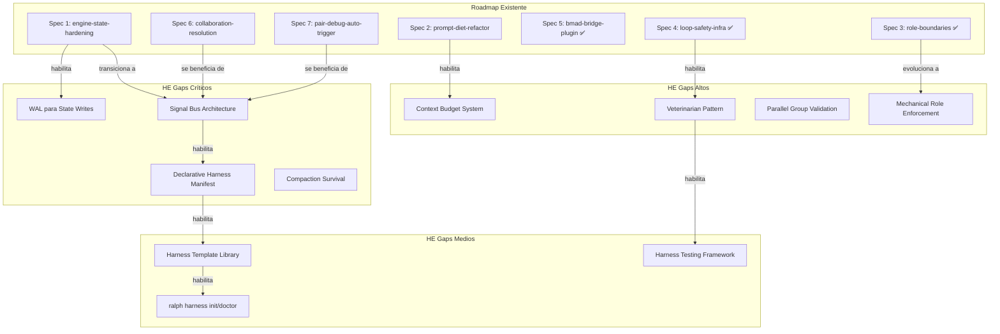
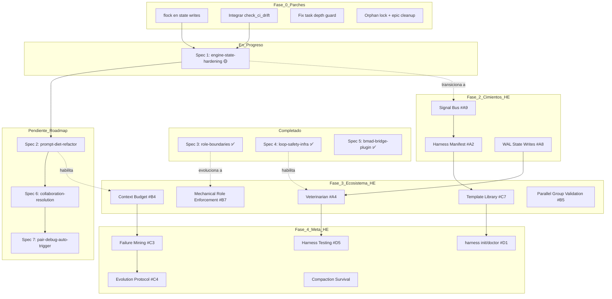

# Análisis de Integración: Harness Engineering ↔ Engine Roadmap

> **Fecha**: 2026-05-01
> **Alcance**: Mapeo cruzado entre el Engine Roadmap existente (`docs/ENGINE_ROADMAP.md`), la investigación de dominio HE, el diagnóstico de implementación, y el brainstorming de 50 ideas
> **Principio**: Solo análisis. No se proponen modificaciones al roadmap.

---

## 1. Mapa del Roadmap Actual

### 1.1 Specs del Roadmap (7 fases)

| # | Spec | Fase Roadmap | Estado | Componente HE que Aborda |
|---|------|-------------|--------|--------------------------|
| 1 | `engine-state-hardening` | Phase 1: Fix Critical Gaps | 🟡 En progreso (52 tasks, algunos completados) | Agent Loop (state integrity), Memory & State (schema), Verification (layer unification), Structured Authorization (HOLD check) |
| 2 | `prompt-diet-refactor` | Phase 2: Reduce Bloat | 🔴 No iniciado | Context Delivery & Compaction (token reduction, modular refs) |
| 3 | `role-boundaries` | Phase 3: Enforce Role Boundaries | ✅ Completado (2026-04-27) | Structured Authorization (role contracts, file access matrix) |
| 4 | `loop-safety-infra` | Phase 4: Add Bmalph-Style Safety | ✅ Completado (2026-04-27) | Agent Loop (circuit breaker, checkpoint persistence), Memory & State (metrics, checkpoint SHA), Verification (CI snapshot) |
| 5 | `bmad-bridge-plugin` | Phase 5: Extend with BMAD Bridge | ✅ Completado (2026-04-28) | Ninguno directamente — es un mapper estructural, no un componente de harness |
| 6 | `collaboration-resolution` | Phase 6: Agent Collaboration Protocol | 🔴 Pendiente | Agent Loop (cross-branch workflow), Tool Design (chat signals extension) |
| 7 | `pair-debug-auto-trigger` | Phase 7: Pair Debug Trigger | 🔴 Pendiente | Agent Loop (auto-trigger, Driver/Navigator), Tool Design (debug logging as technique) |

### 1.2 Specs Existentes Fuera del Roadmap (relevantes para HE)

| Spec | Estado | Componente HE que Aborda |
|------|--------|--------------------------|
| `agent-chat-protocol` | ✅ Completado | Tool Design (signal protocol), Agent Loop (bidirectional communication) |
| `iterative-failure-recovery` | ✅ Completado | Agent Loop (recovery loop, fix task generation) |
| `native-task-sync` | ✅ Completado | Agent Loop (native task sync), Memory & State (sync fields) |
| `parallel-task-execution` | ✅ Completado | Agent Loop (parallel execution groups) |
| `qa-verification` | ✅ Completado | Verification (qa-engineer agent, [VERIFY] tasks) |
| `reality-verification-principle` | ✅ Completado | Verification (goal detection, BEFORE/AFTER documentation) |
| `ralph-quality-improvements` | ✅ Completado | Verification (self-review checklists, external reviewer protocol) |
| `fix-impl-context-bloat` | ✅ Completado | Context Delivery & Compaction (context reduction) |
| `code-fixes-2` | ✅ Completado | Ninguno — bug fixes puntuales |
| `gito-fixes` | ✅ Completado | Ninguno — code review fixes |
| `implement-ralph-wiggum` | ✅ Completado | Agent Loop (Ralph Loop integration) |
| `token-efficient-executor` | ✅ Completado | Context Delivery & Compaction (executor-level) |
| `epic-triage` | ✅ Completado | Agent Loop (epic decomposition) |
| `codebase-indexing` | ✅ Completado | Context Delivery (spec surface map — parcial) |
| `smart-skill-swap-retry` | ? | Agent Loop (retry mechanism) |
| `speckit-stop-hook` | ? | Agent Loop (stop hook) |

---

## 2. Mapeo Cruzado: Roadmap ↔ Harness Engineering

### 2.1 Agent Loop (observe → plan → act → verify)

**Qué dice HE**: El loop es el ciclo fundamental. El harness controla termination conditions, branching on tool results, y checkpoint persistence. Papers clave: ReAct, Codex Agent Loop.

| Sub-componente | ¿Cubierto por roadmap? | ¿Cuál spec? | ¿Qué falta? | ¿Quién lo hace mejor? |
|----------------|----------------------|-------------|-------------|----------------------|
| **Loop Controller** | 🟡 Parcial | Spec 4 (loop-safety-infra) implementó circuit breaker + checkpoint, pero `stop-watcher.sh` sigue siendo monolito de 1,010 líneas con race conditions | Reemplazar transcript-dependent signal detection con Signal Bus (#A9). El loop controller debería ser thin executor de una state machine declarativa (#A3) | HE propone state machines declarativas; el roadmap usa bash monolítico. HE es mejor aquí |
| **Termination Conditions** | ✅ Cubierto | Spec 4: circuit breaker (5 failures), session timeout (48h) | Falta cooldown after failure (#A5.5 del brainstorming) y termination por "harness health" (Veterinarian) | Roadmap es suficiente para termination básica |
| **Checkpoint Persistence** | ✅ Cubierto | Spec 4: git checkpoint + SHA en state file | Falta content-addressable snapshots (#A7) para history completo | Roadmap es pragmático; HE es más elegante pero over-engineered para la necesidad actual |
| **Task Delegation** | ✅ Cubierto | spec-executor.md + Task tool + EXECUTOR_START gate | Nada — bien diseñado | Igual |
| **Parallel Execution** | 🟡 Parcial | `parallel-task-execution` spec implementó [P] groups | Falta completion validation del grupo (diagnóstico: 🟠 ALTA) y Parallel Group State Machine (#B5) | HE propone state machine para grupos; roadmap no valida completitud |
| **Recovery Loop** | ✅ Cubierto | `iterative-failure-recovery` + Spec 4 | Falta BUG_DISCOVERY trigger (Spec 6) y pair-debug escalation (Spec 7) | Roadmap cubre bien; Specs 6-7 completan el recovery |
| **Completion Detection** | 🟡 Parcial | `ALL_TASKS_COMPLETE` del transcript | Dependencia frágil del transcript. Signal Bus (#A9) lo haría mecánico | HE es mejor — file-based signals son más confiables que transcript parsing |

### 2.2 Context Delivery & Compaction

**Qué dice HE**: El context window es finito. El harness debe decidir qué entra, cuándo comprimir, y qué sobrevive a la compresión. Hallazgo crítico: 60% de facts destruidos durante compaction, 54% de behavioral drift.

| Sub-componente | ¿Cubierto por roadmap? | ¿Cuál spec? | ¿Qué falta? | ¿Quién lo hace mejor? |
|----------------|----------------------|-------------|-------------|----------------------|
| **Token Reduction** | 🟡 Parcial | Spec 2 (prompt-diet-refactor) + `fix-impl-context-bloat` + `token-efficient-executor` | Spec 2 es one-time refactor. HE dice que context delivery es CONTINUO — necesita Context Budget (#B4) con tiered loading | HE es mejor — el roadmap trata el problema como puntual, HE lo trata como disciplina continua |
| **Compaction Survival** | 🔴 No cubierto | Ningún spec | HE documenta que lo que sobrevive: current task, recent errors, filenames. Lo que se pierde: initial instructions, intermediate decisions, style rules. El roadmap NO tiene mecanismo para proteger facts críticos a través de compaction | HE es dramáticamente mejor — el roadmap ignora este problema completamente |
| **Progressive Loading** | 🔴 No cubierto | Ningún spec | Cargar solo las primeras 200 líneas de cada referencia, expandir on-demand (#C6) | HE es mejor — el roadmap carga todo siempre |
| **Auto-Tuning** | 🔴 No cubierto | Ningún spec | Trackear qué referencias son útiles vs. desperdicio, ajustar automáticamente (#C2) | HE es mejor — pero es fase 3 (largo plazo) |

**Veredicto**: El roadmap aborda el síntoma (demasiados tokens) pero no la enfermedad (context delivery como disciplina continua). La compaction survival es un gap crítico que el roadmap no menciona.

### 2.3 Tool Design

**Qué dice HE**: El diseño de herramientas es UX del agente. Naming consistente, schemas estrictos, valor de retorno que no requiere parsing. Descubrimiento: 98.7% reducción de tokens cuando agentes escriben código para interactuar con MCP servers.

| Sub-componente | ¿Cubierto por roadmap? | ¿Cuál spec? | ¿Qué falta? | ¿Quién lo hace mejor? |
|----------------|----------------------|-------------|-------------|----------------------|
| **Tool API Coherence** | 🔴 No cubierto | Ningún spec | Las tools existen (checkpoint.sh, write-metric.sh, discover-ci.sh) pero no están documentadas como API coherente. Falta Harness Toolkit como Plugin API (#A1) | HE es mejor — las tools sin API documentada son herramientas huérfanas |
| **Tool Return Values** | 🟡 Parcial | Implementación existente usa exit codes y JSON | Falta estandarización — cada tool tiene formato diferente | Empate — ambos necesitan mejorar |
| **MCP Integration** | 🔴 No cubierto | Ningún spec | Exponer harness tools como MCP server (#E4) para uso cross-platform | HE es mejor — pero es largo plazo |

**Veredicto**: El roadmap no ve Tool Design como disciplina first-class. Las tools son implementación incidental, no diseño deliberado.

### 2.4 Memory & State

**Qué dice HE**: Patrón de 3 capas (core/archival/recall). Problema crítico: 60% destrucción de facts, 54% behavioral drift. Knowledge Objects logran 100% accuracy a 25× menor costo.

| Sub-componente | ¿Cubierto por roadmap? | ¿Cuál spec? | ¿Qué falta? | ¿Quién lo hace mejor? |
|----------------|----------------------|-------------|-------------|----------------------|
| **State Schema** | 🟡 Parcial | Spec 1 agrega campos faltantes (nativeTaskMap, etc.) | Schema sigue siendo flat JSON. No hay 3-tier memory. No hay core/archival/recall | HE es mejor — el roadmap tiene state flat, HE propone capas |
| **Atomic State Write** | 🔴 No cubierto | Ningún spec | WAL para State Writes (#A8) — diagnosticado como 🔴 CRÍTICA. No hay flock en writes a .ralph-state.json | HE es dramáticamente mejor — el roadmap ignora atomic writes |
| **Metrics Persistence** | ✅ Cubierto | Spec 4: .metrics.jsonl con JSONL append-safe | Nada — bien implementado | Igual |
| **Checkpoint Persistence** | ✅ Cubierto | Spec 4: git commit + SHA en state file | Content-addressable snapshots (#A7) para history completo | Roadmap es pragmático; HE es más elegante |
| **Progress Persistence** | 🟡 Parcial | .progress.md — append-only markdown | No es structured para retrieval. No hay archival memory. Facts se pierden en scroll | HE es mejor — .progress.md es un log, no un sistema de memoria |
| **Compaction Survival** | 🔴 No cubierto | Ningún spec | Ver sección 2.2 — mismo problema desde ángulo de memoria | HE es mejor |

**Veredicto**: El roadmap tiene buena persistencia (metrics, checkpoint) pero mala memoria (state flat, sin compaction survival, sin atomic writes). HE identifica esto como el problema central.

### 2.5 Structured Authorization

**Qué dice HE**: Dejar de confiar en prompts para permisos. OWASP LLM06:2025 — Excessive Agency. Claude Agent SDK: cinco-layer evaluation. Authorization Fabric: PEP + PDP.

| Sub-componente | ¿Cubierto por roadmap? | ¿Cuál spec? | ¿Qué falta? | ¿Quién lo hace mejor? |
|----------------|----------------------|-------------|-------------|----------------------|
| **Role Contracts** | ✅ Cubierto | Spec 3: role-contracts.md con access matrix | Nada — bien diseñado | Igual |
| **File Access Restrictions** | 🟡 Parcial | Spec 3: "DO NOT edit" lists en agent prompts | **Prompt-based, no mechanical**. HE dice: "stop trusting prompts for permissions." Falta enforcement mecánico (hooks que previenen edición) | HE es mejor — el roadmap usa la versión débil (prompts), HE exige la versión fuerte (mechanical) |
| **State File Write Ownership** | ✅ Diseñado | Single-writer: coordinator solo | Exception para filesystemHealth no documentada | Empate |
| **Role Boundary Validation** | 🟡 Débil | stop-watcher.sh baseline check | Solo detecta "unknown" agent. Falta hash integrity (#B7) y flock wrapper (#B2) | HE es mejor — hash integrity previene corrupción silenciosa |

**Veredicto**: Spec 3 es el spec del roadmap más alineado con HE, pero se quedó en la versión prompt-based. HE exige mechanical enforcement. La brecha es de grado, no de dirección.

### 2.6 Verification & CI

**Qué dice HE**: Verification loops como pipeline composable. Separación entre task-level verification y global CI health.

| Sub-componente | ¿Cubierto por roadmap? | ¿Cuál spec? | ¿Qué falta? | ¿Quién lo hace mejor? |
|----------------|----------------------|-------------|-------------|----------------------|
| **5-Layer Verification** | ✅ Cubierto | Spec 1 unifica a 5 layers | Pipeline es fijo (siempre 5 layers). HE propone composable pipeline (#B6) donde proyectos agregan layers custom | Roadmap es suficiente para el caso actual; HE es mejor para extensibilidad |
| **Anti-fabrication** | ✅ Cubierto | Layer 3 — verify command independiente | Nada — bien diseñado | Igual |
| **CI Snapshot Separation** | ✅ Cubierto | Spec 4: CI command discovery + snapshot tracking | check_ci_drift() existe pero NUNCA SE LLAMA (🟡 MEDIA per diagnóstico) | Roadmap lo diseñó bien pero no lo integró completamente |
| **CI Drift Reconciliation** | 🔴 No cubierto | Ningún spec | check_ci_drift() está definido pero no integrado. HE propone reconciliation loop estilo Kubernetes (#B3) | HE es mejor — el roadmap tiene el código pero no lo usa |

**Veredicto**: El roadmap tiene buena verification cuando funciona. El gap es de integración (check_ci_drift no llamado) y de extensibilidad (pipeline fijo vs. composable).

---

## 3. Conflictos y Redundancias

### 3.1 Conflictos

| Conflicto | Detalle | Resolución sugerida |
|-----------|---------|---------------------|
| **Spec 1 HOLD check vs. Signal Bus** | Spec 1 propone `grep -c '^\[HOLD\]' chat.md` como check mecánico. El brainstorming #A9 propone reemplazar TODO signal detection con `.signals/` directory. Si se adopta Signal Bus, el grep de Spec 1 queda obsoleto. | El grep de Spec 1 es un parche válido HOY. Signal Bus es la arquitectura correcta MAÑANA. Diseñar Spec 1 para que el grep sea reemplazable por Signal Bus sin refactor. |
| **Spec 2 split vs. Context Budget** | Spec 2 propone dividir coordinator-pattern.md en archivos modulares. El brainstorming #B4 propone un Context Budget System con tiered loading (mandatory/conditional/on-demand). Spec 2 es reorganización de archivos; Context Budget es política de carga runtime. | Son complementarios: Spec 2 crea los archivos modulares que Context Budget necesita para tierar. Pero Spec 2 solo no basta — sin budget, el coordinator puede cargar todos los archivos modulares de golpe. |
| **Spec 3 prompt-based vs. HE mechanical** | Spec 3 usa "DO NOT edit" lists en agent prompts. HE principio P2 dice: "Nunca depender de interpretación del LLM para safety." El roadmap contradice el principio core de HE. | Spec 3 es el primer paso correcto. El siguiente paso es mechanical enforcement (hooks que previenen edición). No es un conflicto de dirección, sino de grado. |
| **Roadmap: Smart Ralph ES el harness vs. Premisa: Smart Ralph PROVEE herramientas** | El roadmap trata a Smart Ralph como el harness mismo (modifica stop-watcher.sh, agrega circuit breaker al engine, etc.). La premisa del brainstorming dice: "Smart Ralph ES el pura sangre, no el arnés." | Este es el conflicto más profundo. El roadmap mejoró el engine internamente (correcto), pero no creó la capa de "herramientas que los proyectos usan para construir sus arneses." Ambas capas son necesarias. |

### 3.2 Redundancias

| Redundancia | Detalle | Acción |
|-------------|---------|--------|
| **fix-impl-context-bloat ≈ Spec 2** | Ambos atacan el mismo problema: reducir contexto por iteración. `fix-impl-context-bloat` tiene 41 tasks. Spec 2 (prompt-diet-refactor) no tiene tasks.md todavía. | Verificar si `fix-impl-context-bloat` ya completó el trabajo de Spec 2. Si es así, Spec 2 puede reducir su scope o enfocarse en lo que falta (Context Budget tiering). |
| **agent-chat-protocol → Spec 6** | `agent-chat-protocol` creó las señales base (OVER, ACK, HOLD, etc.). Spec 6 extiende con señales de colaboración (HYPOTHESIS, EXPERIMENT, etc.). | No es redundancia — es extensión aditiva. Correcto. |
| **iterative-failure-recovery → Spec 4/6** | `iterative-failure-recovery` creó el mecanismo de fix tasks. Spec 4 agrega circuit breaker. Spec 6 extiende fix tasks con BUG_DISCOVERY. | No es redundancia — es extensión aditiva. Correcto. |
| **native-task-sync → Spec 1** | `native-task-sync` agregó los 8 sync sections y los campos al state. Spec 1 agrega esos campos al schema (que native-task-sync no hizo). | Complementario — native-task-sync implementó la lógica, Spec 1 formaliza el schema. |

### 3.3 Specs que deberían reescribirse a la luz de HE

| Spec | Por qué | Qué cambiaría |
|------|---------|---------------|
| **Spec 1 (engine-state-hardening)** | El grep-based HOLD check es un parche. WAL para state writes es más importante que agregar campos al schema. | Priorizar WAL (#A8) sobre grep HOLD. Diseñar grep HOLD como transitional hacia Signal Bus. |
| **Spec 2 (prompt-diet-refactor)** | Reducir archivos es necesario pero insuficiente. Sin Context Budget, el coordinator carga todo de golpe. | Agregar Context Budget (#B4) como parte del spec, no como spec separado. |
| **Spec 3 (role-boundaries)** | Prompt-based enforcement es la versión débil. | Agregar mechanical enforcement (hash integrity #B7, flock wrapper #B2) como Phase 2 del spec. |

---

## 4. Gaps — Qué Falta en el Roadmap

### 4.1 Gaps Críticos (🔴)

| Gap | Componente HE | Descripción | Por qué es crítico |
|-----|--------------|-------------|-------------------|
| **Signal Bus Architecture** | Agent Loop + Tool Design | Reemplazar transcript-dependent signal detection con `.signals/` directory. Cada señal es un archivo atómico. Checks se convierten en `test -f .signals/HOLD`. | El diagnóstico identifica HOLD detection dependiente de transcript como 🔴 CRÍTICA. El grep de Spec 1 es parche; Signal Bus es solución arquitectónica. Habilita: Signal Replay, Harness Testing, Mechanical HOLD. |
| **WAL para State Writes** | Memory & State | Patrón Write-Ahead Log: antes de modificar .ralph-state.json, escribir cambio intencionado a WAL. Si hay crash, replay del WAL. | El diagnóstico identifica atomic state write como 🔴 CRÍTICA. No hay flock en writes al state file. Race conditions posibles. |
| **Declarative Harness Manifest** | Todos | `harness.yaml` que declara qué componentes de harness quiere el proyecto. Smart Ralph lo lee y configura el loop. | Es la encarnación directa de la premisa "Smart Ralph provee herramientas, los proyectos construyen arneses." Sin esto, Smart Ralph es el harness (no el proveedor). Habilita: Templates, Linter, Doctor, Diff on Upgrade. |
| **Compaction Survival** | Context Delivery + Memory | Mecanismo para proteger facts críticos a través de compaction cycles. HE documenta 60% destrucción de facts. | El roadmap ignora completamente este problema. .progress.md es append-only pero no retrievable. No hay core/archival/recall. |

### 4.2 Gaps Altos (🟠)

| Gap | Componente HE | Descripción | Por qué es alto |
|-----|--------------|-------------|----------------|
| **Context Budget System** | Context Delivery | Token budget por iteración con tiered loading (mandatory/conditional/on-demand). | Spec 2 reduce contexto una vez. Context Budget lo hace sostenible. Sin budget, el coordinator puede cargar todos los archivos modulares de golpe. |
| **The Veterinarian Pattern** | Meta-Harness | Health-check subsistema que corre diagnósticos sobre el harness mismo. | Addressa la clase de problemas "definido pero nunca llamado" (check_ci_drift). Es meta-harness: harness que verifica el harness. |
| **Parallel Group Completion Validation** | Agent Loop | Validación de que TODAS las tareas de un grupo [P] completaron antes de avanzar. | Diagnosticado como 🟠 ALTA. Si una tarea en el grupo falla, el behavior es undefined. |
| **Mechanical Role Enforcement** | Structured Authorization | Hooks que previenen edición de archivos prohibidos, no solo prompts que dicen "no editar." | Spec 3 es prompt-based. HE exige mechanical. Hash integrity (#B7) + flock wrapper (#B2). |

### 4.3 Gaps Medios (🟡)

| Gap | Componente HE | Descripción |
|-----|--------------|-------------|
| **Harness Template Library** | DX | 3-5 templates (minimal/standard/strict/experimental) como punto de partida para proyectos |
| **Harness Testing Framework** | DX | Tests para el harness: "cuando HOLD signal existe, el loop se pausa" |
| **ralph harness init** | DX | Comando para scaffoldear harness en proyecto nuevo |
| **ralph harness doctor** | DX | Diagnosticar salud del harness actual |
| **Orphan Lock Reaper** | Tool Design | Daemon/step que limpia .lock files huérfanos |
| **Epic State Cleanup on Cancel** | Agent Loop | cancel.md no actualiza estado del epic padre |
| **CI Drift Integration** | Verification | check_ci_drift() existe pero nunca se llama |

### 4.4 Gaps Deseables (🟢)

| Gap | Componente HE | Descripción |
|-----|--------------|-------------|
| **Harness Evolution Protocol** | Meta-Harness | Workflow post-failure: detectar → diagnosticar → proponer → review → aplicar |
| **Failure Pattern Mining** | Meta-Harness | Analizar .metrics.jsonl cross-spec para patrones de failure |
| **Harness Debt Tracker** | Meta-Harness | Marcar componentes como "muletas" con fecha de retiro estimada |
| **Signal Replay** | Meta-Harness | Flight data recorder para agent loops |
| **Harness Linter** | DX | Validar harness.yaml + scripts: referencias rotas, señales inconsistentes |
| **Harness Diff on Upgrade** | DX | Mostrar qué cambió cuando Smart Ralph se upgradea |

### 4.5 Dónde Encajan en la Secuencia del Roadmap

---

## 5. Oportunidades de Mejora

### 5.1 Specs existentes que se beneficiarían de adoptar patrones HE

| Spec | Patrón HE | Beneficio |
|------|-----------|-----------|
| **Spec 1** (engine-state-hardening) | WAL (#A8) en lugar de solo schema update | Resuelve atomic state write — más importante que agregar campos al schema |
| **Spec 1** (engine-state-hardening) | Signal Bus (#A9) como reemplazo futuro del grep HOLD | Diseñar el grep como transitional, no como solución final |
| **Spec 2** (prompt-diet-refactor) | Context Budget (#B4) como extensión | Sin budget, el coordinator carga todos los archivos modulares de golpe. El split solo no reduce tokens si todo se carga siempre |
| **Spec 3** (role-boundaries) | Mechanical enforcement (#B7, #B2) | De "por favor no edites" a "no puedes editar" |
| **Spec 4** (loop-safety-infra) | Veterinarian (#A4) que llame check_ci_drift() | El código existe pero nunca se llama. El Veterinarian lo invocaría |
| **Spec 6** (collaboration-resolution) | Signal Bus (#A9) para señales de colaboración | HYPOTHESIS, EXPERIMENT, FINDING serían archivos en .signals/, no texto en chat.md |

### 5.2 Ideas del brainstorming que reemplazan/mejoran specs existentes

| Idea Brainstorming | Spec Existente | Cómo mejora/reemplaza |
|-------------------|----------------|----------------------|
| **#A9 Signal Bus** | Spec 1 grep-based HOLD check | Reemplaza: grep en chat.md → test -f .signals/HOLD. Más mecánico, más confiable, habilita Signal Replay |
| **#B4 Context Budget** | Spec 2 prompt-diet-refactor | Extiende: split de archivos + tiered loading con budget. Spec 2 es prerequisito de #B4 |
| **#A8 WAL** | Spec 1 schema update | Complementa: schema update es necesario, pero WAL es más urgente (atomic writes > campos faltantes) |
| **#A2 Harness Manifest** | Ningún spec existente | Nuevo: es la capa que falta entre Smart Ralph (tools) y el proyecto (harness) |
| **#A4 Veterinarian** | check_ci_drift() no llamado | Resuelve: el Veterinarian es el orquestador que llama los checks que ya existen |
| **#B5 Parallel Group State Machine** | parallel-task-execution spec | Extiende: el spec creó [P] groups pero no valida completitud. State machine sí |

### 5.3 Low-Hanging Fruit — Mejoras sin cambio arquitectónico

| # | Mejora | Archivo | Esfuerzo | Impacto |
|---|--------|---------|----------|---------|
| 1 | **Integrar check_ci_drift()** | `stop-watcher.sh` — agregar llamada en flujo principal | 1 línea | 🟠 ALTA — código existe, solo falta llamarlo |
| 2 | **flock en state writes** | `implement.md` — wrappear writes con `(flock 200; cat > file) 200>.lock` | ~10 líneas | 🔴 CRÍTICA — previene race conditions |
| 3 | **Orphan lock cleanup en cancel.md** | `cancel.md` — agregar `find . -name '*.lock' -mtime +1 -delete` | ~5 líneas | 🟡 MEDIA — previene stale locks |
| 4 | **Epic state update en cancel.md** | `cancel.md` — actualizar .epic-state.json al cancelar | ~15 líneas | 🟡 MEDIA — previene epic state inconsistente |
| 5 | **Fix task depth guard en stop-watcher** | `stop-watcher.sh` — validar `fixTaskDepth <= maxFixTaskDepth` | ~5 líneas | 🟠 ALTA — enforcement mecánico de límite |
| 6 | **Crear .signals/ como capa opcional** | Nuevo directorio + stop-watcher.sh check adicional | ~30 líneas | 🟠 ALTA — primer paso hacia Signal Bus sin romper nada |

---

## 6. Recomendación de Secuencia

### 6.1 Qué hacer primero (integrando con el roadmap actual)

**Fase 0: Parches críticos sin cambio arquitectónico** (antes de continuar con Specs 1-2)

Estas acciones addressan brechas 🔴 CRÍTICAS del diagnóstico que NO requieren la nueva arquitectura HE:

1. **flock en state writes** — wrappear todas las writes a `.ralph-state.json` con flock
2. **Integrar check_ci_drift()** — agregar llamada en el flujo principal de stop-watcher.sh
3. **Fix task depth guard** — validación mecánica en stop-watcher.sh
4. **Orphan lock cleanup** — agregar a cancel.md
5. **Epic state cleanup** — agregar a cancel.md

**Justificación**: Estas son brechas que el diagnóstico identificó como críticas/altas y que se pueden resolver con cambios mínimos. No bloquean ningún spec del roadmap, pero sí previenen fallos silenciosos que empeorarán conforme se ejecuten más specs.

### 6.2 Qué hacer después

**Fase 1: Completar roadmap existente** (Specs 1 → 2 → 6 → 7)

1. **Spec 1** (engine-state-hardening) — completar las tasks restantes. **Modificación sugerida**: diseñar el grep-based HOLD check como transitional hacia Signal Bus (que el grep sea reemplazable sin refactor).
2. **Spec 2** (prompt-diet-refactor) — split de coordinator-pattern.md. **Modificación sugerida**: incluir Context Budget tiering como parte del spec, no como spec separado.
3. **Spec 6** (collaboration-resolution) — encode collaboration patterns.
4. **Spec 7** (pair-debug-auto-trigger) — auto-trigger pair-debug.

**Justificación**: Estos specs ya están diseñados, tienen dependencias resueltas (Specs 3-5 completados), y addressan gaps reales. Completarlos primero maximiza el retorno de trabajo ya invertido.

### 6.3 Qué hacer más adelante

**Fase 2: Signal Bus + Harness Manifest** (los dos gaps críticos de HE)

1. **Signal Bus Architecture** (#A9) — nuevo spec. Reemplaza transcript-dependent signal detection con `.signals/` directory. Migración incremental: Signal Bus como capa adicional, transcript como fallback.
2. **Declarative Harness Manifest** (#A2) — nuevo spec. Diseñar harness.yaml schema v1. Sin manifest, comportamiento = idéntico al actual (backward compatible).
3. **WAL para State Writes** (#A8) — nuevo spec o extensión de Spec 1. Wrapper `safe-state-write.sh` con WAL + flock + tmpfile+rename.

**Justificación**: Signal Bus es el prerrequisito que habilita Harness Manifest, Harness Testing, Signal Replay, y Mechanical HOLD definitivo. Harness Manifest es el contrato entre Smart Ralph y los proyectos. WAL es la solución definitiva a atomic writes. Estos tres son los cimientos de la arquitectura HE.

**Fase 3: Ecosistema HE**

1. **Context Budget System** (#B4) — extiende Spec 2 con tiered loading
2. **The Veterinarian Pattern** (#A4) — health-check subsistema
3. **Harness Template Library** (#C7) — templates minimal/standard/strict/experimental
4. **Mechanical Role Enforcement** (#B7, #B2) — evolución de Spec 3
5. **Parallel Group State Machine** (#B5) — evolución de parallel-task-execution

**Fase 4: Meta-Harness y DX**

1. **Harness Testing Framework** (#D5)
2. **ralph harness init / doctor** (#D1, #D2)
3. **Harness Evolution Protocol** (#C4)
4. **Failure Pattern Mining** (#C3)
5. **Harness Debt Tracker** (#E10)
6. **Compaction Survival** — mecanismo para proteger facts críticos

### 6.4 Qué no hacer (y por qué)

| Idea | Por qué no |
|------|-----------|
| **#A3 State Machine reemplaza stop-watcher.sh** | Demasiado riesgo. stop-watcher.sh tiene 1,010 líneas de bash que funcionan (con brechas, pero funcionan). Reemplazar con state machine declarativa es rewrite total. Mejor: evolucionar incrementalmente. |
| **#A5 Jockey Interface** | Nice-to-have. El humano ya puede intervenir vía chat.md y /ralph-specum:cancel. Un TUI sería elegante pero no resuelve ningún gap crítico. |
| **#A7 Content-Addressable State Snapshots** | Over-engineering. El git checkpoint + SHA en state file es suficiente para rollback. Content-addressable snapshots añade complejidad sin beneficio claro para el caso de uso actual. |
| **#C5 Knowledge Objects** | Demasiado experimental. El patrón de hash-addressed fact tuples es académicamente interesante pero no hay evidencia de que funcione en el contexto de un plugin de Claude Code. |
| **#D4 Interactive Harness Builder** | Web UI es scope creep. Smart Ralph es un plugin CLI, no una plataforma web. |
| **#D6 Harness Playground** | Sandbox para testear harnesses es interesante pero requiere infraestructura pesada (containers, isolation). No es prioritario. |
| **#E1 Chaos Harness Mode** | Experimental. Inyectar failures deliberadamente es útil para testing pero no es prioritario cuando hay brechas críticas sin resolver. |
| **#E7 Harness A/B Testing** | Requiere correr el mismo spec dos veces con configuraciones diferentes. Costoso en tokens y tiempo. No hay evidencia de que el beneficio justifique el costo. |
| **#E6 Predictive Failure Detection** | Requiere history de métricas suficiente para entrenar un modelo. No hay suficiente data todavía. |
| **#A10 Harness as Code** | La idea es elegante pero prematura. Los proyectos no van a escribir harness code cuando ni siquiera tienen harness.yaml todavía. Primero declarativo, luego programático. |

---

## 7. Tabla Resumen

| Componente HE | Spec Existente | Estado | Gap | Acción Recomendada |
|--------------|----------------|--------|-----|-------------------|
| **Agent Loop — Loop Controller** | Spec 4 (loop-safety-infra) | ✅ Completado | stop-watcher.sh es monolito con race conditions | Evolucionar incrementalmente; no reescribir |
| **Agent Loop — Termination** | Spec 4 | ✅ Completado | Falta cooldown after failure | Agregar como mejora menor |
| **Agent Loop — Checkpoint Persistence** | Spec 4 | ✅ Completado | Nada significativo | Mantener |
| **Agent Loop — Task Delegation** | spec-executor.md | ✅ Funcional | Nada | Mantener |
| **Agent Loop — Parallel Execution** | parallel-task-execution | ✅ Completado | Completion validation de grupos [P] | Nuevo spec o extensión: Parallel Group State Machine (#B5) |
| **Agent Loop — Recovery Loop** | iterative-failure-recovery + Spec 4 | ✅ Completado | BUG_DISCOVERY trigger (Spec 6) | Completar Spec 6 |
| **Agent Loop — Completion Detection** | stop-watcher.sh | 🟡 Parcial | Dependencia frágil del transcript | Signal Bus (#A9) — Fase 2 |
| **Agent Loop — Signal Detection** | Spec 1 (grep HOLD) | 🟡 Parcial | grep es parche; Signal Bus es solución | Signal Bus (#A9) — Fase 2 |
| **Context — Token Reduction** | Spec 2 + fix-impl-context-bloat | 🟡 Parcial | One-time refactor; necesita disciplina continua | Context Budget (#B4) — Fase 3 |
| **Context — Compaction Survival** | Ninguno | 🔴 No cubierto | 60% facts destruidos; .progress.md no es retrievable | Compaction Survival — Fase 4 |
| **Context — Progressive Loading** | Ninguno | 🔴 No cubierto | Carga todo siempre | Progressive Loading (#C6) — Fase 3 |
| **Context — Auto-Tuning** | Ninguno | 🔴 No cubierto | No trackea qué referencias son útiles | Auto-Tuning (#C2) — Fase 4 |
| **Tool Design — API Coherence** | Ninguno | 🔴 No cubierto | Tools existen sin API documentada | Harness Toolkit (#A1) — Fase 3 |
| **Tool Design — MCP Integration** | Ninguno | 🔴 No cubierto | Solo Claude Code puede usar tools | MCP Server (#E4) — No hacer (prematuro) |
| **Memory — State Schema** | Spec 1 | 🟡 En progreso | Campos faltantes | Completar Spec 1 |
| **Memory — Atomic State Write** | Ninguno | 🔴 No cubierto | Race conditions en .ralph-state.json | WAL (#A8) — Fase 2 |
| **Memory — Metrics Persistence** | Spec 4 | ✅ Completado | Nada | Mantener |
| **Memory — Progress Persistence** | .progress.md | 🟡 Parcial | No es structured para retrieval | Compaction Survival — Fase 4 |
| **Memory — 3-Tier Model** | Ninguno | 🔴 No cubierto | No hay core/archival/recall | Evaluar en Fase 4 |
| **Authorization — Role Contracts** | Spec 3 | ✅ Completado | Nada | Mantener |
| **Authorization — Mechanical Enforcement** | Spec 3 | 🟡 Prompt-based | HE exige mechanical, no prompts | Hash integrity (#B7) + flock (#B2) — Fase 3 |
| **Authorization — State File Integrity** | stop-watcher.sh baseline | 🟡 Débil | Solo detecta unknown agent | Hash integrity (#B7) — Fase 3 |
| **Verification — 5-Layer Pipeline** | Spec 1 | 🟡 En progreso | Pipeline fijo; no composable | Composable Pipeline (#B6) — Fase 3 |
| **Verification — Anti-fabrication** | verification-layers.md | ✅ Funcional | Nada | Mantener |
| **Verification — CI Snapshot** | Spec 4 | ✅ Completado | check_ci_drift() no llamado | Integrar llamada — Fase 0 |
| **Verification — CI Drift Reconciliation** | Ninguno | 🔴 No cubierto | check_ci_drift existe pero no se usa | Veterinarian (#A4) — Fase 3 |
| **Meta-Harness — Veterinarian** | Ninguno | 🔴 No cubierto | Harness que verifica el harness | Veterinarian (#A4) — Fase 3 |
| **Meta-Harness — Evolution Protocol** | Ninguno | 🔴 No cubierto | Auto-mejora del harness | Evolution Protocol (#C4) — Fase 4 |
| **Meta-Harness — Failure Mining** | Ninguno | 🔴 No cubierto | Análisis cross-spec de métricas | Failure Mining (#C3) — Fase 4 |
| **Meta-Harness — Debt Tracker** | Ninguno | 🔴 No cubierto | Trackear muletas del harness | Debt Tracker (#E10) — Fase 4 |
| **DX — Harness Manifest** | Ninguno | 🔴 No cubierto | Contrato Smart Ralph ↔ Proyecto | Harness Manifest (#A2) — Fase 2 |
| **DX — Templates** | Ninguno | 🔴 No cubierto | Punto de partida para proyectos | Template Library (#C7) — Fase 3 |
| **DX — harness init/doctor** | Ninguno | 🔴 No cubierto | Comandos de gestión | DX Commands (#D1, #D2) — Fase 4 |
| **DX — Harness Testing** | Ninguno | 🔴 No cubierto | Tests para el harness | Testing Framework (#D5) — Fase 4 |

---

## Apéndice A: Esquema Visual de la Integración

---

## Apéndice B: Conteo de Gaps por Severidad

| Severidad | Cantidad | Componentes HE afectados |
|----------|---------|------------------------|
| 🔴 Crítico | 8 | Agent Loop (2), Context (2), Memory (2), DX (2) |
| 🟠 Alto | 4 | Context (1), Authorization (1), Agent Loop (1), Verification (1) |
| 🟡 Medio | 7 | DX (4), Tool Design (1), Agent Loop (1), Verification (1) |
| 🟢 Deseable | 6 | Meta-Harness (4), DX (2) |
| **Total** | **25** | |

---

*Documento generado: 2026-05-01*
*Fuentes: [ENGINE_ROADMAP.md](../../docs/ENGINE_ROADMAP.md), [domain-harness-engineering-research](../research/domain-harness-engineering-research-2026-05-01.md), [harness-implementation-diagnostic](../../../plans/harness-implementation-diagnostic-2026-05-01.md), [harness-engineering-implementation-brainstorm](../brainstorming/harness-engineering-implementation-brainstorm-2026-05-01.md)*
*Specs analizadas: 7 del roadmap + 15 existentes fuera del roadmap*
*Ideas de brainstorming mapeadas: 50 (7 top + 43 adicionales)*
