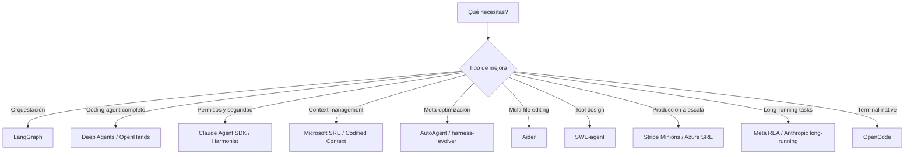

# Implementaciones de Referencia — Proyectos de Éxito para Copiarse

> **Fecha**: 2026-05-13
> **Tipo**: Catálogo de proyectos open-source con implementación real de harness engineering
> **Fuente principal**: [awesome-harness-engineering](https://github.com/ai-boost/awesome-harness-engineering) (902 stars)

---

## Criterio de Selección

Cada proyecto listado aquí tiene:
1. **Código abierto** — puedes leer el harness completo
2. **Resultados medibles** — benchmarks, producción, o métricas publicadas
3. **Lección transferible** — algo que RalphHarness puede copiar o adaptar

---

## Tier 1: Producción Probada (Miles de tareas/semana)

### 1. Stripe Minions — 1,300+ PRs/semana

| Aspecto | Detalle |
|---------|---------|
| **URL** | [stripe.dev/blog/minions-stripes-one-shot-end-to-end-coding-agents-part-2](https://stripe.dev/blog/minions-stripes-one-shot-end-to-end-coding-agents-part-2) |
| **Escala** | 1,300+ PRs/semana, unattended |
| **Modelo** | No publicado (probablemente Claude/GPT interno) |

**Qué copiar de Stripe**:
- **Blueprints**: Interleavan nodos de código deterministas con subtasks agentivos. No es "todo agente" ni "todo script" — es un hybrid.
- **Toolshed**: Un MCP server centralizado con 500+ tools sirve toda la flota de agentes. Un solo punto de registro, caching, y auth.
- **Pre-warmed devboxes**: Invierten en developer experience para humanos → los agentes se benefician igual. Sandboxes pre-calentados eliminan cold-start.
- **Curated tool limit**: ~15 tools por agente, no los 500 todos. El harness filtra qué tools expone a cada agente.

### 2. Microsoft Azure SRE Agent — 35,000+ incidentes

| Aspecto | Detalle |
|---------|---------|
| **URL** | [techcommunity.microsoft.com/blog/appsonazureblog/how-we-build-azure-sre-agent](https://techcommunity.microsoft.com/blog/appsonazureblog/how-we-build-azure-sre-agent-with-agentic-workflows/4508753) |
| **Escala** | 35,000+ incidentes de producción, time-to-mitigation de 40.5h → 3min |
| **Modelo** | No publicado |

**Qué copiar de Microsoft**:
- **Filesystem-based context engineering**: De 100+ bespoke tools a exponer todo como archivos. El agente usa `read_file`, `grep`, `find`, `shell` → Intent Met subió de 45% a 75%.
- **MCP + telemetry + code repos + incident management**: Todo integrado en un solo harness con HITL governance.
- **Lección**: Menos tools especializados, más acceso genérico a filesystem. Los agentes son mejores navegando archivos que aprendiendo APIs custom.

### 3. Meta REA (Ranking Engineer Agent) — Multi-day ML pipelines

| Aspecto | Detalle |
|---------|---------|
| **URL** | [engineering.fb.com/2026/03/17/developer-tools/ranking-engineer-agent-rea](https://engineering.fb.com/2026/03/17/developer-tools/ranking-engineer-agent-rea-autonomous-ai-system-accelerating-meta-ads-ranking-innovation/) |
| **Escala** | Pipelines de 6+ horas, hibernate-and-wake |

**Qué copiar de Meta**:
- **Hibernate-and-wake checkpointing**: Para tareas que exceden el context window. El agente "hiberna" guardando estado completo, y "despierta" restaurándolo sin perder contexto.
- **Scientific workflow harness**: Diseño para workflows donde un solo turn puede exceder el context limit pero el pipeline completo debe mantener coherencia durante días.

---

## Tier 2: Open-Source con Arquitectura Estudiable

### 4. OpenHands — El coding agent más completo arquitectónicamente

| Aspecto | Detalle |
|---------|---------|
| **URL** | [github.com/OpenHands/OpenHands](https://github.com/OpenHands/OpenHands) |
| **Stars** | 40K+ |
| **Arquitectura** | Runtime/Sandbox isolation + EventStream message bus + Agent Controller |

**Qué copiar de OpenHands**:
- **3-layer harness**: Runtime (sandbox) → EventStream (message bus) → Agent Controller (loop). Separación clara de concerns.
- **EventStream**: Todas las comunicaciones entre componentes pasan por un bus de eventos. Permite observabilidad, replay, y debugging.
- **Sandbox isolation**: Cada tarea corre en su propio sandbox. No hay shared state entre tareas.

### 5. Claude Agent SDK — El harness de Anthropic como API

| Aspecto | Detalle |
|---------|---------|
| **URL** | [platform.claude.com/docs/en/agent-sdk/overview](https://platform.claude.com/docs/en/agent-sdk/overview) |
| **Tipo** | SDK oficial de Anthropic |

**Qué copiar de Claude Agent SDK**:
- **Tool execution loop built-in**: No necesitas implementar el loop de tool calls
- **PreToolUse/PostToolUse hooks**: Interceptación determinista en cada tool call
- **5-layer permission evaluation**: hooks → deny rules → permission mode → allow rules → canUseTool
- **Session resumption**: Guardar y restaurar sesiones completas
- **Subagent definitions**: Delegación con permisos heredados

### 6. LangGraph — Orquestación con state machine

| Aspecto | Detalle |
|---------|---------|
| **URL** | [github.com/langchain-ai/langgraph](https://github.com/langchain-ai/langgraph) |
| **Stars** | 30K+ |
| **v2.0** | Type-safe streaming, Deploy CLI, unified primitives (Router, Supervisor, Subagent) |

**Qué copiar de LangGraph**:
- **Graph-based state machine**: El agent loop es un directed graph con typed state, conditional edges, y checkpointing
- **Checkpoint persistence**: Mid-loop state se persiste para resumir después
- **Supervisor/subagent topologies**: Modelado explícito de jerarquías de agentes
- **Error-recovery branches**: El grafo define qué hacer cuando un paso falla

### 7. Deep Agents (LangChain) — Coding agent batteries-included

| Aspecto | Detalle |
|---------|---------|
| **URL** | [github.com/langchain-ai/deepagents](https://github.com/langchain-ai/deepagents) |
| **Stars** | Creciendo rápido |
| **Resultado** | Top 30 → Top 5 en Terminal-Bench 2.0 con harness-only changes |

**Qué copiar de Deep Agents**:
- **Built-in planning, filesystem tools, shell access, sub-agents, auto-summarization**: Todo listo para usar
- **Middleware pattern**: 6 hooks composable para customización sin modificar core
- **Loop detection middleware**: Trackea per-file edit counts, inyecta contexto de reconsideración
- **Pre-completion checklist middleware**: Fuerza verification pass antes de terminar
- **Reasoning sandwich**: xhigh-high-xhigh compute allocation (planning → execution → verification)

### 8. Aider — Multi-file editing con Architect mode

| Aspecto | Detalle |
|---------|---------|
| **URL** | [github.com/Aider-AI/aider](https://github.com/Aider-AI/aider) |
| **Stars** | 30K+ |

**Qué copiar de Aider**:
- **Architect mode**: Un LLM planea (Architect), otro escribe código (Coder). Separación planner/coder.
- **Git-aware tooling**: Usa version control como undo mechanism en lugar de custom state rollback
- **Multi-file editing**: Diseño de tools para editar múltiples archivos coordinadamente

### 9. SWE-agent — Agent-Computer Interface (ACI)

| Aspecto | Detalle |
|---------|---------|
| **URL** | [github.com/SWE-agent/SWE-agent](https://github.com/SWE-agent/SWE-agent) |
| **Stars** | 14K+ |

**Qué copiar de SWE-agent**:
- **Purpose-built ACI**: File viewer, search, y editor tools diseñados específicamente para SWE tasks, no generic bash
- **Explicit state constraints**: Cada tool tiene constraints de estado claros
- **Error feedback**: Las tools devuelven errores estructurados que el agente puede usar para auto-corregirse

### 10. OpenCode — Terminal-native coding agent

| Aspecto | Detalle |
|---------|---------|
| **URL** | [github.com/anomalyco/opencode](https://github.com/anomalyco/opencode) |
| **Stars** | 131K+ |
| **Usuarios** | 2.5M+ monthly active developers |

**Qué copiar de OpenCode**:
- **build/plan agent split**: Separación de planning y execution como agentes distintos
- **Client/server architecture**: El agente corre como servidor, la UI es un cliente
- **75+ LLM providers**: Provider-agnostic, no lock-in
- **LSP auto-configuration**: El agente configura su propio language server protocol
- **Multi-session parallel agents**: Múltiples sesiones corriendo en paralelo

---

## Tier 3: Meta-Harnesses (El Harness Se Optimiza a Sí Mismo)

### 11. AutoAgent — Meta-harness que llegó a #1

| Aspecto | Detalle |
|---------|---------|
| **URL** | [github.com/kevinrgu/autoagent](https://github.com/kevinrgu/autoagent) |
| **Resultado** | #1 en SpreadsheetBench (96.5%), top GPT-5 en TerminalBench (55.1%) en 24h |

**Qué copiar de AutoAgent**:
- **program.md pattern**: Human escribe la directiva de optimización, el agente ejecuta el loop de harness engineering
- **Overnight iteration**: Corre 24h iterando sobre system prompts, tool configs, orchestration, routing
- **Score-based gating**: Cada cambio se acepta o rechaza basado en benchmark score

### 12. harness-evolver — Evolución autónoma del harness

| Aspecto | Detalle |
|---------|---------|
| **URL** | [github.com/raphaelchristi/harness-evolver](https://github.com/raphaelchristi/harness-evolver) |
| **Tipo** | Claude Code plugin |

**Qué copiar de harness-evolver**:
- **Multi-agent proposers in isolated git worktrees**: Cada propuesta de cambio al harness corre en aislamiento
- **LangSmith-backed evaluation**: Cada propuesta se evalúa contra traces reales
- **Regression guards**: Si un cambio mejora A pero empeora B, se rechaza
- **Full-trace counterfactual diagnosis**: Diagnostica fallas comparando traces exitosos vs fallidos

### 13. metaharness — Optimización del harness code

| Aspecto | Detalle |
|---------|---------|
| **URL** | [github.com/SuperagenticAI/metaharness](https://github.com/SuperagenticAI/metaharness) |
| **Tipo** | Python library |

**Qué copiar de metaharness**:
- **Treats AGENTS.md, setup scripts, validation logic, test flows as optimizable artifacts**: No solo prompts
- **Filesystem-backed run stores**: Historial completo de runs para comparación
- **Environment snapshots**: Reproducibilidad exacta de cada experimento
- **Scoped write enforcement**: El optimizador solo puede escribir en paths permitidos

---

## Tier 4: Especializados (Dominio Específico)

### 14. CCA (Confucius Code Agent) — Meta/Harvard

| Aspecto | Detalle |
|---------|---------|
| **URL** | [github.com/facebookresearch/cca-swebench](https://github.com/facebookresearch/cca-swebench) |
| **Resultado** | 59% Resolve@1 en SWE-Bench-Pro (exceeds prior baselines) |

**Qué copiar de CCA**:
- **Three perspectives**: Agent Experience (AX), User Experience (UX), Developer Experience (DX)
- **Persistent note-taking**: Cross-session learning con notas que persisten
- **Meta-agent**: Automatiza build-test-improve cycles

### 15. Live-SWE-agent — Self-evolving scaffold

| Aspecto | Detalle |
|---------|---------|
| **URL** | [arxiv.org/html/2511.13646v3](https://arxiv.org/html/2511.13646v3) |
| **Resultado** | 77.4% en SWE-bench Verified (vs 50% human contractors) |

**Qué copiar de Live-SWE-agent**:
- **Self-evolving scaffold**: El harness se adapta basado en señales de falla
- **No manual retuning**: El scaffold aprende de sus propios errores

### 16. Harmonist — Protocol enforcement as mechanical gate

| Aspecto | Detalle |
|---------|---------|
| **URL** | [github.com/GammaLabTechnologies/harmonist](https://github.com/GammaLabTechnologies/harmonist) |
| **Tipo** | Zero-dependency Python |

**Qué copiar de Harmonist**:
- **IDE-level hooks**: Checkean cada code-changing turn para required reviewers, memory updates, supply-chain integrity
- **Zero dependencies**: stdlib Python, determinismo máximo
- **Deterministic constraints that even frontier models cannot override**: No confía en el LLM para respetar reglas

---

## Mapa de Decisión: Qué Proyecto Estudiar Según Tu Necesidad

---

## Links Rápidos a Templates

| Template | URL |
|----------|-----|
| AGENTS.md template | [github.com/ai-boost/awesome-harness-engineering/blob/main/templates/AGENTS.md](https://github.com/ai-boost/awesome-harness-engineering/blob/main/templates/AGENTS.md) |
| PLAN.md template | [github.com/ai-boost/awesome-harness-engineering/blob/main/templates/PLAN.md](https://github.com/ai-boost/awesome-harness-engineering/blob/main/templates/PLAN.md) |
| IMPLEMENT.md template | [github.com/ai-boost/awesome-harness-engineering/blob/main/templates/IMPLEMENT.md](https://github.com/ai-boost/awesome-harness-engineering/blob/main/templates/IMPLEMENT.md) |
| HARNESS_CHECKLIST.md template | [github.com/ai-boost/awesome-harness-engineering/blob/main/templates/HARNESS_CHECKLIST.md](https://github.com/ai-boost/awesome-harness-engineering/blob/main/templates/HARNESS_CHECKLIST.md) |
| everything-claude-code | [github.com/affaan-m/everything-claude-code](https://github.com/affaan-m/everything-claude-code) (140K+ stars) |
| agentic-stack | [github.com/codejunkie99/agentic-stack](https://github.com/codejunkie99/agentic-stack) |
| Trellis | [github.com/mindfold-ai/Trellis](https://github.com/mindfold-ai/Trellis) |
