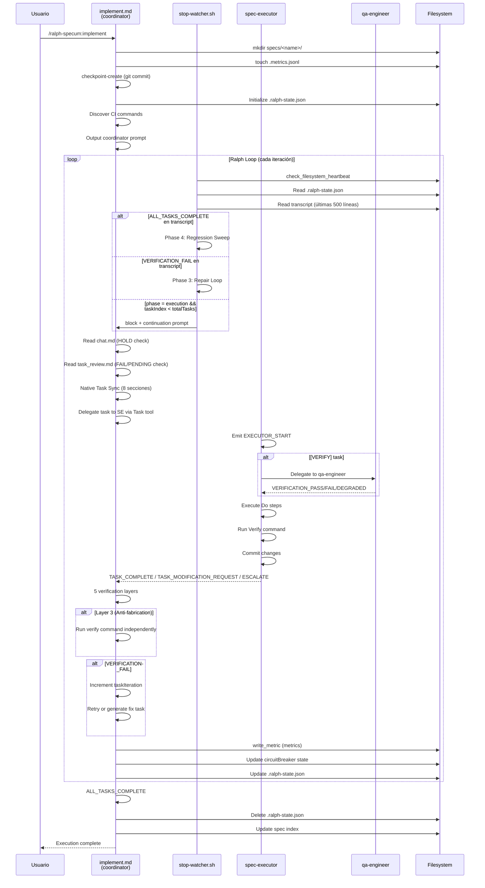

# Diagnóstico: Implementación Existente de Harness en Smart Ralph

> **Fecha**: 2026-05-01
> **Alcance**: Análisis de mecanismos de control (harness) en el loop de ejecución de Smart Ralph
> **Fuentes verificadas**: `stop-watcher.sh`, `spec-executor.md`, `implement.md`, `cancel.md`, `references/loop-safety.md`, `references/verification-layers.md`, `references/failure-recovery.md`, `references/coordinator-pattern.md`, `specs/loop-safety-infra/`, `docs/ARCHITECTURE.md`, `docs/ENGINE_ROADMAP.md`

---

## 1. Componentes Existentes de Harness

### 1.1 `stop-watcher.sh` — Loop Controller (1,010 líneas)

**Ubicación**: `plugins/ralph-specum/hooks/scripts/stop-watcher.sh`

**Función que cumple**: Controla la continuación/detención del Ralph Loop en cada iteración. Lee `.ralph-state.json` y el transcript, detecta señales, y decide si bloquear o continuar.

**Estado**: 🟡 PARCIAL — La implementación existe y es funcional, pero con brechas significativas.

**Problemas específicos detectados**:

| Problema | Ubicación | Detail |
|----------|-----------|--------|
| **Verificación de Capas Contradictoria** | Líneas 65-236 | `ALL_TASKS_COMPLETE` se detecta del transcript, pero la lógica de Phase 3 (Repair Loop) está acoplada con detección de `VERIFICATION_FAIL` en el transcript. Si el transcript está truncado, la detección falla silenciosamente. |
| **Race Condition en State File** | Líneas 48-63 | Solo 1 segundo de sleep en race condition. Para specs grandes con muchos archivos, el coordinador puede no haber terminado de escribir. No hay retry loop robusto. |
| **Phase 3 Repair Loop Incompleto** | Líneas 261-417 | El repair loop solo maneja `VERIFICATION_FAIL` del transcript. No detecta `TASK_MODIFICATION_REQUEST` como señal de falla. El límite de 2 iteraciones de repair (`MAX_REPAIR=2`) está en el hook, pero el estado `repairIteration` vive en el state file — si el state se corrompe, el repair loop puede ejecutarse indefinidamente. |
| **HOLD Detection Dependiente de Transcript** | Líneas 66-69 | La detección de `HOLD` usa `grep` sobre el transcript (últimas 500 líneas). Si el transcript no contiene la señal (porque el coordinador no la escribió correctamente), el hook permite continuar. No hay verificación mecánica del archivo `chat.md`. |
| **Baseline Field Validation Incompleto** | Líneas 494-592 | El sistema de validación de boundaries (`role boundaries`) existe pero es débil: solo detecta campos "unknown" sin validar si el cambio es legítimo. No hay hash de integridad del state file. |
| **Parallel Task Detection Limitado** | Líneas 673-697 | Detecta `[P]` en task blocks para grouping, pero no valida que todas las tareas paralelas completen antes de avanzar. Si una tarea en el grupo `[P]` falla, el behavior es undefined. |

---

### 1.2 `spec-executor.md` — Task Executor Agent (396 líneas)

**Ubicación**: `plugins/ralph-specum/agents/spec-executor.md`

**Función que cumple**: Ejecuta tareas individuales delegadas por el coordinator. Implementa el código, verifica completitud, commitea, y emite señales.

**Estado**: 🟢 FUNCIONAL — El agente funciona correctamente para su rol.

**Problemas específicos detectados**:

| Problema | Ubicación | Detail |
|----------|-----------|--------|
| **EXECUTOR_START como único gate** | `<startup>` | No hay mecanismo para que el executor detecte si fue re-invocado vs. primera invocación. Si el Task tool entrega la misma tarea dos veces, el executor no lo detecta. |
| **TDD Tags Sin Validación de Consistencia** | `<tdd>` | Los tags `[RED]`, `[GREEN]`, `[YELLOW]` se procesan sin validar que la secuencia sea correcta (no se puede hacer GREEN sin RED previo). |
| **Parallel Mode Sin Lock Biolette** | `<parallel>` | Los lock files para `tasks.md` y `.git-commit.lock` se crean pero nunca se limpian si el executor muere. Archivos huérfanos `.lock` persisten. |
| **Modifications Limit es Soft** | `<modifications>` | El límite de 3 modifications por task se verifica en la capa del agente, pero no hay mecanismo en el coordinator para rechazar requests que excedan el límite. |

---

### 1.3 `implement.md` — Coordinator Command (419 líneas)

**Ubicación**: `plugins/ralph-specum/commands/implement.md`

**Función que cumple**: Inicializa el estado de ejecución, crea el checkpoint git, descubre CI commands, e invoca el coordinator prompt.

**Estado**: 🟡 PARCIAL — La inicialización es robusta, pero el coordinator prompt es demasiado pesado.

**Problemas específicos detectados**:

| Problema | Ubicación | Detail |
|----------|-----------|--------|
| **5 Reference Files ~2,118 Lines por Iteración** | Paso 4 (líneas 279-295) | El coordinator carga 5 archivos de referencia en cada iteración. `coordinator-pattern.md` solo tiene 1,098 líneas. Elprompt de contexto es ~15,000+ tokens/iteración — esto viola el NFR de contexto mínimo documentado. |
| **Native Task Sync 8 Secciones** | Paso 4 y `coordinator-pattern.md` | 8 secciones de sync que pueden fallar silenciosamente. El graceful degradation (`nativeSyncFailureCount >= 3`) funciona pero hay demasiantes puntos de falla potenciales. |
| **CI Discovery Carga Helper Scripts** | Líneas 172-179 | El `discover-ci.sh` se sourcea en el command, pero el helper no está documentado en las referencias. Si falla, el error es opaco. |
| **Checkpoint Create Post-State-Merge** | Líneas 144-163 | El checkpoint se crea después de la escritura del state file, lo cual significa que si el checkpoint falla, el state file ya tiene `phase: "execution"` pero sin checkpoint — estado inconsistente. |
| **Metrics Write en Coordinator vs Executor** | Líneas 326-353 | Las métricas se escriben desde el coordinator post-verificación, pero `spec-executor` no tiene forma de saber si las métricas se escribieron correctamente. Si el coordinator muere después de TASK_COMPLETE pero antes de `write_metric`, se pierde el registro. |

---

### 1.4 `cancel.md` — Cleanup Command (119 líneas)

**Ubicación**: `plugins/ralph-specum/commands/cancel.md`

**Función que cumple**: Cancela la ejecución activa, limpia state files, y elimina el spec directory.

**Estado**: 🟢 FUNCIONAL — El comando funciona correctamente.

**Problemas específicos detectados**:

| Problema | Ubicación | Detail |
|----------|-----------|--------|
| **No Limpia Orphaned Locks** | Sección Cleanup | No hay limpieza de `tasks.md.lock`, `.git-commit.lock`, `chat.md.lock`, `.progress-task-*.md` generados por parallel mode. |
| **Epic State No Se Actualiza** | Sección Cleanup | Si el spec pertenece a un epic, el estado del epic no se marca como cancelled — el epic puede quedar en estado inconsistente. |
| **No Hay Rollback de Checkpoint** | Sección Cleanup | El comando cancel no ofrece hacer rollback al checkpoint git. El usuario debe usar `/ralph-specum:rollback` manualmente. |

---

### 1.5 `hooks/scripts/checkpoint.sh` — Git Checkpoint (266 líneas)

**Ubicación**: `plugins/ralph-specum/hooks/scripts/checkpoint.sh`

**Función que cumple**: Crea snapshot git pre-ejecución y provee rollback.

**Estado**: 🟢 FUNCIONAL — Implementación sólida con manejo de edge cases.

**Notas**: Maneja no-repo, detached HEAD, filesystem de solo-lectura, y usa `--no-verify` para evitar blocking por linters. La función `_write_checkpoint` usa jq-safe string escaping.

---

### 1.6 `references/loop-safety.md` — Safety Rules Reference (98 líneas)

**Ubicación**: `plugins/ralph-specum/references/loop-safety.md`

**Función que cumple**: Documenta las decisiones de diseño y procedimientos de recovery para los mecanismos de safety.

**Estado**: 🟢 FUNCIONAL — Documentación completa y precisa.

---

### 1.7 `references/verification-layers.md` — 5-Layer Verification (236 líneas)

**Ubicación**: `plugins/ralph-specum/references/verification-layers.md`

**Función que cumple**: Define 5 capas de verificación que el coordinator debe ejecutar antes de avanzar taskIndex.

**Estado**: 🟢 FUNCIONAL — Canonical source de verdad para verification layers.

**Notas**: Las 5 capas: Layer 0 (EXECUTOR_START), Layer 1 (Contradiction), Layer 2 (Signal), Layer 3 (Anti-fabrication), Layer 4 (Artifact Review). Este archivo es la fuente canonical — contradice lo que dice `implement.md` (3 capas).

---

### 1.8 `references/failure-recovery.md` — Fix Task Generation (545 líneas)

**Ubicación**: `plugins/ralph-specum/references/failure-recovery.md`

**Función que cumple**: Define cómo el coordinator genera fix tasks cuando recoveryMode está enabled.

**Estado**: 🟢 FUNCIONAL — El mecanismo de fix tasks está bien diseñado.

**Notas**: El recovery loop usa `fixTaskMap` para tracking de attempts por task original. Los límites (`maxFixTasksPerOriginal=3`, `maxFixTaskDepth=3`) son configurables. El fix task insertion en tasks.md usa el formato correcto con `fix_type:` tag.

---

## 2. Flujo del Ralph Loop Actual

### 2.1 Diagrama de Flujo

### 2.2 Puntos de Control (Checkpoints)

| Checkpoint | Ubicación | Mecanismo |
|------------|-----------|-----------|
| Pre-loop git checkpoint | `implement.md` Step 3 | `checkpoint.sh` — `git add -A && git commit --no-verify` |
| Pre-task HOLD check | `implement.md` (coordinator prompt) | `grep -c '^\[HOLD\]\|^\[PENDING\]\|^\[URGENT\]'` en `chat.md` |
| Pre-task task_review check | `implement.md` (coordinator prompt) | Lectura de `task_review.md` — FAIL = no delegar |
| Post-task verification layers | `verification-layers.md` | 5 capas obligatorias antes de avanzar |
| Anti-fabrication (Layer 3) | `verification-layers.md` | El coordinator corre el verify command independientemente |
| Native Task Sync | `implement.md` + `coordinator-pattern.md` | 8 sync sections con graceful degradation |
| Circuit Breaker | `stop-watcher.sh` + `implement.md` | CLOSED → OPEN después de 5 failures consecutivas |
| Session Timeout | `stop-watcher.sh` | 48h max session via `maxSessionSeconds` |
| Filesystem Heartbeat | `stop-watcher.sh` | 3-tier response (warn → escalate → block) |

### 2.3 Mecanismos de Seguridad

| Mecanismo | Estado | Implementación |
|-----------|--------|---------------|
| **Git Checkpoint** | ✅ Implementado | `checkpoint.sh` con rollback |
| **Circuit Breaker** | ✅ Implementado | consecutiveFailures >= 5 → OPEN |
| **Session Timeout** | ✅ Implementado | 48h maxSessionSeconds |
| **Filesystem Heartbeat** | ✅ Implementado | 3-tier: warn/escalate/block |
| **HOLD Signal Detection** | ⚠️ Parcial | Dependiente de transcript, no mecánico |
| **Role Boundary Validation** | ⚠️ Parcial | Baseline check pero sin hash integrity |
| **Anti-fabrication** | ✅ Implementado | Layer 3 verification-layers.md |
| **Native Task Sync Graceful Degradation** | ✅ Implementado | `nativeSyncFailureCount >= 3` → disable |

### 2.4 Mecanismos de Verificación

| Mecanismo | Estado | Implementación |
|-----------|--------|---------------|
| **5-Layer Verification** | ✅ Implementado | `verification-layers.md` (canonical) |
| **EXECUTOR_START Gate** | ✅ Implementado | Layer 0 — bloquea si absent |
| **Contradiction Detection** | ✅ Implementado | Layer 1 — detecta "requires manual" + TASK_COMPLETE |
| **Signal Verification** | ✅ Implementado | Layer 2 — requiere TASK_COMPLETE explícito |
| **Anti-fabrication** | ✅ Implementado | Layer 3 — verify command independiente |
| **Periodic Artifact Review** | ✅ Implementado | Layer 4 — spec-reviewer cada 5 tasks |
| **Exit Code Gate** | ✅ Implementado | `spec-executor.md` — test runner exit code es source of truth |
| **Stuck Detection** | ✅ Implementado | `spec-executor.md` — 3+ errores diferentes → ESCALATE |

---

## 3. Brechas Críticas

### 3.1 Controles que NO Existen pero Deberían

| Brecha | Impacto | Severity |
|--------|---------|----------|
| **Verificación Mecánica de HOLD** | El coordinator interpreta HOLD del transcript en lugar de hacer grep binario del `chat.md`. Si el transcript no captured la señal, el HOLD se ignora. | 🔴 CRÍTICA |
| **Retry Loop State Isolation** | `repairIteration` se guarda en `.ralph-state.json` pero puede ser corrompido si el coordinator muere mid-write. No hay atomic write para el state file. | 🔴 CRÍTICA |
| **Parallel Task Completion Validation** | `[P]` groups se detectan pero no hay validación de que TODAS las tareas del grupo completaron antes de avanzar. Si una falla, el behavior es undefined. | 🟠 ALTA |
| **Checkpoint Before State Write** | El checkpoint git se crea después de inicializar el state file con `phase: "execution"`. Si el checkpoint falla, el state ya dice "executing" pero no hay rollback disponible. | 🟠 ALTA |
| **Fix Task Depth Limit Enforcement** | `maxFixTaskDepth` está en el state file pero no hay validación mecánica en `stop-watcher.sh`. El coordinator puede generar fix tasks más profundos de lo permitido. | 🟠 ALTA |
| **Epic State Cleanup on Cancel** | `/ralph-specum:cancel` no actualiza el estado del epic padre cuando se cancela un spec que pertenece a un epic. | 🟡 MEDIA |
| **Orphaned Lock File Cleanup** | `cancel.md` no limpia `tasks.md.lock`, `.git-commit.lock`, `chat.md.lock` ni `.progress-task-*.md` de parallel mode. | 🟡 MEDIA |
| **CI Drift en stop-watcher** | La función `check_ci_drift()` existe en `stop-watcher.sh` (líneas 918-1009) pero NUNCA SE LLAMA desde el flujo principal. El CI drift check está definido pero no integrado. | 🟡 MEDIA |

### 3.2 Implementado Pero No Funciona Correctamente

| Brecha | Ubicación | Problema |
|--------|-----------|----------|
| **HOLD Detection Dependiente de Transcript** | `stop-watcher.sh` líneas 66-69 | El grep busca en transcript (últimas 500 líneas), pero si el coordinator no escribió el HOLD correctamente, la señal se pierde. |
| **State Integrity Post-Check** | `stop-watcher.sh` líneas 594-626 | La verificación "tasks.md unchecked vs state index" es correcta, pero no hay mecanismo para corregir drift automáticamente — solo bloquea. |
| **Parallel Group TASK_MODIFICATION_REQUEST** | `stop-watcher.sh` líneas 673-697 | Si una tarea en un grupo `[P]` emite `TASK_MODIFICATION_REQUEST`, no hay handler definido. El grupo se rompe sin protocolo de recovery. |
| **Phase 3 Classification from Transcript** | `stop-watcher.sh` líneas 369-416 | La clasificación de failure type (`impl_bug`, `env_issue`, etc.) se extrae del transcript. Si la señal está truncada o mal formateada, la clasificación falla. |

### 3.3 Acoplamiento Donde No Debería

| Acoplamiento | Archivos | Problema |
|--------------|----------|----------|
| **Coordinator ↔ 5 Reference Files** | `implement.md` + 5 archivos en `references/` | El coordinator carga ~2,118 líneas de referencias cada iteración. Esto viola el principio de contexto mínimo. |
| **stop-watcher ↔ Transcript Reading** | `stop-watcher.sh` | El hook depende del transcript como source of truth para señales. Si el transcript se trunca (límite de 500 líneas), las señales tempranas se pierden. |
| **Circuit Breaker State en Dos Actores** | `implement.md` (writer) + `stop-watcher.sh` (reader) | El single-writer principle está bien diseñado, pero hay un caso de exception: `filesystemHealthFailures` se escribe desde `stop-watcher.sh`. La decisión está en `loop-safety.md`, pero no hay documentación de por qué esta exception existe. |
| **CI Discovery en implement.md** | `implement.md` + `discover-ci.sh` | La función `discover_ci_commands` se sourcea directamente en `implement.md` en lugar de estar disponible como helper reference. |

---

## 4. Mapeo a Componentes de Harness Engineering

### 4.1 Agent Loop

| Componente | Estado | Detalle |
|-----------|--------|---------|
| **Loop Controller** | 🟡 Parcial | `stop-watcher.sh` + `implement.md` — funciona pero tiene race conditions y dependencias del transcript |
| **Task Delegation** | 🟢 Funcional | `spec-executor.md` + `Task tool` — bien diseñado con EXECUTOR_START gate |
| **Parallel Execution** | 🟡 Parcial | `[P]` groups detectados pero completion validation faltante |
| **Recovery Loop** | 🟢 Funcional | `failure-recovery.md` — fix task generation con depth/count limits |
| **Completion Detection** | 🟡 Parcial | `ALL_TASKS_COMPLETE` del transcript — dependencia frágil |

### 4.2 Context Delivery & Compaction

| Componente | Estado | Detalle |
|-----------|--------|---------|
| **State File** | 🟡 Parcial | `.ralph-state.json` con 20+ campos — schema incompleto (faltan `nativeTaskMap`, etc.) |
| **Progress File** | 🟢 Funcional | `.progress.md` — learnings, completed tasks, blockers |
| **Chat Protocol** | 🟡 Parcial | `chat.md` con señales — HOLD check no mecánico |
| **Reference Loading** | 🔴 Problemático | ~2,118 líneas/iteración — viola contexto mínimo |
| **Context Auditor** | ⚠️ No verificado | `references/context-auditor.md`referenciado pero no analizado |

### 4.3 Tool Design

| Componente | Estado | Detalle |
|-----------|--------|---------|
| **Task Tool** | 🟢 Funcional | Delegation pattern funciona — Native Sync con graceful degradation |
| **Bash Tools** | 🟢 Funcional | `flock`, `jq`, `git` — bien usados con safe defaults |
| **Checkpoint Tool** | 🟢 Funcional | `checkpoint.sh` — idempotente con manejo de edge cases |
| **Metric Tool** | 🟢 Funcional | `write-metric.sh` — JSONL con flock, schema versioned |
| **CI Discovery** | 🟡 Sin Llamar | `discover_ci_commands` existe pero no se integra en el flujo de stop-watcher |

### 4.4 Memory & State

| Componente | Estado | Detalle |
|-----------|--------|---------|
| **State Schema** | 🟡 Incompleto | Falta `nativeTaskMap`, `nativeSyncEnabled`, `nativeSyncFailureCount`, `chat.executor.lastReadLine` |
| **Atomic State Write** | 🔴 Faltante | No hay `flock` para writes al state file — race conditions posibles |
| **Metrics Persistence** | 🟢 Funcional | `.metrics.jsonl` — JSONL append-safe |
| **Checkpoint Persistence** | 🟢 Funcional | Git commit + SHA en state file |
| **Progress Persistence** | 🟢 Funcional | `.progress.md` — markdown append |

### 4.5 Permissions & Authorization

| Componente | Estado | Detalle |
|-----------|--------|---------|
| **Role Contracts** | 🟢 Funcional | `references/role-contracts.md` — matrix de acceso por agente |
| **File Access Restrictions** | 🟡 Parcial | `spec-executor.md` restricciones — pero no hay enforcement mecánico |
| **State File Write Ownership** | 🟢 Diseñado | Single-writer: coordinator solo para `circuitBreaker` — exception para `filesystemHealth` |
| **Role Boundary Validation** | 🟡 Débil | Baseline check existe pero sin hash integrity, solo detecta "unknown" agent |
| **External Reviewer Constraints** | 🟡 Parcial | Reviewer puede escribir `task_review.md` y `chat.md` — pero no puede editar implementation files |

### 4.6 Verification & CI

| Componente | Estado | Detalle |
|-----------|--------|---------|
| **5-Layer Verification** | 🟢 Funcional | Canonical source en `verification-layers.md` |
| **Anti-fabrication Layer** | 🟢 Funcional | Layer 3 — verify command independiente |
| **Exit Code Gate** | 🟢 Funcional | `spec-executor.md` — test runner exit code es source of truth |
| **Stuck Detection** | 🟢 Funcional | 3+ errores diferentes → ESCALATE |
| **CI Command Discovery** | 🟡 Definido Pero No Integrado | `discover_ci_commands` en `stop-watcher.sh` pero nunca llamada |
| **CI Drift Detection** | 🟡 Definido Pero No Integrado | `check_ci_drift` en `stop-watcher.sh` pero nunca llamada |
| **Regression Sweep** | 🟢 Funcional | Phase 4 en `stop-watcher.sh` — dependency map based |

---

## 5. Oportunidades de "Harness-Building Tools"

Basado en el diagnóstico, las siguientes herramientas debería proveer Smart Ralph para que los proyectos que lo usen puedan construir sus propios arneses:

### 5.1 Estribos (Stability/Grounding)

| Herramienta | Propósito | Implementación Sugerida |
|-------------|----------|------------------------|
| **`checkpoint.sh`** | Git snapshot pre-ejecución para rollback | Ya existe en `plugins/ralph-specum/hooks/scripts/checkpoint.sh` — documentar como API pública |
| **`.metrics.jsonl`** | Log de ejecución por spec para debugging | Ya existe — exponer schema y helpers |
| **Circuit Breaker State** | Protección contra loops infinitos | Ya existe en state file — hacer configurable via `loop-safety.md` |
| **Filesystem Heartbeat** | Detección de filesystem read-only | Ya existe en `stop-watcher.sh` — extraer como función reutilizable |
| **Session Timeout** | Límite de tiempo de ejecución | Ya existe — hacerlo configurable |

### 5.2 Bocados (Direction Control)

| Herramienta | Propósito | Implementación Sugerida |
|-------------|----------|------------------------|
| **HOLD Signal (Mecánico)** | Bloqueo de ejecución por señal externa | Grep binario de `chat.md` con exit code — no depender del transcript |
| **`task_review.md` Gate** | Validación externa antes de cada tarea | Ya existe — hacer el check mecánico (grep) en lugar de text-based |
| **Phase Gates** | Transiciones de fase obligatorias | Validar que cada fase complete antes de avanzar a la siguiente |
| **`awaitingApproval` Flag** | Bloqueo para approval humano | Ya existe en state file — asegurar que solo se levante en puntos válidos |
| **Quality Checkpoints** | VE tasks como gates obligatorios | Ya existe en task-planner — hacer enforcement visible |

### 5.3 Herraduras (Protection/Durability)

| Herramienta | Propósito | Implementación Sugerida |
|-------------|----------|------------------------|
| **Anti-fabrication (Layer 3)** | Prevenir谎报 resultados | Ya existe en `verification-layers.md` — documentar como práctica obligatoria |
| **Exit Code Gate** | Test runner exit code como source of truth | Ya existe en `spec-executor.md` — hacer enforcement visible |
| **Stuck Detection** | Detectar loops de fix fallidos | Ya existe — hacer el threshold configurable |
| **Role Boundary Validation** | Prevenir violaciones de rol | Baseline check existe — agregar hash integrity del state file |
| **Atomic State Write** | Prevenir state corruption por crashes | `flock` en writes al `.ralph-state.json` — agregar a `implement.md` |

### 5.4 Fusta (Enforcement/Correction)

| Herramienta | Propósito | Implementación Sugerida |
|-------------|----------|------------------------|
| **Repair Loop** | Auto-fix de implementation failures | Ya existe en `failure-recovery.md` — hacerlo más visible |
| **Fix Task Generation** | Generación de tareas correctivas | Ya existe — documentar el formato y límites |
| **TASK_MODIFICATION_REQUEST** | Modificación de plan por ejecutor | Ya existe — formalizar el workflow |
| **Regression Sweep** | Verificación de specs dependientes | Ya existe en Phase 4 — integrarlo completamente |
| **ESCALATE Signal** | Transferir a humano cuando se agotan opciones | Ya existe — documentar triggers y recovery |

### 5.5 Riendas (Steering/Guidance)

| Herramienta | Propósito | Implementación Sugerida |
|-------------|----------|------------------------|
| **Native Task Sync** | Sincronización con Claude Code Task API | Ya existe — 8 secciones son demasiadas, consolidar a 2 |
| **Parallel Group Detection** | Ejecución paralela de tareas independientes | Ya existe `[P]` — agregar completion validation |
| **5-Layer Verification** | Verificación comprehensiva antes de avanzar | Ya existe — unificar documentación (actualmente contradictorio con implement.md) |
| **Task Continuation Prompt** | Resume de tarea en próxima sesión | Ya existe en `stop-watcher.sh` — hacer el formato más legible |
| **Cooldown After Failure** | Pausa antes de retry para análisis | Nueva — agregar delay configurable después de task failure |

### 5.6 Montura (Interface Between Agent and Project)

| Herramienta | Propósito | Implementación Sugerida |
|-------------|----------|------------------------|
| **`.ralph-state.json` Schema** | Contrato de estado entre componentes | Actualizar schema — agregar campos faltantes (`nativeTaskMap`, etc.) |
| **`chat.md` Protocol** | Comunicación entre coordinator y external-reviewer | Ya existe — formalizar el protocolo con estado machine |
| **Signal Catalog** | Catálogo de señales entre agentes | Referencia `coordinator-signals.md` no existe — crear |
| **`coordinator-pattern.md` Split** | Reducir contexto cargadoc por iteración | Dividir en: `coordinator-core.md` (~150 líneas) + references modulares |
| **Recovery Procedures** | Procedimientos de recovery documentados | Ya existe en `loop-safety.md` — hacer más visible y accesible |

---

## 6. Resumen de Hallazgos

### 6.1 Lo que Está Bien

- El sistema de **checkpoint y rollback** está bien diseñado e implementado
- La **5-layer verification** es comprehensiva cuando se sigue `verification-layers.md`
- El **repair loop** con fix tasks es un patrón sólido
- Los **mecanismos de safety** (circuit breaker, heartbeat, metrics) están bien pensados
- El **role contract** matrix existe y está documentado

### 6.2 Lo que Necesita Arreglarse

| Prioridad | Item | Acción Requerida |
|----------|------|-----------------|
| 🔴 CRÍTICA | HOLD check dependiente de transcript | Hacer grep binario de `chat.md` en `implement.md` coordinator prompt |
| 🔴 CRÍTICA | Atomic state write | Agregar `flock` a writes de `.ralph-state.json` en `implement.md` |
| 🔴 CRÍTICA | CI drift check no integrado | Llamar `check_ci_drift()` desde el flujo principal de `stop-watcher.sh` |
| 🟠 ALTA | 2,118 líneas de contexto por iteración | Split `coordinator-pattern.md` en modular refs |
| 🟠 ALTA | Schema incompleto | Agregar `nativeTaskMap`, `nativeSyncEnabled`, `nativeSyncFailureCount` |
| 🟠 ALTA | Parallel group completion validation | Agregar validación post-group completion en coordinator |
| 🟡 MEDIA | Cancel no limpia epic state | Actualizar epic state cuando se cancela un spec |
| 🟡 MEDIA | Orphaned lock files | Cleanup en `cancel.md` |

### 6.3 Lo que Está Definido Pero No Implementado

| Item | Ubicación | Status |
|------|-----------|--------|
| `check_ci_drift()` | `stop-watcher.sh` líneas 918-1009 | Definido pero NUNCA LLAMADO |
| `discover_ci_commands()` | `stop-watcher.sh` líneas 866-916 | Definido en checkpoint.sh pero no usado |
| Phase 4 Regression Sweep | `stop-watcher.sh` líneas 93-233 | Implementado pero con edge cases de transcript truncation |

---

*Documento generado: 2026-05-01*
*Verificado contra: `stop-watcher.sh` (1,010 líneas), `spec-executor.md` (396 líneas), `implement.md` (419 líneas), `cancel.md` (119 líneas), `references/loop-safety.md` (98 líneas), `references/verification-layers.md` (236 líneas), `references/failure-recovery.md` (545 líneas), `specs/loop-safety-infra/` (design + requirements), `docs/ARCHITECTURE.md`, `docs/ENGINE_ROADMAP.md`*
