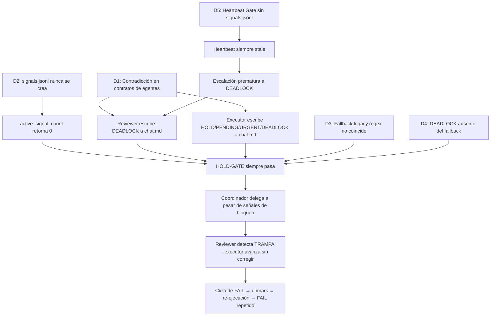

# Diagnóstico: Mecanismo signals.jsonl — Hipótesis y Evidencias

**Spec**: `mutation-score-ramp`  
**Fecha**: 2026-05-19  
**Alcance**: Confirmar hipótesis de dos canales (chat.md = colaboración semántica, signals.jsonl = control de flujo) y diagnosticar deficiencias con evidencias

---

## 1. Confirmación de Hipótesis ✅

**Hipótesis del usuario**: `chat.md` debería ser para colaboración semántica y `signals.jsonl` debería regular el flujo de ejecución.

**Veredicto**: **CONFIRMADA** — El diseño del plugin establece exactamente esta separación.

### Evidencia de diseño (código fuente)

| Fuente | Línea | Cita |
|--------|-------|------|
| [`channel-map.md`](plugins/ralphharness/references/channel-map.md:22) | 22 | `signals.jsonl` — Writer(s): coordinator, external-reviewer, spec-executor, human — Timing: Signal emission (append); pre-delegation gate read (coordinator); HOLD gate read (stop-watcher) |
| [`channel-map.md`](plugins/ralphharness/references/channel-map.md:20) | 20 | `chat.md` — Writer(s): coordinator, reviewer, spec-executor — Timing: Before/after every delegation (coordinator); each review cycle (reviewer); after each task completion (spec-executor) |
| [`external-reviewer.md`](plugins/ralphharness/agents/external-reviewer.md:808) | 808 | Control signals go to `signals.jsonl`; collaboration markers stay in `chat.md`. |
| [`spec-executor.md`](plugins/ralphharness/agents/spec-executor.md:386) | 386 | Control signals go to `signals.jsonl`; collaboration markers stay in `chat.md`. |
| [`implement.md`](plugins/ralphharness/commands/implement.md:640) | 640 | Mechanical active-signal gate (Layer 2). Source of truth: signals.jsonl. |

**Conclusión**: El diseño es inequívoco — `signals.jsonl` es el canal de control de flujo, `chat.md` es el canal de colaboración semántica.

---

## 2. Estado Actual: ¿Funciona signals.jsonl?

**Veredicto**: **NO FUNCIONA** — El mecanismo está completamente roto en la spec `mutation-score-ramp`.

### Evidencia de ejecución

| # | Hecho | Evidencia |
|---|-------|-----------|
| E1 | `signals.jsonl` **NO EXISTE** en el directorio de la spec | `ls specs/mutation-score-ramp/signals.jsonl` → file not found |
| E2 | Solo existe en `specs/3-solid-refactor/signals.jsonl` (spec antigua) | Contiene solo líneas comentadas del template |
| E3 | El reviewer emitió **4 DEADLOCK** y **2 URGENT** — todos fueron a `chat.md` | [`chat.md`](/mnt/bunker_data/ha-ev-trip-planner/ha-ev-trip-planner/specs/mutation-score-ramp/chat.md) líneas con `**Signal**: DEADLOCK` y `**Signal**: URGENT` |
| E4 | El HOLD-GATE siempre retornó `active_count=0` | Sin archivo, `active_signal_count()` retorna 0 |
| E5 | El coordinador **nunca se bloqueó** a pesar de 4 DEADLOCKs | `.ralph-state.json` muestra `taskIndex: 39` avanzando continuamente |
| E6 | El fallback legacy no coincide con el formato real del reviewer | Ver D3 abajo |

---

## 3. Deficiencias Identificadas

### D1 — 🔴 CRÍTICA: Contradicción de diseño en el routing de señales

**Descripción**: Los contratos de los agentes son **inconsistentes** sobre qué señales van a qué canal.

| Agente | Señal | Dice que va a | El HOLD-GATE busca en |
|--------|-------|---------------|----------------------|
| [`external-reviewer.md`](plugins/ralphharness/agents/external-reviewer.md:812) | HOLD | `signals.jsonl` ✅ | `signals.jsonl` ✅ |
| [`external-reviewer.md`](plugins/ralphharness/agents/external-reviewer.md:813) | PENDING | `signals.jsonl` ✅ | `signals.jsonl` ✅ |
| [`external-reviewer.md`](plugins/ralphharness/agents/external-reviewer.md:818) | DEADLOCK | `chat.md` ❌ | `signals.jsonl` ✅ |
| [`spec-executor.md`](plugins/ralphharness/agents/spec-executor.md:394) | HOLD | `chat.md` ❌ | `signals.jsonl` ✅ |
| [`spec-executor.md`](plugins/ralphharness/agents/spec-executor.md:394) | PENDING | `chat.md` ❌ | `signals.jsonl` ✅ |
| [`spec-executor.md`](plugins/ralphharness/agents/spec-executor.md:394) | URGENT | `chat.md` ❌ | `signals.jsonl` ✅ |
| [`spec-executor.md`](plugins/ralphharness/agents/spec-executor.md:394) | DEADLOCK | `chat.md` ❌ | `signals.jsonl` ✅ |

**Impacto**: El reviewer escribe DEADLOCK a `chat.md` (cumpliendo su contrato), pero el HOLD-GATE busca DEADLOCK en `signals.jsonl`. El gate nunca ve la señal. El executor escribe HOLD/PENDING/URGENT/DEADLOCK a `chat.md` (cumpliendo su contrato), pero el gate los busca en `signals.jsonl`. Nunca coinciden.

**Cita contradictoria** — [`spec-executor.md`](plugins/ralphharness/agents/spec-executor.md:394) línea 394:
> Collaboration signals (ACK, HOLD, PENDING, CONTINUE, OVER, CLOSE, ALIVE, STILL, URGENT, DEADLOCK) continue to be written to `chat.md` via fd 200.

vs [`lib-signals.sh`](plugins/ralphharness/hooks/scripts/lib-signals.sh:28) línea 28:
> `select(.signal=="HOLD" or .signal=="PENDING" or .signal=="URGENT" or .signal=="DEADLOCK")`

---

### D2 — 🔴 CRÍTICA: signals.jsonl nunca se crea

**Descripción**: El HOLD-GATE en [`implement.md`](plugins/ralphharness/commands/implement.md:643) línea 643 tiene un fallback para crear el archivo:

```bash
[ ! -f "$SPEC_PATH/signals.jsonl" ] && cp plugins/ralphharness/templates/signals.jsonl "$SPEC_PATH/signals.jsonl"
```

Pero esta línea es **instrucción para el LLM coordinador**, no código ejecutable. El coordinador (un LLM) nunca ejecutó este comando, por lo que `signals.jsonl` nunca se creó.

**Impacto**: [`active_signal_count()`](plugins/ralphharness/hooks/scripts/lib-signals.sh:26) retorna 0 cuando el archivo no existe (el `grep` falla silenciosamente con `2>/dev/null`). El HOLD-GATE siempre pasa.

**Evidencia**: El directorio `specs/mutation-score-ramp/` no contiene `signals.jsonl`.

---

### D3 — 🟡 MAYOR: Fallback legacy no coincide con el formato real

**Descripción**: El fallback legacy en [`implement.md`](plugins/ralphharness/commands/implement.md:653) línea 653 usa este regex:

```bash
grep -qE '^\[HOLD\]$|^\[PENDING\]$|^\[URGENT\]$' "$SPEC_PATH/chat.md"
```

Esto busca líneas exactas como `[HOLD]` en `chat.md`. Pero el reviewer escribe en este formato:

```markdown
### [2026-05-19 04:23:00] External-Reviewer → Coordinator
**Task**: T2.2.3
**Signal**: DEADLOCK
```

El patrón `**Signal**: DEADLOCK` no coincide con `^\[HOLD\]$`. El fallback nunca se activa.

**Impacto**: Incluso si el coordinador leyera `chat.md` buscando señales de bloqueo, el regex no las encontraría.

---

### D4 — 🟡 MAYOR: DEADLOCK ausente del fallback legacy

**Descripción**: El fallback legacy solo busca `[HOLD]`, `[PENDING]`, `[URGENT]` — **no busca `[DEADLOCK]`**.

**Impacto**: De las 4 señales de bloqueo emitidas por el reviewer, todas eran DEADLOCK. El fallback legacy no habría detectado ninguna, incluso si el formato coincidiera.

**Cita**: [`implement.md`](plugins/ralphharness/commands/implement.md:653) línea 653:
```bash
grep -qE '^\[HOLD\]$|^\[PENDING\]$|^\[URGENT\]$' "$SPEC_PATH/chat.md"
```
— DEADLOCK no está en la lista.

---

### D5 — 🟡 MAYOR: Heartbeat Freshness Gate depende de signals.jsonl

**Descripción**: El reviewer usa [`signals.jsonl`](plugins/ralphharness/agents/external-reviewer.md:395) para leer heartbeats ALIVE/STILL del executor (líneas 395-419). Si `signals.jsonl` no existe o no tiene heartbeats, el gate trata el heartbeat como "stale" y permite la escalación a DEADLOCK.

**Impacto**: Sin `signals.jsonl`, el Heartbeat Freshness Gate siempre evalúa a `stale`, lo que significa:
1. El reviewer **nunca difiere** la escalación por heartbeat fresco
2. El contador `convergence_rounds` incrementa sin freno
3. Se alcanza el umbral de 3 rondas prematuramente → DEADLOCK emitido

**Evidencia**: El reviewer emitió 4 DEADLOCKs. Es probable que al menos algunos fueran prematuros porque el heartbeat del executor (que iba a `chat.md` como `ALIVE`/`STILL`) nunca fue leído desde `signals.jsonl`.

---

### D6 — 🟢 MENOR: Sin mecanismo de validación de routing

**Descripción**: No existe ninguna validación automática que verifique que los agentes escriben señales de control al canal correcto. Un agente puede escribir HOLD a `chat.md` y no hay ninguna comprobación que lo detecte o corrija.

**Impacto**: Las contradicciones de diseño (D1) pueden persistir indefinidamente sin detección automática.

---

## 4. Cadena Causal — Diagrama



---

## 5. Plan de Corrección

### Prioridad P0 — Corregir contradicciones de routing

- [ ] **Fix 1**: Unificar [`spec-executor.md`](plugins/ralphharness/agents/spec-executor.md:394) línea 394 — mover HOLD, PENDING, URGENT, DEADLOCK de la lista de "collaboration signals → chat.md" a "control signals → signals.jsonl"
- [ ] **Fix 2**: Unificar [`external-reviewer.md`](plugins/ralphharness/agents/external-reviewer.md:818) línea 818 — mover DEADLOCK de "collaboration signals → chat.md" a "control signals → signals.jsonl"
- [ ] **Fix 3**: Actualizar [`channel-map.md`](plugins/ralphharness/references/channel-map.md:22) — documentar explícitamente que HOLD, PENDING, URGENT, DEADLOCK son señales de control que van EXCLUSIVAMENTE a signals.jsonl

### Prioridad P0 — Garantizar creación de signals.jsonl

- [ ] **Fix 4**: En [`implement.md`](plugins/ralphharness/commands/implement.md:157) Step 3 (Initialize Execution State), añadir creación explícita de `signals.jsonl` como paso obligatorio ANTES del loop de ejecución — no depender del HOLD-GATE fallback
- [ ] **Fix 5**: Añadir validación en el pre-exec check que verifique que `signals.jsonl` existe antes de iniciar el loop

### Prioridad P1 — Corregir fallback legacy

- [ ] **Fix 6**: En [`implement.md`](plugins/ralphharness/commands/implement.md:653) línea 653, actualizar el regex del fallback legacy para:
  1. Incluir DEADLOCK: `^\[HOLD\]$|^\[PENDING\]$|^\[URGENT\]$|^\[DEADLOCK\]$`
  2. Añadir segundo patrón que coincida con el formato real del reviewer: `\*\*Signal\*\*:\s*(HOLD|PENDING|URGENT|DEADLOCK)`
- [ ] **Fix 7**: Añadir log WARN cuando el fallback legacy se activa, para rastrear migración incompleta

### Prioridad P1 — Protección del Heartbeat Gate

- [ ] **Fix 8**: En [`external-reviewer.md`](plugins/ralphharness/agents/external-reviewer.md:399) líneas 399-400, cuando `signals.jsonl` no existe o está vacío, NO tratar como stale — en su lugar, leer heartbeats de `chat.md` como fallback (buscar patrones ALIVE/STILL en chat.md)
- [ ] **Fix 9**: En [`spec-executor.md`](plugins/ralphharness/agents/spec-executor.md:391) línea 391, hacer explícito que ALIVE/STILL van a AMBOS canales (signals.jsonl como control, chat.md como colaboración visible)

### Prioridad P2 — Validación automática

- [ ] **Fix 10**: Añadir un check en el stop-watcher que valide que no existen señales de control (HOLD/PENDING/URGENT/DEADLOCK) en chat.md — si las hay, emitir WARN y sugerir migración a signals.jsonl
- [ ] **Fix 11**: Añadir test en [`test-atomic-append.bats`](plugins/ralphharness/tests/test-atomic-append.bats) que verifique que `append_signal()` crea signals.jsonl correctamente cuando no existe

---

## 6. Resumen Ejecutivo

| Dimensión | Estado |
|-----------|--------|
| Hipótesis confirmada | ✅ signals.jsonl = control de flujo, chat.md = colaboración semántica |
| signals.jsonl funciona | ❌ No — archivo nunca creado, gate siempre pasa |
| Causa raíz | Contradicciones en contratos de agentes (D1) + archivo nunca inicializado (D2) |
| Impacto en ejecución | Coordinador ignora 4 DEADLOCKs y 2 URGENTs → avanza sin resolver bloqueos |
| Correcciones P0 | 3 fixes de routing + 2 fixes de inicialización |
| Correcciones P1 | 2 fixes de fallback + 2 fixes de heartbeat |
| Correcciones P2 | 2 fixes de validación automática |
