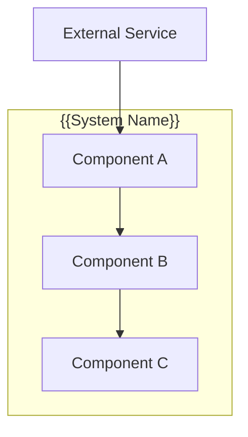
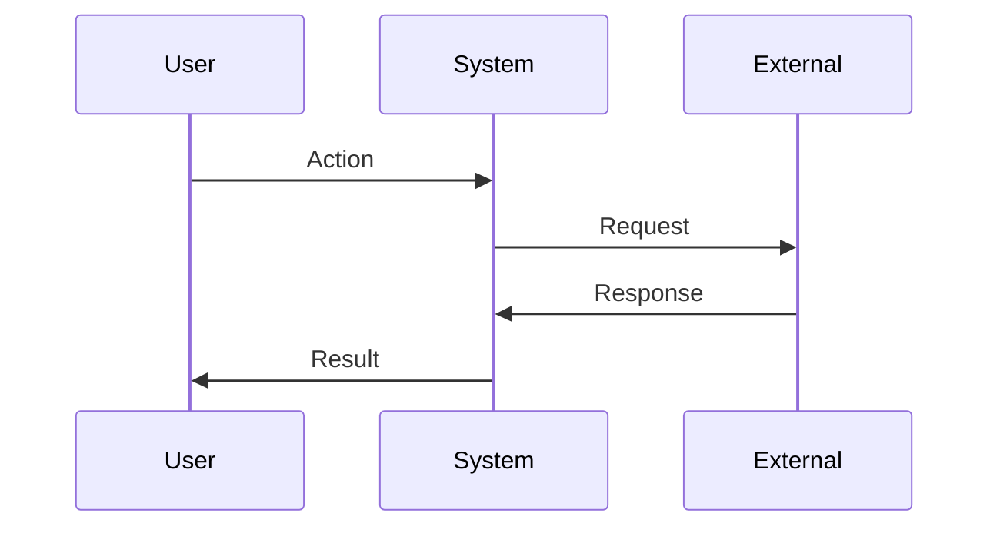

# Design: {{FEATURE_NAME}}

## Overview

{{Technical approach summary in 2-3 sentences}}

## Architecture

### Component Diagram



### Components

#### Component A
**Purpose**: {{What this component does}}
**Responsibilities**:
- {{Responsibility 1}}
- {{Responsibility 2}}

#### Component B
**Purpose**: {{What this component does}}
**Responsibilities**:
- {{Responsibility 1}}
- {{Responsibility 2}}

### Data Flow



1. {{Step one of data flow}}
2. {{Step two}}
3. {{Step three}}

## Technical Decisions

| Decision | Options Considered | Choice | Rationale |
|----------|-------------------|--------|-----------|
| {{Decision 1}} | A, B, C | B | {{Why B was chosen}} |
| {{Decision 2}} | X, Y | X | {{Why X was chosen}} |

## File Structure

| File | Action | Purpose |
|------|--------|---------|
| {{src/path/file.ts}} | Create | {{Purpose}} |
| {{src/path/existing.ts}} | Modify | {{What changes}} |

## Interfaces

```typescript
interface {{ComponentInput}} {
  {{param}}: {{type}};
}

interface {{ComponentOutput}} {
  success: boolean;
  result?: {{type}};
  error?: string;
}
```

## Error Handling

| Error Scenario | Handling Strategy | User Impact |
|----------------|-------------------|-------------|
| {{Scenario 1}} | {{How handled}} | {{What user sees}} |
| {{Scenario 2}} | {{How handled}} | {{What user sees}} |

## Edge Cases

- **{{Edge case 1}}**: {{How handled}}
- **{{Edge case 2}}**: {{How handled}}

## Dependencies

| Package | Version | Purpose |
|---------|---------|---------|
| {{package}} | {{version}} | {{purpose}} |

## Security Considerations

- {{Security requirement or approach}}

## Performance Considerations

- {{Performance approach or constraint}}

## Test Strategy

<!-- MANDATORY: architect-reviewer must fill every row before marking design complete.
     spec-executor reads this section before writing any test file.
     An empty or vague Test Strategy causes spec-executor to ESCALATE. -->

### Mock Boundary

| Layer | Mock allowed? | Rationale |
|---|---|---|
| Own business logic | ❌ NEVER | Must test real implementation |
| Own utility functions | ❌ NEVER | Must test real implementation |
| Internal modules imported by SUT | ❌ NEVER | Use real imports, test real wiring |
| Database / ORM | ✅ YES (integration tests use real DB) | External I/O |
| External HTTP APIs | ✅ YES | Network unavailable in unit tests |
| Email / SMS / push | ✅ YES | Side effects |
| {{Add project-specific rows}} | {{?}} | {{Rationale}} |

> Rule: if it lives in this repo and is not an I/O boundary, it is NOT mockable.

### Test Coverage Table

| Component / Function | Test type | What to assert | Mocks needed |
|---|---|---|---|
| {{ComponentA.methodX}} | unit | {{Returns expected value for input Y}} | none |
| {{ComponentA → ExternalService}} | integration | {{HTTP call made with correct payload}} | mock ExternalService |
| {{User flow: action → result}} | e2e | {{URL changes, user sees expected state}} | none (real browser) |

Test types:
- **unit**: pure logic, no I/O, runs in <10ms. Mock only true I/O boundaries.
- **integration**: two or more real modules wired together, may use test DB/server.
- **e2e**: full browser/API flow. No mocks. Uses real environment.

### Skip Policy

Tests marked `.skip` / `xit` / `xdescribe` / `test.skip` are FORBIDDEN unless:
1. The functionality is not yet implemented
2. A GitHub issue reference is in the skip reason: `it.skip('TODO: #123 — reason', ...)`

### Test File Conventions

<!-- Fill from codebase scan — do NOT leave as template text -->

- Test runner: {{vitest / jest / ...}}
- Test file location: {{co-located `*.test.ts` / `__tests__/` / ...}}
- Integration test pattern: {{e.g. `*.integration.test.ts`}}
- E2E test pattern: {{e.g. `*.e2e.ts` / Playwright spec files}}
- Mock cleanup: {{afterEach with mockClear/mockReset / vi.restoreAllMocks}}

## Existing Patterns to Follow

Based on codebase analysis:
- {{Pattern 1 found in codebase}}
- {{Pattern 2 to maintain consistency}}
