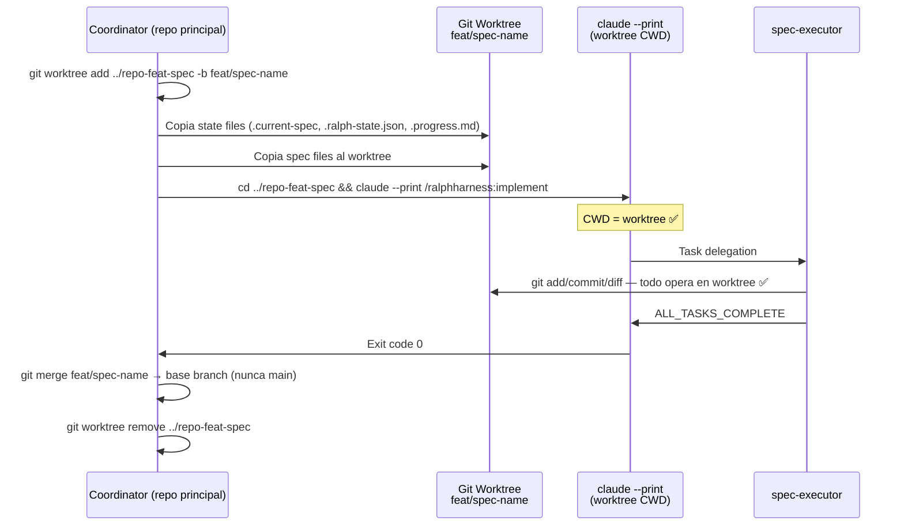

# Snap Mode — Worktree-Based Agent Isolation

> Reference for implementing automatic worktree-based isolation for spec execution.
> Used by: implement.md (snap mode flag), coordinator-pattern.md (process spawning).

## Overview

Snap Mode is a workflow where the coordinator:
1. Creates a git worktree for the spec's feature branch
2. Spawns a **separate Claude Code process** in the worktree directory
3. Waits for execution to complete
4. Merges the worktree branch back to the spec's base branch (never to main)
5. Cleans up the worktree

The key insight is that Claude Code's Task tool subagents inherit the parent's CWD.
To achieve worktree isolation, we must spawn a **separate Claude Code process**
with CWD = worktree directory — not try to delegate to a subagent within the same session.

## Why Separate Process?

| Approach | CWD | Git ops | basePath | Veredicto |
|----------|-----|--------|---------|-----------|
| Task tool subagent (same CWD) | Repo principal | Repo principal | Puede ser path absoluto | ❌ No aísla |
| Spawn proceso separado | Worktree | Worktree | Relative → resuelve en worktree | ✅ Aislamiento completo |

Git operations (`git add`, `git commit`, `git diff`) operan sobre el index/HEAD del CWD actual.
No hay forma de redirigirlas via basePath — necesitan CWD = worktree.

## Implementation: Snap Mode Coordinator

### Flag Detection

In `implement.md`, detect `--snap` flag:

```bash
# Parse --snap flag
SNAP_MODE=false
case "$ARGUMENTS" in
  *--snap*) SNAP_MODE=true ;;
esac
```

### Snap Mode Flow



### Core Script: `snap-worktree.sh`

```bash
#!/usr/bin/env bash
# snap-worktree.sh — Creates worktree, spawns Claude Code, merges, cleans up
set -euo pipefail

SPEC_NAME="$1"
WORKTREE_PATH="${2:-../smart-ralph-$SPEC_NAME}"
BRANCH_NAME="feat/$SPEC_NAME"

# 1. Create worktree
echo "[snap] Creating worktree at $WORKTREE_PATH on branch $BRANCH_NAME"
git worktree add "$WORKTREE_PATH" -b "$BRANCH_NAME"

# 2. Copy spec state files
WORKTREE_SPECS="$WORKTREE_PATH/specs"
mkdir -p "$WORKTREE_SPECS"

# Copy .current-spec if exists
if [ -f "specs/.current-spec" ]; then
  cp "specs/.current-spec" "$WORKTREE_SPECS/.current-spec"
fi

# Copy full spec directory
if [ -d "specs/$SPEC_NAME" ]; then
  cp -r "specs/$SPEC_NAME" "$WORKTREE_SPECS/"
fi

# 3. Spawn Claude Code in worktree
echo "[snap] Spawning Claude Code in worktree..."
WORKTREE_CWD="$(pwd)/$WORKTREE_PATH"
cd "$WORKTREE_PATH"

# Launch Claude Code with --print for non-interactive execution
# The --print flag outputs the final message to stdout and exits
claude --print --model "${CLAUDE_MODEL:-claude-sonnet-4-20250514}" \
  "/ralphharness:implement --spec $SPEC_NAME" 2>&1 | tee /tmp/snap-exec.log

EXIT_CODE=${PIPESTATUS[0]}

# 4. Post-execution: merge and cleanup
if [ $EXIT_CODE -eq 0 ]; then
  echo "[snap] Execution complete. Merging branch..."
  
  # Get the base branch (the branch we're merging INTO, not main)
  # This should be the branch that existed before we created feat/$SPEC_NAME
  BASE_BRANCH=$(git show-branch --merge-base "$BRANCH_NAME" HEAD 2>/dev/null | \
    git branch --contains 2>/dev/null | grep -v "$BRANCH_NAME" | head -1)
  
  # Merge worktree branch into base branch (never main)
  if [ -z "$BASE_BRANCH" ]; then
    echo "[snap] ERROR: Could not auto-detect base branch. BRANCH_NAME=$BRANCH_NAME"
    echo "[snap] Please ensure the worktree branch has a valid merge base."
    exit 1
  fi
  
  if [ "$BASE_BRANCH" = "main" ]; then
    echo "[snap] ERROR: Cannot merge to main branch. BASE_BRANCH=$BASE_BRANCH, BRANCH_NAME=$BRANCH_NAME"
    exit 1
  fi
  
  git checkout "$BASE_BRANCH"
  git merge --squash "$BRANCH_NAME"
  git branch -d "$BRANCH_NAME"  # Safe delete (merged)
  
  # Cleanup worktree
  git worktree remove "$WORKTREE_PATH"
  echo "[snap] Done. Worktree removed."
else
  echo "[snap] Execution failed with exit code $EXIT_CODE"
  echo "[snap] Worktree preserved at $WORKTREE_PATH for debugging"
  exit $EXIT_CODE
fi
```

### Monitoring for Completion

Instead of waiting on a single process, the coordinator can poll for completion:

```bash
# Polling approach (alternative to blocking --print)
(
  cd "$WORKTREE_PATH"
  claude --print "/ralphharness:implement --spec $SPEC_NAME" &
  CLAUDE_PID=$!
  
  # Poll for ALL_TASKS_COMPLETE in transcript
  while kill -0 $CLAUDE_PID 2>/dev/null; do
    if grep -q "ALL_TASKS_COMPLETE" /tmp/snap-exec.log 2>/dev/null; then
      kill $CLAUDE_PID 2>/dev/null || true
      break
    fi
    sleep 30
  done
  
  wait $CLAUDE_PID
  EXIT_CODE=$?
)
```

### State File Sync

After snap execution, state files in the worktree need to be synced back:

```bash
# After execution, copy updated state files back to main repo
if [ -f "$WORKTREE_PATH/specs/$SPEC_NAME/.ralph-state.json" ]; then
  cp "$WORKTREE_PATH/specs/$SPEC_NAME/.ralph-state.json" \
     "specs/$SPEC_NAME/.ralph-state.json"
fi

if [ -f "$WORKTREE_PATH/specs/$SPEC_NAME/.progress.md" ]; then
  cp "$WORKTREE_PATH/specs/$SPEC_NAME/.progress.md" \
     "specs/$SPEC_NAME/.progress.md"
fi

# Commit the merged changes
git add "specs/$SPEC_NAME/"
git diff --cached --quiet || git commit -m "feat($SPEC_NAME): merge from snap mode"
```

## Critical Rules

### NEVER Merge to Main

The snap mode merge target is **always the spec's base branch, never main**:

| Scenario | Merge target |
|----------|--------------|
| Spec branch from main | `main` (BUT wrapped in feature branch first) |
| Spec branch from feat/base | `feat/base` |
| Spec branch from develop | `develop` |

The rule: "el worktree trabaja en la rama de la spec. cuando acaba hace el merge de su rama con la misma rama de worktree principal"

This means:
- Worktree branch: `feat/my-spec`
- Merge target: The branch that `feat/my-spec` was branched from (e.g., `main`, `develop`, `feat/base`)
- NEVER: `git merge feat/my-spec into main`

### Merge Strategy: `--squash`

Use `git merge --squash feat/spec-name` to squash all commits into one,
keeping the history clean while avoiding many small commits in the base branch.

### Cleanup Always

Use `git worktree remove <path>` after successful merge.
The worktree should not persist after execution unless there was a failure.

## Exit Codes

| Code | Meaning |
|------|---------|
| 0 | Execution succeeded, merge and cleanup complete |
| 1 | Execution failed, worktree preserved for debugging |
| 2 | Worktree creation failed |
| 3 | Merge failed, requires manual intervention |

## Error Handling

### If Claude Code process hangs

```bash
TIMEOUT_SECONDS=3600  # 1 hour
(
  cd "$WORKTREE_PATH"
  timeout $TIMEOUT_SECONDS claude --print "/ralphharness:implement" 2>&1 | tee /tmp/snap-exec.log
)
if [ $? -eq 124 ]; then
  echo "[snap] TIMEOUT: Execution exceeded $TIMEOUT_SECONDS seconds"
  # Worktree preserved for manual cleanup
fi
```

### If worktree already exists

```bash
if git worktree list | grep -q "$WORKTREE_PATH"; then
  echo "[snap] Worktree already exists at $WORKTREE_PATH"
  read -p "Remove and recreate? [y/N] " -r
  if [[ $REPLY =~ ^[Yy]$ ]]; then
    git worktree remove "$WORKTREE_PATH" --force
  else
    echo "[snap] Aborting snap mode"
    exit 1
  fi
fi
```

## Integration Points

### In `implement.md`

Add snap mode flag handling after Step 2 (Parse Arguments):

```bash
if [ "$SNAP_MODE" = true ]; then
  echo "[snap] Starting snap mode for spec $SPEC_NAME"
  exec bash "$CLAUDE_PLUGIN_ROOT/hooks/scripts/snap-worktree.sh" "$SPEC_NAME" "$WORKTREE_PATH"
fi
```

### In `coordinator-pattern.md`

Add a note about CWD in Task tool delegation:

> **Snap Mode Note**: When running in snap mode, the coordinator does NOT delegate via Task tool.
> Instead, it spawns a separate Claude Code process in the worktree. The Task tool's CWD inheritance
> means subagents cannot achieve worktree isolation — only a separate process with CWD = worktree can.

## Relationship to harness-evolver

The `harness-evolver` project (referenced in docs/harness-engineering/09-reference-implementations.md)
already uses worktrees for multi-agent proposer isolation:

> "Multi-agent proposers in isolated git worktrees: Cada propuesta de cambio al harness corre en aislamiento"

Snap Mode applies the same pattern to RalphHarness spec execution.

## Related Files

- `references/branch-management.md` — Worktree creation logic (Step 3, option 2)
- `hooks/scripts/snap-worktree.sh` — Core snap mode script (to be created)
- `commands/implement.md` — Snap mode flag detection
- `coordinator-pattern.md` — Note about CWD and Task tool delegation