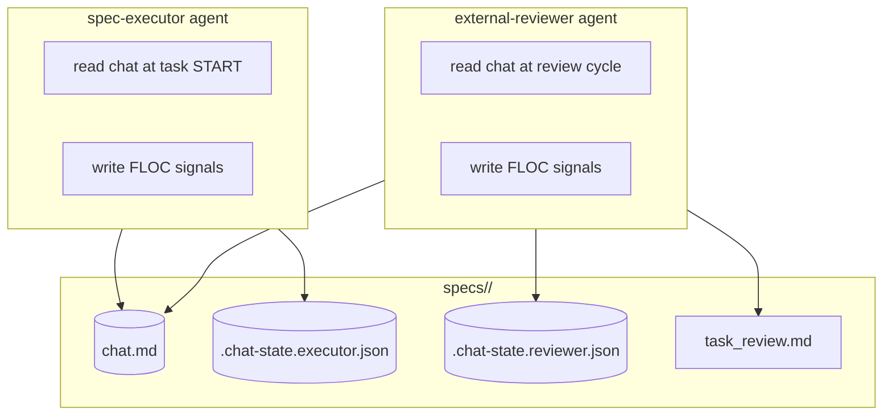
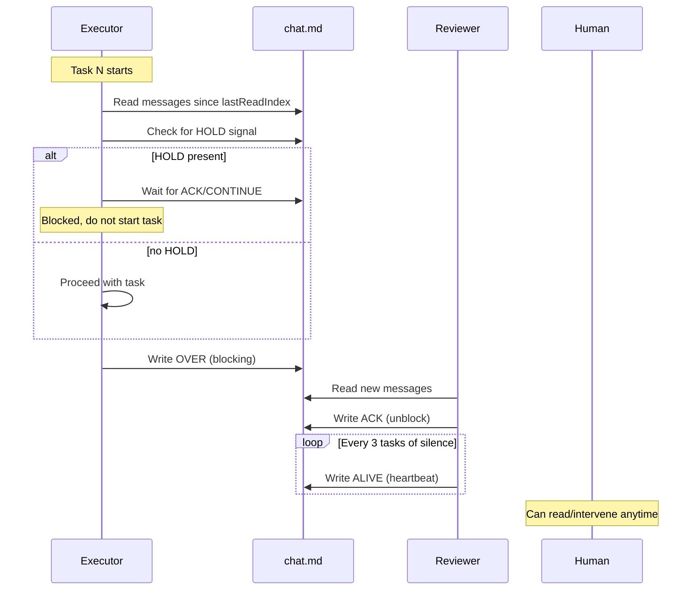

# Design: agent-chat-protocol

## Overview

A filesystem-based bidirectional chat channel between executor and reviewer using FLOC (Floor Control for Agent Collaboration) signals to resolve 5 communication gaps. Chat accumulates across the spec lifetime as human-readable markdown, coexisting with the formal `task_review.md` channel. Executor reads chat at task START only; reviewer reads at each review cycle. Atomic writes via temp-file+rename prevent corruption.

## Architecture

### System Boundary



### Data Flow



## Component: Chat Channel

### Responsibilities
- Accumulate all messages in append-only order
- Preserve human-readable format for direct reading
- Prevent concurrent write corruption via atomic writes
- Support future rotation (archive old chat, start new)

### State
No central state. Each agent tracks its own position via `.chat-state.{agent}.json`.

### Interface

**Write a message:**
1. Write content to `chat.tmp.{agent}.{timestamp}`
2. Read current `chat.md` line count to determine append position
3. Atomic rename `chat.tmp.{agent}.{timestamp}` → `chat.md`
4. Update `lastReadIndex` in `.chat-state.{agent}.json` (atomic write)

**Read new messages:**
1. Read `.chat-state.{agent}.json` → `lastReadIndex`
2. Read `chat.md` lines from `lastReadIndex + 1` to end
3. Update `lastReadIndex` to new end

## Component: Per-Agent State (inside .ralph-state.json)

Following the established pattern in the repo (`jq ... > /tmp/state.json && mv /tmp/state.json .ralph-state.json`), the per-agent chat state is stored inside `.ralph-state.json` rather than separate files. This avoids creating 2 new files and uses the existing atomic write pattern both agents already use for shared state.

### Schema: `chat` field inside `.ralph-state.json`

```json
{
  "source": "spec",
  "name": "agent-chat-protocol",
  "phase": "execution",
  "taskIndex": 5,
  "chat": {
    "executor": {
      "lastReadIndex": 42,
      "lastSignal": "OVER",
      "lastSignalTask": "2.4",
      "stillTtl": 0
    },
    "reviewer": {
      "lastReadIndex": 38,
      "lastSignal": "ALIVE",
      "lastSignalTask": "2.1",
      "pendingIntentFail": null
    }
  }
}
```

| Field | Type | Description |
|-------|------|-------------|
| `chat.executor.lastReadIndex` | integer | 0-indexed line number of last read message |
| `chat.executor.lastSignal` | string | Last FLOC signal written or received |
| `chat.executor.lastSignalTask` | string | task-ID where signal was sent |
| `chat.executor.stillTtl` | integer | Tasks remaining before alarm (max 3, resets on any signal) |
| `chat.reviewer.lastReadIndex` | integer | 0-indexed line number of last read message |
| `chat.reviewer.lastSignal` | string | Last FLOC signal written or received |
| `chat.reviewer.lastSignalTask` | string | task-ID where signal was sent |
| `chat.reviewer.pendingIntentFail` | string | null or task-ID with active INTENT-FAIL (1-task window) |

### Atomic Write Pattern

Each agent writes only its own `chat.{executor|reviewer}` subsection using the established pattern:

```bash
# Executor updates its chat state
jq --argjson idx 42 --arg signal "OVER" --arg task "2.4" \
  '.chat.executor.lastReadIndex = $idx | .chat.executor.lastSignal = $signal | .chat.executor.lastSignalTask = $task' \
  .ralph-state.json > /tmp/state.json && mv /tmp/state.json .ralph-state.json
```

**Collision safety**: Executor writes `taskIndex` at end of each task; reviewer writes `external_unmarks`. Both agents already share `.ralph-state.json` today without collision. Adding per-agent `chat` subsections follows the same pattern — each agent writes its own subsection only.

## FLOC Signal State Machine

### Signal Taxonomy

| Signal | Direction | Blocking? | TTL | Description |
|--------|-----------|-----------|-----|-------------|
| OVER | executor → reviewer | Yes (1 task then CONTINUE) | — | Request for response |
| ACK | reviewer → executor | No | — | Processing, unblocks |
| CONTINUE | reviewer → executor | No | — | No response needed, proceed |
| HOLD | reviewer → executor | Yes (pre-task gate) | — | Block next task start |
| STILL | reviewer → executor | No | 3 tasks | Intentionally silent, working |
| ALIVE | reviewer → executor | No | — | Heartbeat, resets STILL TTL |
| CLOSE | reviewer → executor | No | — | Debate resolved, thread closed |
| URGENT | reviewer → executor | Yes (breaks boundary) | — | Critical issue, cannot wait |
| DEADLOCK | executor ↔ reviewer | Yes (human escalation) | — | Neither can resolve |
| INTENT-FAIL | reviewer → executor | No | 1 task | Pre-FAIL warning, executor can correct |

### State Transitions

```mermaid
stateDiagram-v2
    [*] --> UNKNOWN: chat.md exists with ≥1 message
    UNKNOWN --> ACTIVE: First FLOC signal sent
    ACTIVE --> ACTIVE: Any signal
    ACTIVE --> BLOCKED: OVER sent (awaiting response)
    BLOCKED --> ACTIVE: ACK or CONTINUE or CLOSE received
    BLOCKED --> ACTIVE: 1 task passed without response (auto-CONTINUE)
    ACTIVE --> HELD: HOLD received (pre-task gate)
    HELD --> ACTIVE: ACK or CONTINUE received
    ACTIVE --> ESCALATED: DEADLOCK written
    ESCALATED --> [*]: Human resolves

    note for BLOCKED: "OVER timeout = 1 task cycle"
    note for HELD: "HOLD read at task START only, not mid-execution"
    note for ESCALATED: "Execution pauses until human resolves"
```

### Signal Sequencing Rules

1. **OVER** must receive **ACK**, **CONTINUE**, or **CLOSE** within 1 task cycle or auto-proceed
2. **INTENT-FAIL** → 1 task window → FAIL written to task_review.md if not corrected
3. **STILL** counter resets on ANY signal (OVER, ACK, CONTINUE, ALIVE, etc.)
4. **ALIVE** sent every 3 tasks of silence (when STILL TTL would expire)
5. **HOLD** is invisible until next task boundary (never interrupts mid-task)
6. **URGENT** boundary is after current qa-engineer delegation completes (not during Task tool call)

## Atomic Write Implementation

### Pattern: Temp File + Atomic Rename

```bash
# Step 1: Compose message to temp file
cat > chat.tmp.executor.1712512325 << 'EOF'
### [executor → reviewer] 14:32:05 | task-2.4 | OVER

Why does the authentication token expire after 30 minutes?
EOF

# Step 2: Read current line count for append position
lines=$(wc -l < chat.md)

# Step 3: Read temp file content and append to chat.md using cat redirect (not >>)
# The rename below is the atomic operation
cat chat.md chat.tmp.executor.1712512325 > chat.md.tmp
mv chat.md.tmp chat.md

# Step 4: Clean up temp file
rm -f chat.tmp.executor.1712512325

# Step 5: Update lastReadIndex atomically
jq --argjson idx $lines '{agent: "executor", lastReadIndex: $idx, lastSignal: "OVER", lastSignalTask: "2.4", stillTtl: 0, updatedAt: now | todate}' > /tmp/chat-state.tmp.json
mv /tmp/chat-state.tmp.json .chat-state.executor.json
```

### Alternative (Single Write, No Concatenation)

For lower file size risk, use a single append that guarantees atomicity:

```bash
# Write message to temp, then atomic rename into chat.md
# chat.md is append-only — we never modify existing lines
cat > chat.tmp.executor.1712512325 << 'EOF'
### [executor → reviewer] 14:32:05 | task-2.4 | OVER

Why does the authentication token expire after 30 minutes?
EOF
mv chat.tmp.executor.1712512325 chat.md
```

**Constraint**: `rename(2)` is atomic on the same filesystem. `chat.md` and temp file MUST be in the same directory.

### Concurrent Write Safety

If two agents write simultaneously:
1. Agent A writes `chat.tmp.executor.{tsA}` → rename to `chat.md`
2. Agent B writes `chat.tmp.reviewer.{tsB}` → rename to `chat.md`
3. Both renames are atomic; one completes first
4. Result: messages from both agents appear in chat.md (ordering non-deterministic but no corruption)

**What MUST NOT happen**: Direct append (`>>`) without atomic rename. This can interleave writes on some filesystems.

## Chat Template

### File: `specs/<specName>/chat.md`

```markdown
# Chat — agent-chat-protocol

Human-readable bidirectional chat channel between executor and reviewer.
FLOC signals govern turn-taking, acknowledgment, and status.
Human can read and intervene at any time. Human voice is always final.

## Signals Legend

| Signal | Direction | Blocking | TTL | Purpose |
|--------|-----------|----------|-----|---------|
| OVER | executor→reviewer | Yes (1 task) | — | Request response |
| ACK | reviewer→executor | No | — | Processing, unblocks |
| CONTINUE | reviewer→executor | No | — | Proceed |
| HOLD | reviewer→executor | Yes (pre-task gate) | — | Block next task |
| STILL | reviewer→executor | No | 3 tasks | Intentionally silent |
| ALIVE | reviewer→executor | No | — | Heartbeat |
| CLOSE | reviewer→executor | No | — | Debate resolved |
| URGENT | reviewer→executor | Yes (breaks boundary) | — | Critical issue |
| DEADLOCK | bidirectional | Yes (human) | — | Escalation |
| INTENT-FAIL | reviewer→executor | No | 1 task | Pre-FAIL warning |

## Messages

<!-- Messages accumulate here. Append only. Do not edit or delete. -->

```

### Message Format (per entry)

```
### [<writer> → <addressee>] <HH:MM:SS> | <task-ID> | <SIGNAL>

<message body>
```

**Examples:**
```
### [executor → reviewer] 14:32:05 | task-2.4 | OVER

Why does the authentication token expire after 30 minutes? The spec says 60.

### [reviewer → executor] 14:33:41 | task-2.4 | ACK

Investigating. The token expiry is configurable — let me check the env var.

### [reviewer → executor] 14:35:12 | task-2.4 | CONTINUE

The 30-minute default is from the auth library. It's configurable via AUTH_TOKEN_TTL.
No change needed — your implementation is correct.
```

### CLOSE Thread Example

```
### [reviewer → executor] 14:40:00 | task-2.7 | OVER

The error handling in auth.ts does not match the spec's Fail-Fast requirement.
Line 45 catches Exception and logs without re-raising — this suppresses failures.

### [executor → reviewer] 14:41:30 | task-2.7 | CONTINUE

Understood. Will refactor to re-raise after logging.

### [reviewer → executor] 14:45:00 | task-2.7 | CLOSE

Your refactor on line 47 now re-raises after logging. Fail-Fast satisfied.
Thread closed.
```

## File Structure

| File | Action | Purpose |
|------|--------|---------|
| `specs/<specName>/chat.md` | **CREATE** | Shared chat channel |
| `.ralph-state.json` | **MODIFY** | Add `chat` field with per-agent lastReadIndex and signal state |
| `plugins/ralph-specum/templates/chat.md` | **CREATE** | Chat template for new specs |
| `plugins/ralph-specum/agents/spec-executor.md` | **MODIFY** | Add Chat Protocol section: read at task START, respect HOLD |
| `plugins/ralph-specum/agents/external-reviewer.md` | **MODIFY** | Implement FLOC signals: ALIVE, INTENT-FAIL, CLOSE, URGENT, DEADLOCK |
| `specs/<specName>/task_review.md` | No change | Remains authoritative formal channel |

### Files that DO NOT Change
- `task_review.md` template — stays as formal PASS/FAIL/WARNING channel

## Error Handling

| Failure | Detection | Recovery |
|---------|-----------|----------|
| Append collision (garbled text) | Message format check: each entry starts with `### [` | Stop both agents. Human repairs chat.md manually. Resume after repair. |
| Temp file orphaned (rename failed) | Temp file exists but no corresponding entry in chat.md | Clean up temp file. Re-write the message. |
| State file corrupted (invalid JSON) | `jq .` fails on `.ralph-state.json` | Overwrite the `chat` subsection with defaults: `jq '.chat = {executor: {lastReadIndex: 0}, reviewer: {lastReadIndex: 0}}'` (reset positions to 0) |
| lastReadIndex ahead of actual lines | State file line count > chat.md actual lines | Reset to `wc -l chat.md` |
| Chat file missing at read time | File does not exist | Executor: proceed without chat (FR-1). Reviewer: skip chat read. |
| BLOCKED state timeout (no ACK/CONTINUE) | 1 task passes without response to OVER | Auto-proceed as CONTINUE. Log in .progress.md. |
| STILL TTL exhausted (3 tasks no signal) | stillTtl reaches 0 | Executor raises alarm. Write DEADLOCK. Human must respond. |
| URGENT during qa-engineer delegation | qa-engineer is active in executor session | Queue URGENT; apply after delegation completes (FR-10 boundary) |
| INTENT-FAIL window expired | 1 task passed after INTENT-FAIL | Reviewer writes FAIL to task_review.md |
| qa-engineer chat participation | Message written by qa-engineer in chat | Silently ignore — qa-engineer has no session, cannot write |
| Human intervention conflict | Human writes to chat while agents active | Human voice is final. All agents respect human messages. |

## Test Strategy

### Test Discovery

**Runner**: vitest (Node.js)
**Test file location**: Co-located `*.test.ts` with source
**Test commands** (from package.json):
- Unit: `npm run test` / `vitest run src/`
- Integration: `vitest run --config vitest.integration.config.ts`

Current commands available:
```bash
npm test 2>&1 | head -5  # smoke run
```

### Test Double Policy

| Component | Unit test | Integration test | Rationale |
|---|---|---|---|
| `chat.md` (file I/O) | Stub (mock fs operations) | Fake file with temp dir | External I/O boundary |
| `ChatWriter` (atomic write) | Real (test temp file + rename) | Fake filesystem | Own logic, must verify atomicity |
| `ChatReader` (read + index update) | Real | Fake filesystem | Own logic |
| PerAgentState JSON | Real (test jq pattern) | Fake temp dir | Own serialization |
| FLOC state machine | Unit (pure transitions) | Stub (mock signals) | Pure logic |

### Mock Boundary

| Component | Unit | Integration | Rationale |
|---|---|---|---|
| Filesystem (chat.md read/write) | Stub (mock `readFile`, `writeFile`) | Fake (tempfs) | I/O boundary |
| External reviewer agent | Mock (verify FLOC signals sent) | Stub (fake chat file) | Can't run real reviewer |
| spec-executor agent | Mock (verify HOLD respected) | Stub (fake chat file) | Can't run real executor |
| Human intervention | None (not testable) | Fixture (pre-written human message) | Manual action |

### Fixtures & Test Data

| Component | Required state | Form |
|---|---|---|
| `ChatWriter` | Empty chat, one message exists | `chat.md` fixture file with 1-2 messages |
| `ChatReader` | Messages at known indices | Factory function `buildChatMessages(n)` |
| `StateFile` | Valid JSON, corrupted JSON, missing | Fixture files in `fixtures/` |
| FLOC state machine | ACTIVE, BLOCKED, HELD, ESCALATED | Inline constants |
| Concurrent writes | Two agents writing simultaneously | Test with `Promise.all` + temp files |

### Test Coverage Table

| Component / Function | Test type | What to assert | Test double |
|---|---|---|---|
| `ChatWriter.write()` with clean state | unit | Message appears in file, format correct | Stub fs |
| `ChatWriter.write()` concurrent | integration | No corruption, no lost messages | Real temp files |
| `ChatWriter.atomicRename()` | unit | Temp file gone, content in target | Stub fs |
| `ChatReader.readNewMessages()` | unit | Returns only messages after lastReadIndex | Stub state file |
| `ChatReader.updateLastReadIndex()` | unit | State file updated with correct index | Stub state file |
| PerAgentState JSON serialization | unit | Valid JSON output from jq pattern | Real jq |
| PerAgentState JSON deserialization | unit | Parsed state matches expected schema | Real jq |
| FLOC state: ACTIVE → BLOCKED on OVER | unit | State transitions correctly | none |
| FLOC state: BLOCKED → ACTIVE on ACK | unit | State transitions correctly | none |
| FLOC state: auto-CONTINUE on timeout | unit | 1 task passes, state becomes ACTIVE | none |
| HOLD: executor reads at task START | integration | Executor blocked until ACK/CONTINUE | Fake chat |
| ALIVE: resets STILL TTL | unit | stillTtl resets to 3 | none |
| INTENT-FAIL: 1 task window | integration | FAIL written after 1 task if not corrected | Fake task_review |
| Executor respects HOLD (not mid-task) | integration | Executor proceeds with current task, blocks next | Fake chat |
| Chat format: human-readable | integration | `cat chat.md` shows readable markdown | none |

### Test File Conventions

- Test runner: **bats** (Bash test framework)
- Test file location: `tests/` — .bats files in root tests directory
- Integration test pattern: `*.bats` files co-located with `tests/`
- E2E test pattern: Playwright specs (not bats)
- Mock cleanup: `teardown() { rm -f /tmp/chat-tmp-*; }` after each test
- Fixture location: `tests/fixtures/chat/` for chat.md fixture files
- Helper utilities: `tests/helpers/` for shared bash functions

**Commands**:
- `bats tests/chat-protocol.bats` — run chat protocol tests
- `bats tests/` — run all integration tests

### Testing Discovery Checklist

**Step 1 — Runner detection**: bats available (confirmed in tests/)
**Step 2 — Execution commands**: `bats tests/chat-protocol.bats` (TO CREATE)
**Step 3 — Smoke run**: N/A — no existing chat-protocol tests yet

## Unresolved Questions

- **Chat archival trigger**: At what size (line count, file size, date) should chat.md be rotated? Design supports rotation but threshold not defined. Deferred to implementation phase.
- **DEADLOCK notification mechanism**: How does human get notified? Coordinator output signal is mentioned in requirements but mechanism not specified. Recommend: coordinator prints `DEADLOCK detected — human arbitration required` and pauses.

## Implementation Steps

1. Create `plugins/ralph-specum/templates/chat.md` — chat template with format header and signals legend
2. Create `specs/<specName>/chat.md` — initialize from template when reviewer activates
3. Create `.chat-state.executor.json` and `.chat-state.reviewer.json` — initialize with `{agent, lastReadIndex: 0, lastSignal: null, stillTtl: 0}` and `updatedAt: now`
4. Modify `spec-executor.md` — add Chat Protocol section: at task START, read chat.md for new messages, check HOLD, block if present
5. Modify `external-reviewer.md` — add FLOC signal implementation: ALIVE every 3 tasks, INTENT-FAIL pre-warning, CLOSE for resolved threads, URGENT for critical, DEADLOCK for escalation
6. Implement `ChatWriter` utility with atomic temp-file+rename pattern
7. Implement `ChatReader` utility with lastReadIndex tracking
8. Write unit tests for FLOC state machine transitions
9. Write integration test for concurrent writes (100 messages, verify zero corruption)
10. Write integration test for HOLD pre-task gate behavior