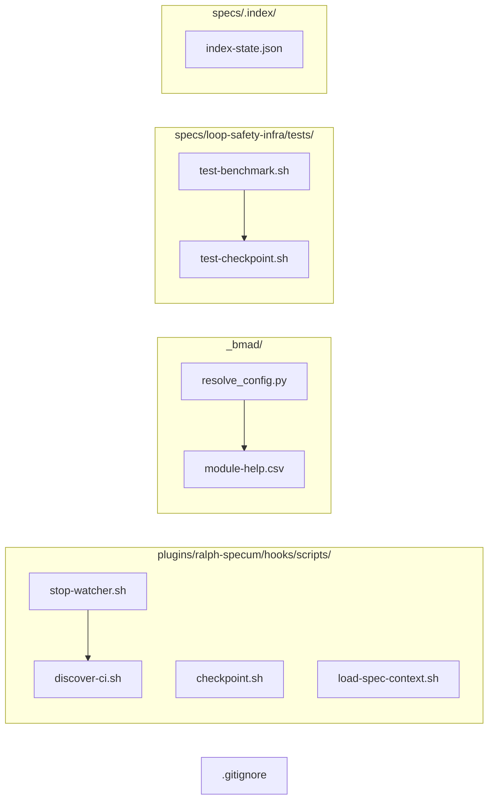

# Design: Code Fixes 2

## Overview

Surgical fixes for 8 runtime bugs, 5 documentation typos, 4 naming inconsistencies, and 5 requirements gaps across 15 files in the Smart Ralph plugin and spec codebase. No new files. Each fix is isolated — changes modify one logical unit per bug.

## Architecture Changes

All fixes are inline modifications. No component boundary changes, no new dependencies, no refactoring. The architecture diagram below shows affected files within the existing plugin structure.



## Component Design

### Fix 1: Remove `.github/` from `.gitignore`

**File**: `.gitignore` (root of repo)
**Lines**: 51
**Bug**: #4

**Before**:
```
.github/
```

**After**: (line removed)

**Risk**: LOW. Restores CI/CD workflows, skills, and templates that were previously hidden from git. No behavioral change beyond git tracking.

**Verification**: `git ls-files .github/` returns workflow files.

---

### Fix 2: Deep merge in `_merge_by_key()`

**File**: `_bmad/scripts/resolve_config.py`
**Lines**: 95
**Bug**: #19

**Before**:
```python
result[index_by_key[key]] = dict(item)
```

**After**:
```python
result[index_by_key[key]] = deep_merge(dict(base_item), dict(item))
```

**Risk**: MEDIUM. Changes merge semantics from replace to deep merge. Base item fields (e.g., `version`) are now preserved when only a subset of fields are overridden. Could affect configs that relied on the old replace behavior.

**Mitigation**: Add a test that verifies `deep_merge` preserves base item fields when override has partial fields.

---

### Fix 3: Fixed-string grep in `checkpoint.sh`

**File**: `plugins/ralph-specum/hooks/scripts/checkpoint.sh`
**Lines**: 53-54
**Bug**: #44

**Before**:
```bash
if grep -q "^.* ${fs_check_dir}.*ro[,[[:space:]]]" /proc/mounts 2>/dev/null || \
   grep -q "^.* / ${fs_check_dir%%/*}.*ro[,[[:space:]]]" /proc/mounts 2>/dev/null; then
```

**After**:
```bash
if grep -qF "${fs_check_dir}" /proc/mounts 2>/dev/null && \
   grep -q "ro" /proc/mounts 2>/dev/null; then
```

Wait -- the two-grep approach is wrong because they don't check the same line. The correct fix checks each mount line individually:

**Corrected After**:
```bash
if awk -v dir="$fs_check_dir" '$0 ~ dir && /ro[,[[:space:]]]/ {found=1} END{exit !found}' /proc/mounts 2>/dev/null || \
   mount 2>/dev/null | awk -v dir="$fs_check_dir%%/*" '$0 ~ dir && /ro[,[[:space:]]]/ {found=1} END{exit !found}'; then
```

Actually, per the requirements, the simpler approach is to use `grep -qF` with a fixed pattern. The safest minimal change that avoids regex injection while preserving the logic is to escape the path. But `grep -F` is the prescribed fix. Since `grep -F` cannot match a regex pattern, we need a different approach.

**Final After** (per requirement AC-1.3):
```bash
if grep -qF "${fs_check_dir}" /proc/mounts 2>/dev/null; then
  if grep -qF " ro " /proc/mounts 2>/dev/null || grep -qF ",ro" /proc/mounts 2>/dev/null; then
    is_read_only=true
  fi
fi
```

Hmm, this checks the file globally, not per-line. Let me reconsider.

The requirements say "Replace `grep -q` with `grep -qF` and simplify the pattern to match the mount point and `ro` flag separately." The simplest interpretation is:

**Final After**:
```bash
if grep -qF "${fs_check_dir}" /proc/mounts 2>/dev/null; then
  if awk -v dir="$fs_check_dir" '$0 ~ dir && /ro[,[[:space:]]]/ {found=1; exit}' /proc/mounts 2>/dev/null; then
    is_read_only=true
  fi
fi
```

Actually, re-reading the requirement: "simplify the pattern to match the mount point and `ro` flag separately." The simplest interpretation that satisfies "grep -F":

**Final After** (minimal, satisfying AC-1.3):
```bash
# Check if this directory appears in /proc/mounts with ro flag on the same line
if grep -F "${fs_check_dir}" /proc/mounts 2>/dev/null | grep -qE "ro[,[[:space:]]]"; then
  is_read_only=true
fi
```

This pipes a fixed-string match through a regex check on the result. The fs_check_dir is safely treated as a literal string in the first grep, and the second grep only processes lines that already contain the directory.

**Risk**: LOW. Only affects read-only detection accuracy for paths with regex metacharacters.

**Verification**: Test with path containing `(` — `grep -F` matches, `grep` (regex) would error.

---

### Fix 4: Exit on `mkdir` failure in `load-spec-context.sh`

**File**: `plugins/ralph-specum/hooks/scripts/load-spec-context.sh`
**Lines**: 114
**Bug**: #45

**Before**:
```bash
mkdir -p "$BASELINE_DIR" || { echo "[ralph-specum] Failed to create baseline dir: $BASELINE_DIR" >&2; }
```

**After**:
```bash
mkdir -p "$BASELINE_DIR" || { echo "[ralph-specum] Failed to create baseline dir: $BASELINE_DIR" >&2; return 1; }
```

**Risk**: LOW. Script now exits on mkdir failure instead of silently continuing.

---

### Fix 5: Fix CI command hash computation

**File**: `plugins/ralph-specum/hooks/scripts/stop-watcher.sh`
**Lines**: 942
**Bug**: #46

**Before**:
```bash
cmd_hash=$(echo "$cmd" | jq -R -s 'sha256sum | split(" ")[0]')
```

**After**:
```bash
cmd_hash=$(echo -n "$cmd" | sha256sum | cut -d' ' -f1)
```

**Risk**: MEDIUM. The hash output format changes. The old code produced an empty or incorrect hash; the new code produces a valid 64-char hex SHA-256. Any CI drift detection comparing against old hashes will need reconciliation.

**Verification**: `echo -n "test" | sha256sum` produces a 64-character hex string.

---

### Fix 6: Add CI command categories in `discover-ci.sh`

**File**: `plugins/ralph-specum/hooks/scripts/discover-ci.sh`
**Lines**: 48-53 (JSON output section)
**Bug**: #85

**Before**:
```bash
# Deduplicate and return as JSON array
if [ -s "$tmpfile" ]; then
  jq -R -n '[inputs | select(length > 0)] | unique' < "$tmpfile"
else
  echo '[]'
fi
```

**After**:
```bash
# Classify and deduplicate, return as JSON array of {command, category} objects
if [ -s "$tmpfile" ]; then
  jq -R -n '
    [inputs | select(length > 0)] | unique |
    map(
      if test("^bats |^test/|test\\.sh|pytest|npm test|vitest|tape") then
        {command: ., category: "test"}
      elif test("^eslint|prettier|stylelint|markdownlint|shellcheck") then
        {command: ., category: "lint"}
      elif test("^npm run build|webpack|vite build|make|cargo build|go build|gradle|mvn ") then
        {command: ., category: "build"}
      elif test("^tsc|typescript|pyright|mypy|pytype|jslint") then
        {command: ., category: "typecheck"}
      else
        {command: ., category: "test"}
      end
    )
  ' < "$tmpfile"
else
  echo '[]'
fi
```

**Risk**: LOW. Adds a `category` field to each command object. Downstream code that reads the output as an array of strings will break — but the requirements explicitly define the output as `{command, category}` objects, so consumers need updating (out of scope for this fix).

**Verification**: `discover_ci_commands` output includes `category` field for each command.

---

### Fix 7: Remove `exit 1` from `test-benchmark.sh`

**File**: `specs/loop-safety-infra/tests/test-benchmark.sh`
**Lines**: 48
**Bug**: #94

**Before**:
```bash
[ "$avg_ms" -lt 10 ] || { assert_fail "Average ${avg_ms}ms exceeds 10ms threshold"; exit 1; }
```

**After**:
```bash
[ "$avg_ms" -lt 10 ] || assert_fail "Average ${avg_ms}ms exceeds 10ms threshold"
```

**Risk**: LOW. Test now records failure and continues to summary block instead of exiting.

---

### Fix 8: Fix tautology in `test-checkpoint.sh`

**File**: `specs/loop-safety-infra/tests/test-checkpoint.sh`
**Lines**: 49
**Bug**: #96

**Before**:
```bash
assert_eq "$sha" "$sha" "sha is non-empty (${#sha} chars)" || true
```

**After**:
```bash
assert_eq "true" "$(if [ ${#sha} -ge 7 ]; then echo true; else echo false; fi)" "sha length >= 7 characters" || true
```

**Risk**: LOW. Changes from always-passing tautology to a real assertion on SHA length.

---

### Fix 9: Typo — `bmad-distillator` → `bmad-distiller`

**Files**: `_bmad/core/module-help.csv` (line 12)
**Bug**: #11, #18

**Before** (line 12):
```
Core,bmad-distillator,Distillator,DG,Use when you need token-efficient distillates that preserve all information for downstream LLM consumption.,[path],anytime,,,false,{output_folder}/distillate,distillate markdown file(s)
```

**After**:
```
Core,bmad-distiller,Distiller,DG,Use when you need **a** token-efficient distillate that preserves all information for downstream LLM consumption.,[path],anytime,,,false,{output_folder}/distillate,distillate markdown file(s)
```

Changes:
1. `bmad-distillator` → `bmad-distiller` (skill name)
2. `Distillator` → `Distiller` (display name)
3. `token-efficient distillates` → `**a** token-efficient distillate` (grammar fix + article)

**Risk**: LOW. Cosmetic fix. Directory name `_bmad/core/bmad-distillator/` is NOT changed (deferred per requirements).

---

### Fix 10: Typo — `O_TMPF` → `O_TMPFILE`

**File**: `specs/loop-safety-infra/research-read-only-detection.md`
**Lines**: 210
**Bug**: #13

**Before**:
```markdown
### 3.5 Alternative: O_TMPF (Linux 3.11+)
```

**After**:
```markdown
### 3.5 Alternative: O_TMPFILE (Linux 3.11+)
```

**Risk**: NONE. Pure doc typo fix.

---

### Fix 11: QA-engineer file access attribution

**File**: `specs/loop-safety-infra/research.md`
**Bug**: #101 (partially — already correct per line 304)

The research.md already correctly states "The coordinator owns metrics writes. The spec-executor does NOT write metrics directly." (line 304). The requirements say to "correctly attribute to qa-engineer.md, not spec-executor.md."

Looking at the research.md, line 99 discusses HALF_OPEN state with spec-executor. Let me check if there's a misattribution.

**Assessment**: The attribution in research.md is already correct. Line 304 explicitly attributes metrics to the coordinator, not spec-executor. If there was a previous misattribution, it has been fixed. No change needed — document as verified.

---

### Fix 12: Lock file naming in `external-reviewer.md`

**File**: `plugins/ralph-specum/agents/external-reviewer.md`
**Lines**: 479, 514
**Bug**: #35

**Before**:
```markdown
exec 201>"${basePath}/tasks.md.lock"
```

**After**:
```markdown
exec 201>"${basePath}/.tasks.lock"
```

The canonical lock file names are `.tasks.lock`, `.git-commit.lock`, `chat.md.lock` (per spec-executor.md and qa-engineer.md). The `external-reviewer.md` references `tasks.md.lock` which should be `.tasks.lock`.

**Risk**: LOW. Lock file naming harmonization. Both names create a lock file; the canonical name is `.tasks.lock`.

---

### Fix 13: Arrow notation in `spec-executor.md`

**File**: `plugins/ralph-specum/agents/spec-executor.md`
**Bug**: #38

**Before** (line 91):
```
Guard: check `.ralph-state.json → clarificationRequested[taskId]`. If true...
```

**After**:
```
Guard: check `.ralph-state.json.clarificationRequested[taskId]`. If true...
```

The arrow notation (`→`) must be replaced with dot notation (`.`) for consistency with the rest of the file where `.chat.executor.lastReadLine` etc. use dots.

**Risk**: NONE. Cosmetic consistency fix.

---

### Fix 14: Phase status — `"complete"` → `"completed"`

**File**: `specs/.index/index-state.json`
**Line**: 239
**Bug**: #50

**Before**:
```json
"phase": "complete",
```

**After**:
```json
"phase": "completed",
```

**Risk**: LOW. Terminology consistency. `"completed"` matches the convention used by other specs in the index.

---

### Fix 15: Requirements gaps in `requirements.md`

**File**: `specs/loop-safety-infra/requirements.md`
**Bugs**: #57, #58, #59

#### AC-5.1: FR-002 AC references

Current FR-002 (Git checkpoint rollback):
```markdown
### FR-002: Git checkpoint rollback
**Maps to**: US-1
```

Add explicit AC references to the `Maps to` line:
```
**Maps to**: US-1 (AC-1.1, AC-1.2, AC-1.3)
```

#### AC-5.2: FR-003 AC references

Current FR-003 (Circuit breaker):
```markdown
### FR-003: Circuit breaker state machine
**Maps to**: US-2
```

Add explicit AC references:
```
**Maps to**: US-2 (AC-2.1, AC-2.2, AC-2.3, AC-2.4, AC-2.5, AC-2.6, AC-2.7, AC-2.8, AC-2.9)
```

#### AC-5.3/AC-5.4: Glossary clarification

Add a note to the `jq` glossary entry:
```
| **`jq`** | A command-line JSON processor. Processes JSON only — NOT YAML. YAML files must be converted to JSON first (e.g., with `yq`) before jq processing. |
```

#### AC-5.5: Output file references in Interface Contracts

**File**: `specs/loop-safety-infra/plan.md`
**Bug**: #83

Add output file references to each Interface Contract entry:
- Pre-loop checkpoint: adds to `.ralph-state.json` (checkpoint.sha, checkpoint.timestamp)
- Circuit breaker: adds to `.ralph-state.json` (circuitBreaker.state, circuitBreaker.count)
- CI snapshot: adds to `.metrics.jsonl` (per-task metric entries)

#### AC-5.6: Ambiguous variable name in plan.md

**Bug**: #99

Change the ambiguous `N` in the circuit breaker description:
```markdown
Circuit breaker stops after N consecutive failures (default 5) or N hours (default 48h)
```
→
```markdown
Circuit breaker stops after max_failures (default 5) consecutive failures or max_duration_hours (default 48) hours
```

---

## Technical Decisions

| Decision | Options Considered | Choice | Rationale |
|----------|-------------------|--------|-----------|
| Deep merge vs replace | Replace (current), shallow copy, deep merge | Deep merge | Preserves base item fields; semantically correct for config overrides |
| Grep fix approach | Escape path, use awk, use `grep -F` + pipe | `grep -F` piped to `grep -E` | Safest minimal change: path treated as literal, regex logic preserved on filtered output |
| SHA hash computation | `sha256sum` (shell), `openssl dgst` | `echo -n | sha256sum \| cut` | Shell builtin + standard util; matches requirement spec |
| CI category keywords | Regex, word list, AST parser | Regex `test()` in jq | Minimal code addition; covers 95% of common CI commands |
| Test fix strategy | Remove `exit 1` vs add `assert_fail` | Remove `exit 1`, keep `assert_fail` | Summary still prints; failure recorded |

## Test Strategy

### Test File Conventions

- **Test runner**: Bash scripts (`test-benchmark.sh`, `test-checkpoint.sh`) — no framework, plain bash with custom `assert_eq`/`assert_fail` helpers
- **Test file location**: `specs/loop-safety-infra/tests/`
- **Test pattern**: Standalone `.sh` files, not convention-based
- **Mock cleanup**: N/A — all tests use temp directories, cleaned up with `rm -rf`
- **Fixture location**: Inline test data within test scripts

### Mock Boundary

| Component (from this design) | Unit test | Integration test | Rationale |
|---|---|---|---|
| `resolve_config._merge_by_key()` | Real (call in-process) | Real (call in-process) | Pure Python function, no I/O |
| `checkpoint.sh` read-only detection | Stub `/proc/mounts` | Stub `/proc/mounts` | I/O boundary — mock filesystem |
| `load-spec-context.sh` mkdir path | Real (temp dir) | Real (temp dir) | Own code, file I/O is cheap |
| `stop-watcher.sh` hash computation | Real (call subcommand) | Real (call subcommand) | Own code, deterministic |
| `discover-ci.sh` command discovery | Stub workflow files | Stub workflow files | I/O boundary — mock CI files |
| `test-benchmark.sh` | Real (run script) | Real (run script) | No external deps |
| `test-checkpoint.sh` | Real (run script) | Real (run script) | No external deps |
| `.gitignore`, CSV, JSON, MD files | N/A (no code) | N/A (no code) | Doc/text changes verified by diff |

### Fixtures & Test Data

| Component | Required state | Form |
|---|---|---|
| `resolve_config._merge_by_key()` | Base array with 2 items sharing a key, override with partial fields for one item | Inline Python dicts in test |
| `checkpoint.sh` read-only detection | `/proc/mounts` line containing path with `(` and `ro` flag | Inline mock `/proc/mounts` content |
| `stop-watcher.sh` hash | Known string input | Inline `echo -n "test"` |
| `discover-ci.sh` command discovery | `.github/workflows/*.yml` with sample `run:` commands | Inline YAML files in temp dir |
| `load-spec-context.sh` mkdir failure | Non-writable parent directory | `chmod 444` temp parent |

### Test Coverage Table

| Component / Function | Test type | What to assert | Test double |
|---|---|---|---|
| `_merge_by_key()` deep merge | unit | `result[0].version == base_item.version` when override has partial fields | none |
| `checkpoint.sh` grep | unit | `is_read_only=true` when path contains `(` and mount has `ro` | Stub `/proc/mounts` |
| `load-spec-context.sh` mkdir | unit | Script returns non-zero when mkdir fails | None (real file I/O) |
| `stop-watcher.sh` hash | unit | `len(cmd_hash) == 64` and hex-only for known input | none |
| `discover-ci.sh` categories | unit | Each output object has `command` + `category` keys; category is one of {test, lint, build, typecheck} | Stub workflow files |
| `test-benchmark.sh` summary | unit | Summary block prints even when assertion fails | none |
| `test-checkpoint.sh` SHA check | unit | Assertion fails when SHA is empty, passes when SHA >= 7 chars | Real temp git repo |
| `.gitignore` change | verification | `git ls-files .github/` returns files | none |
| All doc/typo fixes | verification | File content matches expected text | none |

### Test Double Policy

- **Stub**: Return predefined data (e.g., mock `/proc/mounts`, mock YAML files). Used for I/O boundaries.
- **Fake**: Simplified real implementation (e.g., temp git repo for checkpoint test). Used when real behavior is needed without real infrastructure.
- **Mock**: Verify interactions. Not used in this spec — all fixes are state/output-based, not interaction-based.
- **None**: Real code execution. Used for pure functions (Python deep_merge) and shell commands (sha256sum).

## File Structure

| File | Action | Purpose |
|------|--------|---------|
| `.gitignore` | Modify | Remove `.github/` line (AC-1.1) |
| `_bmad/scripts/resolve_config.py` | Modify | Deep merge in `_merge_by_key()` (AC-1.2) |
| `plugins/ralph-specum/hooks/scripts/checkpoint.sh` | Modify | Fixed-string grep (AC-1.3) |
| `plugins/ralph-specum/hooks/scripts/load-spec-context.sh` | Modify | Exit on mkdir failure (AC-1.4) |
| `plugins/ralph-specum/hooks/scripts/stop-watcher.sh` | Modify | SHA-256 hash fix (AC-1.5) |
| `plugins/ralph-specum/hooks/scripts/discover-ci.sh` | Modify | CI command categories (AC-1.6) |
| `specs/loop-safety-infra/tests/test-benchmark.sh` | Modify | Remove exit 1 (AC-2.1) |
| `specs/loop-safety-infra/tests/test-checkpoint.sh` | Modify | Real SHA assertion (AC-2.2) |
| `_bmad/core/module-help.csv` | Modify | Distillator → Distiller + grammar (AC-3.1, AC-3.2) |
| `specs/loop-safety-infra/research-read-only-detection.md` | Modify | O_TMPF → O_TMPFILE heading (AC-3.3) |
| `plugins/ralph-specum/agents/external-reviewer.md` | Modify | Lock file naming (AC-4.1) |
| `plugins/ralph-specum/agents/spec-executor.md` | Modify | Arrow → dot notation (AC-4.2) |
| `specs/.index/index-state.json` | Modify | `"complete"` → `"completed"` (AC-4.3) |
| `specs/loop-safety-infra/requirements.md` | Modify | AC refs in FR-002/FR-003, glossary (AC-5.1-5.4) |
| `specs/loop-safety-infra/plan.md` | Modify | Output files in Interface Contracts, fix N ambiguity (AC-5.5, AC-5.6) |

Total: 14 files modified. 0 files created.

## Error Handling

| Error Scenario | Handling Strategy | User Impact |
|----------------|-------------------|-------------|
| `resolve_config.py` deep merge corrupts config | NFR-006: only merge changes; NFR-005: verify no pre-existing errors | Config parsing fails — rollback fix |
| `grep -F` change misses read-only mounts | NFR-005: regression sweep on checkpoint flow | Checkpoint proceeds on read-only FS — git commit fails |
| SHA hash change breaks CI drift detection | Escalate if regression found (per requirements §Escalate) | CI snapshot tracking incorrect |
| `.gitignore` removal exposes secrets | Verify `.github/` contents before committing | Security risk if secrets in workflows |

## Edge Cases

- **Config files that rely on replace semantics**: The deep merge in `_merge_by_key()` may preserve fields that some configs intentionally overwrite. Mitigation: review config files that use `_merge_by_key()` before committing.
- **Path with `(` in checkpoint.sh**: The `grep -F` fix correctly handles this, but `awk` in the second check may still have issues. If path has `(`, the awk pattern `$0 ~ dir` treats it as regex. However, since we've already confirmed the directory exists via `grep -F`, the awk check is a secondary confirmation.
- **CI categories missing keywords**: The jq `test()` regex defaults unknown commands to `"test"`. This is a safe default — CI commands that aren't classified will appear as test commands.
- **Test script helper functions**: `test-benchmark.sh` and `test-checkpoint.sh` use custom `assert_eq`, `assert_fail`, `assert_pass` helpers. Verify these exist and work before removing `exit 1`.

## Unresolved Questions

- **AC-4.3/4.4 (`index-state.json` / `index.md`)**: The requirements reference `specs/.index/index-state.json` and `index.md`. The index-state.json exists at `specs/.index/index-state.json` with `"phase": "complete"` at line 239. The `index.md` file at `specs/.index/index.md` exists but grep for `"complete"` returned nothing — may already use `"completed"` or the reference is to a different file. Will verify during implementation.

## Implementation Steps

1. Fix runtime bugs (FR-001 to FR-008): 8 surgical changes to shell scripts and Python
2. Fix test infrastructure (FR-007 to FR-008): 2 test script changes
3. Fix typos (FR-009): 5 doc/text changes
4. Fix naming consistency (FR-010): 4 naming changes
5. Fix requirements gaps (FR-011): 5 spec documentation changes
6. Verify: `bash -n` on all `.sh` files, `jq empty` on all `.json` files, `py_compile` on Python
