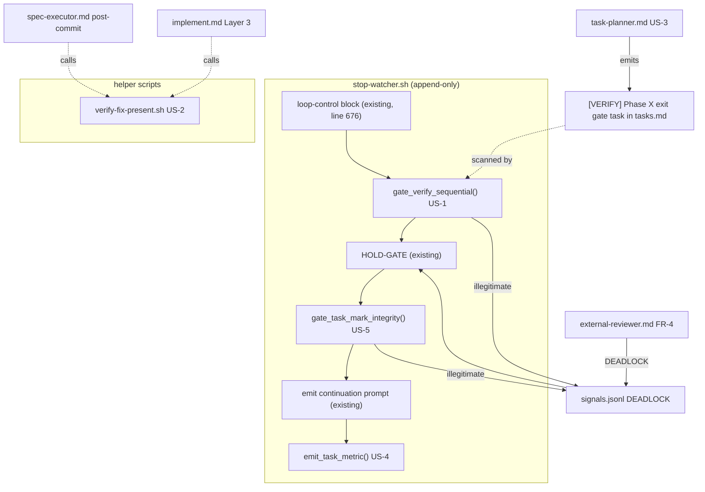
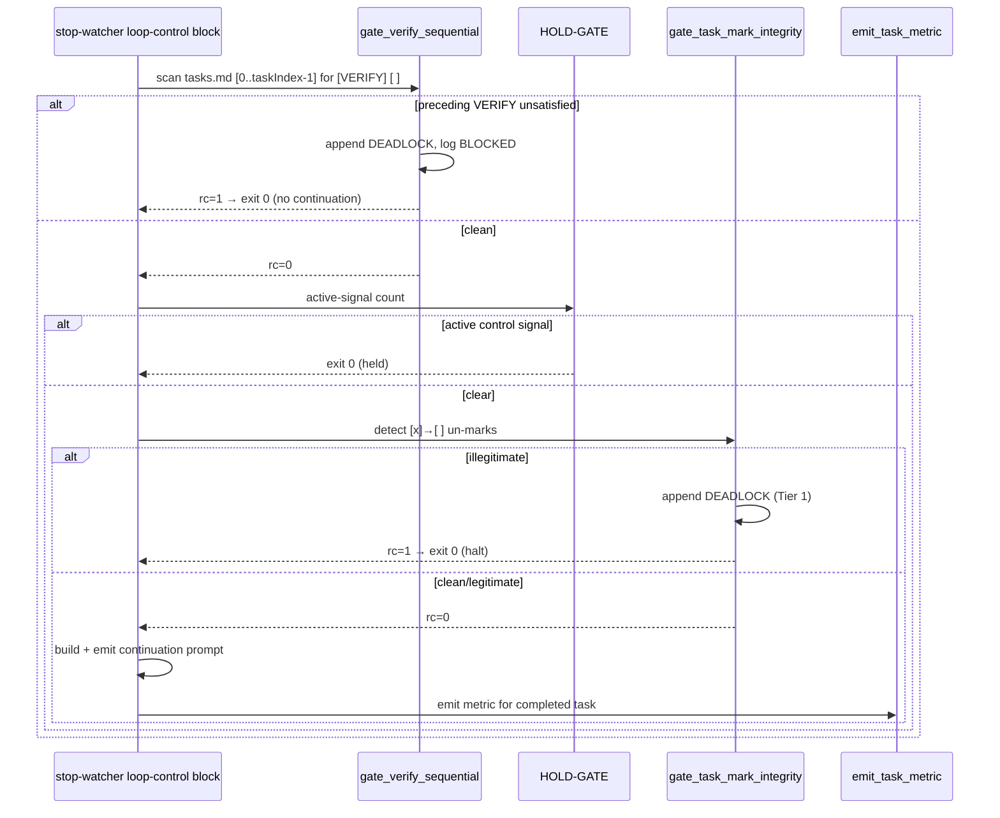

# Design: harness-enforcement-gates

## Overview

Replace 5 prose-only execution rules with deterministic shell enforcement gates by
appending functions to `stop-watcher.sh`, adding one standalone helper script, and
re-pointing two prose checks (spec-executor post-commit, coordinator Layer 3) at the
helper. No existing `stop-watcher.sh` control flow is edited — every new gate is an
appended function invoked from the loop-control block. Legacy specs degrade gracefully
(skip + WARN, never abort).

## Architecture



## Components

### Component 1 — `gate_verify_sequential()` (US-1, FR-1/2/3)

**Purpose**: Mechanically block loop continuation while any preceding `[VERIFY]` task is unsatisfied.
**Integration point**: Appended function in `stop-watcher.sh`; **called** from inside the existing loop-control block (line 676 `if`-body), immediately before the BEGIN HOLD-GATE block. The call line is the *only* added line inside existing flow — it is a single function invocation, not a control-flow edit. (Escalation note: a one-line call insertion inside the existing `if` body is unavoidable for any in-loop gate; this is consistent with how `lib-signals.sh` is already `source`d inside that same block. If a stricter reading of "append-only" forbids even the call site, escalate — but the existing HOLD-GATE precedent confirms in-block calls are permitted.)

**Signature**: `gate_verify_sequential <spec_path> <tasks_file> <task_index>` → exit code.

**Algorithm**:
1. If `tasks_file` absent → return 0 (degrade).
2. `awk` scan: iterate `^- \[[ x]\]` lines, 0-based counter; for each line at index `< task_index` whose text matches `\[VERIFY\]` and mark is `\[ \]` → collect its index.
3. If no offending index → return 0 (transparent, AC-1.5).
4. Else: for the first offending index N, log `BLOCKED: preceding VERIFY task N unsatisfied` to stderr (AC-1.4); append a DEADLOCK control signal to `signals.jsonl` via `append_signal` (AC-1.2); return 1.
5. No `deferred` marker recognised — every unchecked preceding `[VERIFY]` blocks (AC-1.3, FR-3).

**Caller routing**: when the function returns non-zero, the loop-control block does NOT emit a continuation prompt — it `exit 0`s (same shape as the HOLD-GATE block `exit 0` at line 706). The appended DEADLOCK signal then makes the existing HOLD-GATE bite on subsequent invocations.

**DEADLOCK payload** (validated by `append_signal`'s `jq -e`):
```json
{"type":"control","signal":"DEADLOCK","status":"active",
 "source":"gate_verify_sequential","reason":"preceding VERIFY task <N> unsatisfied",
 "taskIndex":<N>,"timestamp":"<ISO8601>","iteration":"<globalIteration>"}
```

**Legacy degradation**: if `signals.jsonl` is absent the loop-control block already `cp`s the template before HOLD-GATE; the gate runs *before* that, so it must itself guard: if `signals.jsonl` absent → log WARN to `.progress.md`, skip the signal append, still return 1 to halt? No — AC-1.7 says the gate's *absence of signals.jsonl* must not abort the loop. Resolution: if `signals.jsonl` is absent, the gate copies the template (idempotent `cp`) before appending, mirroring HOLD-GATE; the gate never silently skips its *block* decision. The WARN-and-skip degradation in AC-1.7 applies only to a missing file that cannot be created (read-only fs) — then return 0 + WARN.

### Component 2 — `verify-fix-present.sh` (US-2, FR-5/6)

**Purpose**: Robustly confirm a claimed fix exists in any git state since branch divergence.
**Integration point**: New standalone script at `plugins/ralphharness/hooks/scripts/verify-fix-present.sh`.

**Signature**: `verify-fix-present.sh <file> [<pattern>]` → exit 0 (present) / non-zero (absent).

**Algorithm**:
```text
1. file=$1 ; pattern=$2
2. base = git merge-base HEAD origin/main
   - if that fails (origin/main unreachable): fallback to recorded checkpoint SHA
     read from <spec>/.ralph-state.json .checkpoint.sha (resolved via RALPH_CWD / current spec);
     log WARN "origin/main unreachable, base=<sha>" to stderr. (AC-2.7)
   - if no checkpoint SHA either: exit 3 with diagnostic "cannot resolve base ref"
     (the documented ESCALATE condition).
3. three-state diff — file changed if ANY non-empty:
     committed:    git diff --quiet "$base" HEAD -- "$file"   (non-zero ⇒ changed)
     staged:       git diff --cached --quiet -- "$file"
     working-tree: git diff --quiet -- "$file"
4. changed = (committed OR staged OR working-tree)
5. if not changed: exit 1, stderr "FIX ABSENT: <file> unchanged since <base> in all 3 states"
6. if pattern supplied:
     git show HEAD:"$file" 2>/dev/null | grep -qF -- "$pattern"
     - if absent: exit 2, stderr "FIX PATTERN ABSENT: '<pattern>' not in HEAD:<file>"
7. exit 0
```

**Exit-code contract**: 0 = present; 1 = file unchanged; 2 = pattern absent; 3 = base unresolvable.
**Outputs**: diagnostic strings on stderr only; stdout silent (composable).

**Callers**:
- `spec-executor.md` post-commit check (FR-7): replace `git diff HEAD~1 --stat` with a call to `verify-fix-present.sh` for each file in the task's Files list; non-zero ⇒ investigate before `TASK_COMPLETE`.
- `implement.md` Layer 3 anti-fabrication review (FR-8): replace bare `git diff HEAD` with `verify-fix-present.sh <file> [<pattern>]`; non-zero ⇒ FABRICATION → REJECT.

### Component 3 — Phase exit-gate task emission (US-3, FR-9/10)

**Purpose**: Make phase advancement a first-class `[VERIFY]` task that US-1 already enforces.
**Integration point**: `task-planner.md` task-generation rules (prose-as-instruction is acceptable here — task-planner *produces* the artifact; the *enforcement* is the shell gate US-1 that reads it. NFR-1 forbids enforcement-as-prose, not artifact-generation-as-prose).

**Rule added to task-planner**: as the FINAL task of every phase block, ALWAYS append exactly one:
```markdown
- [ ] X.G [VERIFY] Phase X exit gate
  - **Do**: Confirm all preceding tasks and checkpoints of Phase X are complete and green.
  - **Verify**: All Phase X [VERIFY] tasks above are [x].
  - **Done when**: Phase X is fully satisfied; safe to advance to Phase X+1.
```
Appended even when the phase already ends with a `[VERIFY]` checkpoint (interview decision 3 — unambiguous mechanical marker). It is an ordinary `[VERIFY]` task: US-1's `gate_verify_sequential` picks it up with no special-casing (AC-3.2). Not coupled to `ciSnapshot` / `.metrics.jsonl` (AC-3.3).

**Legacy degradation**: legacy `tasks.md` without exit-gate tasks still run — US-1 simply finds no extra `[VERIFY]` line to block on (AC-3.5).

### Component 4 — `emit_task_metric()` (US-4, FR-11/12)

**Purpose**: Deterministically write one `.metrics.jsonl` line per task advancement.
**Integration point**: Appended function in `stop-watcher.sh`; **called** from the loop-control block after the continuation prompt is built, gated on a detected advancement.

**Advancement detection** (mechanical, AC-4.2): the function compares the current `taskIndex` against a `lastMetricTaskIndex` field in `.ralph-state.json`:
- `taskIndex > lastMetricTaskIndex` ⇒ the previous task advanced ⇒ status `pass`; emit one metric for index `taskIndex - 1`.
- `taskIndex == lastMetricTaskIndex` and `taskIteration` increased ⇒ status `fail` (retry); emit one metric for the current index.
- After emit, set `lastMetricTaskIndex = taskIndex` and `lastMetricIteration = taskIteration` in state (jq + atomic mv). This idempotency guard guarantees exactly one line per advancement (AC-4.4, AC-4.5) and prevents duplicates across re-invocations.

**Signature**: `emit_task_metric <spec_path> <state_file>` → 0 (best-effort; never aborts loop).

**Body**: `source write-metric.sh`; derive `commit_sha` via `git -C "$CWD" log -1 --format=%H`; call `write_metric "$spec_path" "$status" "$idx" "$iter" 0 "$title" "$type" "$task_id" "$commit_sha"`. `write-metric.sh`'s own `flock -x 200` on `.metrics.lock` is reused unchanged (AC-4.4).

**FR-12**: the LLM-discretionary metrics block in `implement.md` (~lines 680-708) is **removed**. The hook is now the sole authoritative writer; no fallback prompt is kept (a kept fallback risks the duplicate line FR-12 forbids).

**Legacy degradation**: legacy state files lack `lastMetricTaskIndex` — `jq '.lastMetricTaskIndex // -1'` defaults to `-1`, so the first invocation treats any `taskIndex >= 0` as an advancement and self-heals from there (NFR-4).

### Component 5 — `gate_task_mark_integrity()` (US-5, FR-13..18)

**Purpose**: Detect illegitimate `[x]`→`[ ]` un-marks and run the tiered escalation.
**Integration point**: Appended function in `stop-watcher.sh`; called from the loop-control block after the HOLD-GATE, before continuation emission.

**Snapshot field** (interview decision 1 — `.ralph-state.json` field, NOT a sidecar; follows `engine-state-hardening` conventions):
```jsonc
"taskMarkSnapshot": {
  "schemaVersion": 1,
  "checkedTaskIds": ["1.1", "1.2", "1.G"],   // task IDs that were [x] at last invocation
  "externalUnmarks": { "1.3": 1 },           // copy of external_unmarks at snapshot time
  "capturedAt": "<ISO8601>"
}
```
Coordinator-owned (the guard writes it; only the external-reviewer writes `external_unmarks`). Legacy state files lack the field — `jq '.taskMarkSnapshot // null'`; on a `null` snapshot the guard takes a **fresh snapshot and returns 0** (first run cannot detect a regression — NFR-4).

**Detection logic**:
1. Read `signals.jsonl` and `task_review.md` presence. If `task_review.md` absent → WARN to `.progress.md`, skip guard, return 0 (AC-5.9, NFR-4).
2. Under `flock -e 201` on `tasks.md.lock` (NFR-3, AC-5.8): read current `[x]` task IDs (`current_checked`).
3. `prior = taskMarkSnapshot.checkedTaskIds`. `unmarked = prior \ current_checked` (was `[x]`, now `[ ]`).
4. For each `taskId` in `unmarked`:
   - `hasPass` = `task_review.md` has a `status: PASS` entry for that task (`awk` block parse on the `### [task-X.Y]` YAML entries).
   - `extInc` = `external_unmarks[taskId]` (current) `>` `taskMarkSnapshot.externalUnmarks[taskId]` (prior).
   - **LEGITIMATE** if `extInc` is true (AC-5.7) — the external-reviewer authored it.
   - **ILLEGITIMATE** if `hasPass` AND NOT `extInc` (FR-14, AC-5.2).
5. After classification, refresh `taskMarkSnapshot` (new `current_checked`, new `external_unmarks` copy) under the same lock.
6. The guard NEVER writes `external_unmarks` and NEVER re-marks/auto-reverts (AC-5.6, FR-18).

**Tiered escalation** (on ≥1 illegitimate un-mark):

```mermaid
sequenceDiagram
    participant SW as stop-watcher (gate_task_mark_integrity)
    participant SIG as signals.jsonl
    participant T2 as Tier 2 triage (bmad-consensus-party)
    participant Loop as Ralph Loop
    participant Human

    SW->>SIG: append DEADLOCK control (active)  [Tier 1, FR-15]
    SW->>SW: HALT — no continuation prompt (exit 0)
    Note over Loop: HOLD-GATE blocks next invocations
    SW->>T2: invoke triage skill on next coordinator turn
    alt triage = false positive (resolvable)
        T2->>SIG: resolve DEADLOCK (status: resolved)
        T2->>Loop: loop resumes
    else triage = genuine conflict
        T2->>Human: Tier 3 — escalate, DEADLOCK stays active
        Human->>SIG: manual resolution
    end
```

- **Tier 1 (FR-15, AC-5.3)**: the guard appends a DEADLOCK control signal (`source:"gate_task_mark_integrity"`, `reason:"illegitimate un-mark of task <id>"`, `taskId`) and the loop-control block `exit 0`s — no continuation. HALT is immediate and mechanical.
- **Tier 2 (FR-16, AC-5.4)**: triage runs on the *next* coordinator turn (the DEADLOCK is in `signals.jsonl`, so the coordinator's HOLD-GATE handling already routes to a DEADLOCK handler). The DEADLOCK signal carries `source:"gate_task_mark_integrity"`, which the coordinator uses to dispatch the integrity-triage path:
  - **Primary**: invoke the `bmad-consensus-party` SKILL via the Skill tool (confirmed at `.claude/skills/bmad-consensus-party/SKILL.md`). It runs BMAD Party Mode iteratively with context enrichment between rounds until agents reach consensus.
  - **Fallback** (skill absent — `[ -f .claude/skills/bmad-consensus-party/SKILL.md ]` is false): invoke 2–3 subagents via the Task tool — `external-reviewer` + `qa-engineer` (+ optionally a third reviewer) — each independently answering the same triage question; the coordinator takes the majority verdict.
  - **Triage input contract** (passed to skill or subagents):
    ```yaml
    - unmarked taskId and its task block from tasks.md
    - the task's task_review.md PASS entry (full YAML entry)
    - external_unmarks[taskId] current value + prior snapshot value
    - the git history of tasks.md around the un-mark (git log -p -- tasks.md, last 3 commits)
    ```
  - **Consensus output contract** (the skill / majority of subagents must return one of):
    ```text
    VERDICT: FALSE_POSITIVE   reason: <why the un-mark is actually legitimate/benign>
    VERDICT: GENUINE_CONFLICT reason: <why human intervention is required>
    ```
- **Tier 2 → resume (AC-5.4)**: on `FALSE_POSITIVE`, the coordinator resolves it autonomously: it marks the DEADLOCK signal `status:"resolved"` in `signals.jsonl` (existing signal-resolution path), logs the resolution to `.progress.md`, and the loop resumes on the next invocation (HOLD-GATE now sees zero active control signals).
- **Tier 3 (FR-17, AC-5.5)**: on `GENUINE_CONFLICT`, the DEADLOCK signal stays `active`. The coordinator emits a human-facing escalation block (same shape as the existing `stop-watcher.sh` ESCALATE blocks) describing the un-marked task, the PASS entry, and the triage rationale; sets `awaitingApproval=true`. The loop stays halted until a human resolves.

## Data Flow



## Technical Decisions

| Decision | Options Considered | Choice | Rationale (resolves) |
|----------|-------------------|--------|----------------------|
| Mark-snapshot persistence | sidecar `.task-marks.prev`; `.ralph-state.json` field | `.ralph-state.json` field `taskMarkSnapshot` | Interview decision 1; single source of truth, atomic with state, follows `engine-state-hardening`. |
| Phase exit gate mechanism | `phaseGate` state field; phase-boundary scan; synthetic gate task | Synthetic `[VERIFY] Phase X exit gate` task | FR-9/10; reduces phase gating to "an unsatisfied `[VERIFY]`" which US-1 already enforces — zero new gate logic. |
| Exit-gate naming when phase ends in `[VERIFY]` | label existing checkpoint; append a distinct gate task | Always append a distinct `Phase X exit gate` task | Interview decision 3 — unambiguous mechanical marker, no parsing ambiguity. |
| Metrics emission point | keep prompt + hook backstop; PostToolUse hook; `stop-watcher.sh` hook | `stop-watcher.sh` `emit_task_metric()`, remove prompt block | FR-11/12; the prompt block is LLM-discretionary (the §4.2 root cause). Hook runs unconditionally. |
| Metric duplicate prevention | timestamp dedup; `lastMetricTaskIndex` state field | `lastMetricTaskIndex` / `lastMetricIteration` state fields | AC-4.4/4.5; exactly one line per advancement, idempotent across re-invocations. |
| Integrity guard response | blind auto-revert; detect + escalate | detect + tiered escalation, never auto-revert | FR-18, AC-5.6; `tasks.md` is two-writer — a blind revert races the reviewer. |
| Tier 2 triage mechanism | dedicated agent; `bmad-consensus-party` skill + subagent fallback | `bmad-consensus-party` skill, fallback to 2–3 consensus subagents | Interview decision 2; iterative multi-agent consensus filters false positives before bothering a human. |
| Base ref for fix verification | `HEAD~1`; `git diff HEAD`; `merge-base HEAD origin/main` + checkpoint fallback | `merge-base` + checkpoint SHA fallback | FR-5, AC-2.7; covers all branch commits; fallback survives an unreachable `origin/main`. |
| `verify-fix-present.sh` callers | inline in each consumer; shared helper script | shared helper script | DRY; one tested implementation reused by executor and coordinator (FR-7/8). |

## File Structure

| File | Action | Nature of change |
|------|--------|------------------|
| `plugins/ralphharness/hooks/scripts/stop-watcher.sh` | Modify | **Append** 3 functions (`gate_verify_sequential`, `emit_task_metric`, `gate_task_mark_integrity`) at end of file; add **3 call lines** inside the existing loop-control `if`-body (before HOLD-GATE, after HOLD-GATE, after continuation build) — mirrors the existing in-block `source lib-signals.sh` pattern. No existing control-flow line edited. |
| `plugins/ralphharness/hooks/scripts/verify-fix-present.sh` | Create | New standalone helper: `merge-base` three-state diff + optional pattern check + checkpoint fallback. |
| `plugins/ralphharness/commands/implement.md` | Modify | Layer 3 review prose re-pointed to `verify-fix-present.sh` (FR-8); remove the LLM-discretionary metrics block ~lines 680-708 (FR-12); add the integrity-triage DEADLOCK handler dispatch (Tier 2, `source:"gate_task_mark_integrity"`). |
| `plugins/ralphharness/agents/spec-executor.md` | Modify | Post-commit check (~line 73): replace `git diff HEAD~1 --stat` with `verify-fix-present.sh` per task file (FR-7). |
| `plugins/ralphharness/agents/external-reviewer.md` | Modify | DEADLOCK escalation also appends a DEADLOCK control signal to `signals.jsonl` via `append_signal` (FR-4). |
| `plugins/ralphharness/agents/task-planner.md` | Modify | Add rule: append a `[VERIFY] Phase X exit gate` task as the last task of every phase block (FR-9). |
| `plugins/ralphharness/.claude-plugin/plugin.json` | Modify | Version bump 5.6.0 → 5.7.0 (minor — feature) (NFR-5). |
| `.claude-plugin/marketplace.json` | Modify | Bump matching `ralphharness` entry to 5.7.0 (NFR-5). |
| `plugins/ralphharness/tests/test-verify-sequential-gate.bats` | Create | US-1 pass/block/legacy bats. |
| `plugins/ralphharness/tests/test-verify-fix-present.bats` | Create | US-2 three-state + pattern + fallback bats. |
| `plugins/ralphharness/tests/test-phase-exit-gate.bats` | Create | US-3 task-planner emission bats. |
| `plugins/ralphharness/tests/test-task-metrics.bats` | Create | US-4 metric emission bats. |
| `plugins/ralphharness/tests/test-mark-integrity-gate.bats` | Create | US-5 detection/tiering/legacy bats. |

**Count: 4 create (scripts/agent-facing) + 5 create (bats) = 9 create; 7 modify.**

## Error Handling

| Error Scenario | Handling Strategy | Loop Impact |
|----------------|-------------------|-------------|
| `tasks.md` absent in `gate_verify_sequential` | return 0 | gate transparent |
| `signals.jsonl` absent | `cp` template (idempotent); if fs read-only, WARN + return 0 | not aborted (AC-1.7) |
| `origin/main` unreachable in `verify-fix-present.sh` | fallback to `.ralph-state.json .checkpoint.sha`, WARN | not aborted (AC-2.7) |
| No checkpoint SHA either | exit 3 + diagnostic — documented ESCALATE | caller escalates |
| `task_review.md` absent in integrity guard | WARN to `.progress.md`, skip guard, return 0 | not aborted (AC-5.9) |
| `taskMarkSnapshot` field absent (legacy state) | `// null` → take fresh snapshot, return 0 | self-heals (NFR-4) |
| `lastMetricTaskIndex` absent (legacy state) | `// -1` → self-heals on first emit | not aborted (NFR-4) |
| `write_metric` fails | WARN, return 0 (best-effort) | not aborted |
| `flock -e 201` contention | `flock` blocks until lock free (existing discipline) | serialised, no corruption |
| `bmad-consensus-party` skill absent | fallback to 2–3 consensus subagents | Tier 2 still runs |

### Legacy-degradation Matrix

| Gate | Missing artifact | Behaviour |
|------|------------------|-----------|
| US-1 sequential VERIFY | `signals.jsonl` (read-only fs) | WARN, skip, return 0 |
| US-1 sequential VERIFY | no `[VERIFY]` tasks at all | transparent, return 0 |
| US-2 fix-present | `origin/main` | checkpoint-SHA fallback + WARN |
| US-3 phase gate | legacy `tasks.md` w/o exit-gate task | no extra `[VERIFY]` to block — runs normally |
| US-4 metrics | legacy state w/o `lastMetricTaskIndex` | default `-1`, self-heal |
| US-5 integrity | `task_review.md` | WARN, skip guard, return 0 |
| US-5 integrity | `taskMarkSnapshot` (legacy state) | fresh snapshot, return 0 |

## Test Strategy

> Core rule: if it lives in this repo and is not an I/O boundary, test it real.
> Every gate is a pure shell function / script — tests run the real shell against fixture dirs.

### Test Double Policy

| Type | Use here |
|------|----------|
| **Fixture** | Spec dirs with prepared `tasks.md` / `signals.jsonl` / `task_review.md` / `.ralph-state.json`; git repo fixtures with a branch diverged from a fake `origin/main`. |
| **Stub** | None of the external I/O is stubbed — `git`, `flock`, `jq` run real against fixture repos. |
| **Mock** | Tier 2 triage skill/subagent invocation is not exercised in bats (it is a coordinator-prompt path) — bats asserts only the DEADLOCK *signal* the guard emits (the observable mechanical outcome). |
| **Fake** | A throwaway local git repo acts as a fake `origin/main` (real git, disposable). |

### Mock Boundary

| Component | Unit test (bats) | Integration | Rationale |
|-----------|------------------|-------------|-----------|
| `gate_verify_sequential` | Real — fixture `tasks.md` | Real | Pure awk scan; no external service. |
| `verify-fix-present.sh` | Real — fixture git repo | Real | Real `git` against a disposable repo. |
| `emit_task_metric` | Real — fixture spec dir + `write-metric.sh` | Real | Real `flock` write; assert `.metrics.jsonl` line count. |
| `gate_task_mark_integrity` (detection) | Real — fixture `tasks.md`/`task_review.md`/state | Real | Pure detection logic + real `flock`. |
| `gate_task_mark_integrity` (Tier 2 triage) | none in bats — assert DEADLOCK signal only | n/a | Triage is a coordinator-prompt path; bats verifies the *mechanical* Tier-1 signal, not the LLM triage. |
| task-planner exit-gate emission | Real — assert `[VERIFY] Phase X exit gate` line in generated `tasks.md` fixture | n/a | Artifact-shape assertion. |

### Fixtures & Test Data

| Fixture | Required state | Form |
|---------|----------------|------|
| `fixture-multiphase` | `tasks.md` with 2 phases, mixed `[x]`/`[ ]` `[VERIFY]` tasks incl. exit-gate tasks; `.ralph-state.json` with `taskIndex`, `taskIteration`, `external_unmarks`, `taskMarkSnapshot`; `signals.jsonl`; `task_review.md` with PASS entries; `.metrics.jsonl` | bats `setup()` writes files into `$BATS_TMPDIR` |
| `fixture-git-fix` | git repo with branch diverged from a local fake `origin/main`; one variant per state — fix committed / staged / working-tree / absent | bats `setup()` shell-builds repo with `git init` |
| `fixture-legacy` | spec dir lacking `signals.jsonl` and `task_review.md`; state lacking `taskMarkSnapshot` / `lastMetricTaskIndex` | bats `setup()` writes minimal files |

### Test Coverage Table

| Component / Function | Test type | What to assert | Test double |
|----------------------|-----------|----------------|-------------|
| `gate_verify_sequential` — block | unit | preceding `[VERIFY]` `[ ]` ⇒ rc=1, `BLOCKED:` on stderr, DEADLOCK line appended to `signals.jsonl` | fixture |
| `gate_verify_sequential` — pass | unit | all preceding `[VERIFY]` `[x]` ⇒ rc=0, no signal appended | fixture |
| `gate_verify_sequential` — legacy | unit | no `[VERIFY]` tasks ⇒ rc=0; read-only fs `signals.jsonl` ⇒ WARN + rc=0 | fixture |
| `verify-fix-present.sh` — committed | unit | fix in a branch commit ⇒ exit 0 | git fixture |
| `verify-fix-present.sh` — staged | unit | fix `git add`ed not committed ⇒ exit 0 | git fixture |
| `verify-fix-present.sh` — working-tree | unit | fix unstaged ⇒ exit 0 | git fixture |
| `verify-fix-present.sh` — absent | unit | file unchanged ⇒ exit 1 + `FIX ABSENT` stderr | git fixture |
| `verify-fix-present.sh` — pattern | unit | pattern present ⇒ 0; pattern absent ⇒ exit 2 | git fixture |
| `verify-fix-present.sh` — fallback | unit | `origin/main` removed ⇒ checkpoint SHA used, WARN, correct verdict; no SHA ⇒ exit 3 | git fixture |
| task-planner exit-gate | unit | generated multi-phase `tasks.md` has exactly one `[VERIFY] Phase X exit gate` as last task of each phase | fixture |
| `emit_task_metric` — pass | unit | `taskIndex` advanced ⇒ one `pass` line for index-1; `lastMetricTaskIndex` updated | fixture |
| `emit_task_metric` — fail | unit | `taskIteration` up, no advance ⇒ one `fail` line for current index | fixture |
| `emit_task_metric` — count | unit | N advancements ⇒ N lines, zero empty lines | fixture |
| `gate_task_mark_integrity` — illegitimate | unit | `[x]`→`[ ]` w/ PASS entry, no `external_unmarks` increment ⇒ rc=1 + DEADLOCK signal | fixture |
| `gate_task_mark_integrity` — legitimate | unit | `[x]`→`[ ]` w/ matching `external_unmarks` increment ⇒ rc=0, no signal | fixture |
| `gate_task_mark_integrity` — no-revert | unit | after detection, `tasks.md` mark is unchanged (no auto-revert); `external_unmarks` untouched | fixture |
| `gate_task_mark_integrity` — flock | unit | `tasks.md` access uses `flock -e 201` (grep the script source) | fixture |
| `gate_task_mark_integrity` — legacy | unit | missing `task_review.md` ⇒ rc=0 + WARN; missing `taskMarkSnapshot` ⇒ fresh snapshot, rc=0 | fixture |
| `stop-watcher.sh` append-only | unit | git-diff the changed `stop-watcher.sh` — only appended lines + ≤3 in-block call lines; no edited pre-existing logic line | repo |

### Test File Conventions

Discovered from codebase scan:
- Test runner: **`bats`** (Bats 1.13.0, on PATH). Smoke run of `test-atomic-append.bats` → 3/3 pass, clean.
- Test file location: `plugins/ralphharness/tests/*.bats` (14 existing files).
- Run command: `bats plugins/ralphharness/tests/<file>.bats` (no `package.json` test script — invoke `bats` directly).
- Fixture pattern: `setup()`/`teardown()` build fixtures in `$BATS_TMPDIR`; `REPO_ROOT=$(git rev-parse --show-toplevel)`.
- Integration / E2E: not applicable — every gate is a unit-testable shell function/script.
- Mock cleanup: `teardown()` removes `$BATS_TMPDIR` fixture dirs.

## Performance Considerations

- Each gate is an `awk`/`grep`/`jq` scan of small per-spec files (`tasks.md`, `signals.jsonl`, `task_review.md`) — < 500 ms per iteration (NFR-7). `verify-fix-present.sh` runs 3 `git diff --quiet` calls — sub-second on normal repos.

## Security Considerations

- All JSONL writes go through `append_signal` (`jq -e` validation) / `write_metric` (`jq -n --arg` escaping) — no JSON injection.
- The integrity guard reads but never writes `external_unmarks` (write-authority invariant preserved).

## Existing Patterns to Follow

- HOLD-GATE block (`stop-watcher.sh` 688-707): the template for an appended in-loop gate that `exit 0`s on block — new gates mirror its shape and call-site convention.
- `append_signal` / `active_signal_count` (`lib-signals.sh`): reused verbatim for DEADLOCK signals — `source`d the same way the loop-control block already does.
- `write_metric` (`write-metric.sh`): reused verbatim; its `flock -x 200` discipline is not duplicated.
- `flock` fd convention: 200 (`.metrics.lock`), 201 (`tasks.md.lock`), 202 (`signals.jsonl.lock`) — new code reuses these exact fds.
- Atomic state write: `jq ... > tmp && mv tmp state` (used throughout `implement.md`) — reused for `taskMarkSnapshot` / `lastMetricTaskIndex` updates.
- `test-atomic-append.bats`: model for new bats files (`REPO_ROOT`, `@test` blocks, grep-the-source assertions).

## Traceability

| Component | FRs | ACs |
|-----------|-----|-----|
| `gate_verify_sequential` | FR-1, FR-2, FR-3 | AC-1.1..1.5, AC-1.7 |
| external-reviewer DEADLOCK→signals | FR-4 | AC-1.6 |
| `verify-fix-present.sh` | FR-5, FR-6 | AC-2.1..2.4, AC-2.7 |
| spec-executor post-commit re-point | FR-7 | AC-2.5 |
| implement.md Layer 3 re-point | FR-8 | AC-2.6 |
| task-planner exit-gate emission | FR-9, FR-10 | AC-3.1..3.5 |
| `emit_task_metric` | FR-11 | AC-4.1, AC-4.2, AC-4.4, AC-4.5 |
| remove implement.md metrics block | FR-12 | AC-4.3 |
| `gate_task_mark_integrity` (snapshot+detect) | FR-13, FR-14 | AC-5.1, AC-5.2, AC-5.7 |
| `gate_task_mark_integrity` Tier 1 | FR-15 | AC-5.3 |
| Tier 2 triage (`bmad-consensus-party` + fallback) | FR-16 | AC-5.4 |
| Tier 3 conditional human escalation | FR-17 | AC-5.5 |
| no-auto-revert + `flock -e 201` | FR-18 | AC-5.6, AC-5.8 |
| append-only shell discipline | FR-19 | AC-6.1, AC-6.2 |
| version bump | — | AC-6.3 (NFR-5) |
| bats suites | — | AC-6.4 (NFR-6) |

## Unresolved Questions

- None blocking. One flagged item for the executor's awareness: `gate_verify_sequential` and the other in-loop gates require a one-line *call* inside the existing loop-control `if`-body. This is consistent with the existing in-block `source lib-signals.sh` line and is NOT a control-flow edit. If task-planner / executor reads loop-safety.md Decision 3 as forbidding even a call insertion, escalate before implementing — but the HOLD-GATE precedent confirms in-block calls are within policy.

## Implementation Steps

1. Create `verify-fix-present.sh` (`merge-base` three-state diff + pattern + checkpoint fallback); add `test-verify-fix-present.bats`.
2. Append `gate_verify_sequential()` to `stop-watcher.sh`; add its call line before HOLD-GATE; add `test-verify-sequential-gate.bats`.
3. Modify `external-reviewer.md` — DEADLOCK also appends a control signal via `append_signal` (FR-4).
4. Add task-planner rule for `[VERIFY] Phase X exit gate` tasks; add `test-phase-exit-gate.bats`.
5. Append `emit_task_metric()` to `stop-watcher.sh`; add its call line; remove the LLM metrics block from `implement.md`; add `test-task-metrics.bats`.
6. Append `gate_task_mark_integrity()` to `stop-watcher.sh` (snapshot field, detection, Tier 1 DEADLOCK); add its call line; add `test-mark-integrity-gate.bats`.
7. Add the Tier 2 integrity-triage DEADLOCK handler to `implement.md` (`bmad-consensus-party` skill + subagent fallback); wire Tier 3 conditional escalation.
8. Re-point `spec-executor.md` post-commit check to `verify-fix-present.sh`; re-point `implement.md` Layer 3 review to `verify-fix-present.sh`.
9. Bump `plugin.json` + `marketplace.json` to 5.7.0.
10. Run all 5 bats suites; verify pass / block / legacy-degradation paths green.

---
_Changelog: 2026-05-19 — initial design._
