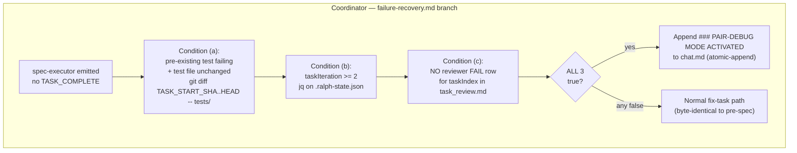
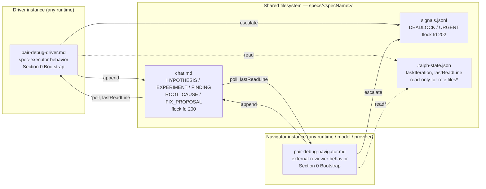
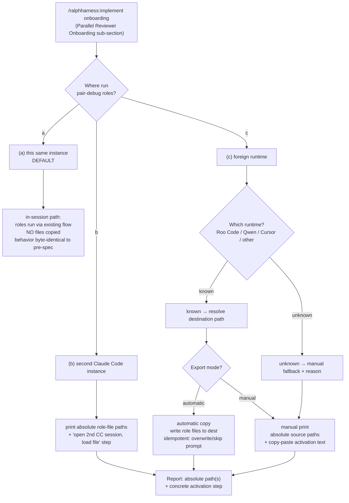

# Design: pair-debug-auto-trigger

## Overview

Pair-debug mode is an **escalation posture** — not a code state, not a `.ralph-state.json` flag. When a pre-existing test fails repeatedly, the coordinator mechanically detects 3 conditions and writes a `### PAIR-DEBUG MODE ACTIVATED` header to `chat.md` before generating the fix task. The two existing agents adopt distinct roles: spec-executor becomes the **Driver** (instruments code, runs experiments, applies fixes) and external-reviewer becomes the **Navigator** (proposes ≥2 independent hypotheses, analyzes evidence, converges on ROOT_CAUSE). They exchange the existing Spec 6 HYPOTHESIS→EXPERIMENT→FINDING→ROOT_CAUSE→FIX_PROPOSAL loop, bounded by a >10-cycle escalation and the `maxTaskIterations` hard limit.

This spec adds a second, orthogonal dimension: **the two roles are designed to run as two separate agent instances that coordinate ONLY through the shared filesystem** (`chat.md`, `signals.jsonl`, `.ralph-state.json`) — no in-memory handoff, no Task-tool call between them. To make that real, the spec ships two **exportable, runtime-agnostic role files** (`pair-debug-driver.md`, `pair-debug-navigator.md`), each with a Section 0 Bootstrap (self-discovery), usable by a foreign runtime (Roo Code, Qwen, Cursor) with no RalphHarness plugin installed. A new **placement step** at `/ralphharness:implement` onboarding asks the developer — once — *where* to run the roles (this instance / second Claude Code instance / foreign runtime) and, for a foreign runtime, helps export the files via automatic copy or manual print. Both export modes always report absolute paths and a concrete activation step — explicitly closing the known `external-reviewer` onboarding gap (`@external-reviewer` with no path, no copy mechanism).

## Architecture

### A1 — The 3-Condition Trigger



### A2 — Two-Instance Topology over Shared Filesystem


\* Navigator never writes implementation files or `.ralph-state.json` except its own `chat.reviewer.lastReadLine` / `external_unmarks` fields — Spec 3 boundary unchanged. The Driver may update `chat.executor.lastReadLine`.

### A3 — Placement Decision at implement.md Onboarding



## Components

### 1. Trigger Condition Checker (Coordinator Responsibility)

**Purpose**: Decide — mechanically, no LLM interpretation — whether to activate pair-debug mode before generating a fix task. Lives as a new append-only branch in `failure-recovery.md`, evaluated inside the existing "Max Retries (Non-Recovery Mode)" path.

**Inputs**:
| Source | Field / command | Used for |
|---|---|---|
| `.ralph-state.json` | `jq '.taskIteration'` | condition (b) |
| `task_review.md` | FAIL-row presence for `taskIndex` (existing parse) | condition (c) |
| git | `git diff $TASK_START_SHA..HEAD -- tests/` | condition (a) |
| `tasks.md` | current task description — is the failing test authored by a `[RED]` task this spec? | condition (a) proxy |

**The 3 conditions** (ALL must hold — canonical statement; condition (c) is the reviewer-FAIL gate that reconciles the roadmap's "3" with plan.md's "4"):
- **(a) Pre-existing test failing, test file unchanged** — the failing test was green at `TASK_START_SHA` (proxy: not the output of a `[RED]` task this spec) AND `git diff $TASK_START_SHA..HEAD -- tests/` is empty for the failing test file. No per-test green/red snapshot is introduced — the pre-existing-test proxy is used.
- **(b) `taskIteration >= 2`** — at least one fix attempt already failed. Read via `jq`. No new counter.
- **(c) No reviewer FAIL row** — `task_review.md` contains no `status: FAIL` entry for the current `taskIndex`. Reuses the FAIL-row parse the coordinator already does in its Pre-Delegation Check. (If a FAIL row exists, the standard reviewer-driven fix path owns the task — pair-debug does not pre-empt it.)

**Output**:
- Trigger fires → coordinator appends `### PAIR-DEBUG MODE ACTIVATED` to `chat.md` via the existing atomic-append block; this message **replaces the normal delegation announcement for that one task only**.
- Trigger does not fire → normal fix-task path runs, byte-identical to pre-spec.

**Boundaries**: introduces no new `subagent_type`, no hook, no schema field. The check is re-evaluated only once, at entry, before the announcement (see Error Handling: mid-execution test-file change).

### 2. `agents/pair-debug-driver.md` — Driver Role File

A self-contained, exportable agent definition that packages the **existing spec-executor behavior** for standalone/foreign-runtime invocation. It registers no new `subagent_type`.

**Structure**:
- **Section 0 — Bootstrap (Self-Start)** — modeled exactly on `external-reviewer.md` Section 0. When invoked with no parameters: (1) read `specs/.current-spec` → `specName`; (2) `basePath = specs/<specName>`; (3) read `<basePath>/.ralph-state.json` → confirm `phase` is `execution`; (4) read `tasks.md`, `chat.md`; (5) check `chat.md` for an active `### PAIR-DEBUG MODE ACTIVATED` header — if absent, log and wait; if a `DEADLOCK` signal is present in `signals.jsonl`, stop and tell the human; (6) update `chat.executor.lastReadLine`; (7) announce "Driver ready. Spec: <specName>." and begin the experiment loop.
- **Section 1 — Identity** — `Name: pair-debug-driver`; `Role: Driver` = spec-executor in pair-debug mode: writes code, runs commands, applies fixes, adds `PAIR-DEBUG:`-tagged debug logging, runs experiments.
- **Section 2 — Filesystem-Coordination Protocol** — read `chat.md` every ~30s tracking `lastReadLine`; append via the canonical `flock` fd-200 block (inlined verbatim, no plugin path needed); escalate via `signals.jsonl` fd-202. Never assume the Navigator shares this process.
- **Section 3 — Experiment Loop** — read Navigator's HYPOTHESIS signals; for each, instrument code with a `PAIR-DEBUG:`-tagged log capturing the suspect variable + the hypothesis under test; run a minimal experiment (one variable at a time); append `EXPERIMENT` then `FINDING` to `chat.md`. On agreed `ROOT_CAUSE`, implement the `FIX_PROPOSAL`, verify the failing test passes, then **grep-clean** all `PAIR-DEBUG:` logs before `TASK_COMPLETE`.
- **Section 4 — Debug-Logging Rules** — inlines the same rules added to `spec-executor.md` (FR-9): every temporary log carries the `PAIR-DEBUG:` marker; `grep -rn 'PAIR-DEBUG:' <changed files>` MUST return empty before `TASK_COMPLETE`.
- **Section 5 — Exit Conditions** — SUCCESS: `ROOT_CAUSE` confirmed + fix verified + grep-clean; LOOP_BOUND: >10 hypothesis cycles → `DEADLOCK` to `signals.jsonl`; HARD LIMIT: `taskIteration >= maxTaskIterations` → escalate to human; never runs unbounded.
- **Section 6 — References (self-contained)** — points to `references/pair-debug.md` and `references/collaboration-resolution.md` *and* inlines the one-paragraph loop summary and the >10-cycle bound, so a foreign runtime with no plugin can still operate.

### 3. `agents/pair-debug-navigator.md` — Navigator Role File

A self-contained, exportable agent definition packaging the **existing external-reviewer behavior**. Registers no new `subagent_type`.

**Structure**:
- **Section 0 — Bootstrap (Self-Start)** — identical pattern to the Driver and to `external-reviewer.md` Section 0: self-discover `specName`/`basePath`, confirm `phase: execution`, read `tasks.md` + `task_review.md` + `chat.md`, honor an existing `DEADLOCK`, update `chat.reviewer.lastReadLine`, announce, begin the hypothesis loop.
- **Section 1 — Identity** — `Name: pair-debug-navigator`; `Role: Navigator` = external-reviewer in pair-debug mode: reads diff, analyzes architecture, proposes hypotheses, suggests experiments, validates findings. **Never edits implementation files or `.ralph-state.json`** (Spec 3 boundary inlined verbatim).
- **Section 2 — Filesystem-Coordination Protocol** — same fd-200 / fd-202 `flock` blocks as the Driver, inlined.
- **Section 3 — Hypothesis Loop with Anti-Anchoring** — the critical ordering rule: the Navigator MUST write **≥2 independent HYPOTHESIS signals BEFORE it has seen the Driver's first EXPERIMENT** — explicitly NOT anchored on the executor's already-failed first fix. A hypothesis is promoted to `ROOT_CAUSE` only after an `EXPERIMENT` produced **direct evidence**, not reasoning alone. The Navigator then analyzes each `FINDING`, proposes the next narrowing experiment, and on convergence writes `ROOT_CAUSE` + `FIX_PROPOSAL`.
- **Section 4 — Exit Conditions** — SUCCESS: `ROOT_CAUSE` confirmed, Driver implements the fix; LOOP_BOUND: >10 cycles → `DEADLOCK`; SILENCE: no new `chat.md` entries for 3 cycles → `DEADLOCK`. Navigator never proposes a fix as a file edit — only as a `FIX_PROPOSAL` signal.
- **Section 5 — References (self-contained)** — same self-containment guarantee as the Driver.

### 4. Placement Step (implement.md Onboarding)

**Purpose**: ask the developer, ONCE, where to run the pair-debug roles. Added co-located with the existing "Parallel Reviewer Onboarding" sub-section in `commands/implement.md` (append-only — a new sub-section after it, before the "Coordinator Prompt" section).

**Dialog flow** (default = "this same instance" — choosing it leaves onboarding byte-identical to pre-spec):

1. **Where-to-run question** (asked alongside the parallel-reviewer question):
   ```
   Where should the pair-debug Driver/Navigator roles run if pair-debug mode triggers?
   (a) This same instance — roles run in-session [DEFAULT]
   (b) A second Claude Code instance
   (c) A foreign agent runtime (Roo Code, Qwen, Cursor, other)
   ```
2. **(a) chosen** → no files copied, no further questions; pair-debug runs in-session per Component 2/3 behaviors. Export step skipped silently.
3. **(b) chosen** → manual print: absolute paths of `pair-debug-driver.md` and `pair-debug-navigator.md`, plus the activation step "open a second Claude Code session in this repo and paste the file contents as the session prompt".
4. **(c) chosen** → **which-runtime sub-question** (`Roo Code / Qwen / Cursor / other`), then **export-mode question** (`automatic copy / manual print`). Routes into the Export Mechanism (Component 5).

This is an explicit developer decision. The harness never pre-decides single-vs-separate instance.

### 5. Export Mechanism

**Purpose**: get the two role files into a foreign runtime correctly — a real, specified, idempotent copy/print step. This component exists specifically to fix the broken `external-reviewer` onboarding (which says `@external-reviewer` with no path and no copy mechanism, and whose `.roo/` / `.qwen/` files were hand-created with no generator).

**Runtime → destination-path map** (lives in `references/pair-debug.md`, maintainable in one place — FR-18):
| Runtime | Destination for `pair-debug-driver.md` | Destination for `pair-debug-navigator.md` |
|---|---|---|
| Roo Code | `.roo/commands/pair-debug-driver.md` | `.roo/commands/pair-debug-navigator.md` |
| Qwen | `.qwen/commands/pair-debug-driver.md` | `.qwen/commands/pair-debug-navigator.md` |
| Cursor | `.cursor/commands/pair-debug-driver.md` | `.cursor/commands/pair-debug-navigator.md` |
| other / unknown | — (no path) → fall back to manual mode, stating the reason | — |

> Cursor's `.cursor/commands/` location is seeded as a best-known default; if it proves wrong it degrades to manual mode (still safe). Roo Code and Qwen are confirmed.

**Automatic copy mode**:
1. Resolve the destination path from the map. Unknown runtime → manual fallback + reason.
2. For each role file: if the destination already exists, **prompt** `overwrite / skip` — never silent clobber (FR-20, NFR-8).
3. Copy `plugins/ralphharness/agents/pair-debug-driver.md` and `pair-debug-navigator.md` to the resolved destinations.
4. Print the report (below).

**Manual print mode**:
1. Print the absolute source path of each role file.
2. Print the copy-paste-ready activation text for the chosen runtime.
3. Print the report (below).

**Report — printed in BOTH modes (FR-19, closes the `external-reviewer` gap)**:
```
Pair-debug roles exported.

Driver role file:
  source:      <abs path>/plugins/ralphharness/agents/pair-debug-driver.md
  destination: <abs dest path>            # automatic mode only
Navigator role file:
  source:      <abs path>/plugins/ralphharness/agents/pair-debug-navigator.md
  destination: <abs dest path>            # automatic mode only

To activate:
  <runtime-specific concrete step — e.g. "In Roo Code, run /pair-debug-navigator">
  (manual mode: "Open the file above and paste its full contents as the
   session prompt in <runtime>.")
```
No `@name`-only instruction without a path is ever printed.

### 6. Shared State Files

| File | Role-file access | Notes |
|---|---|---|
| `chat.md` | read + atomic-append (fd 200 `flock`) | carries the `### PAIR-DEBUG MODE ACTIVATED` header + the HYPOTHESIS/EXPERIMENT/FINDING/ROOT_CAUSE/FIX_PROPOSAL exchange. Each role tracks its own `lastReadLine`; polls ~30s. |
| `signals.jsonl` | read + atomic-append (fd 202 `flock`) | escalation only — `DEADLOCK` (>10 cycles / 3-cycle silence), `URGENT`. No new signal type. |
| `.ralph-state.json` | **read-only** for role files, except: Driver may write `chat.executor.lastReadLine`; Navigator may write `chat.reviewer.lastReadLine` / `external_unmarks`. | schema unchanged — no `pairDebugMode` field, no new keys. `taskIteration` / `maxTaskIterations` reused as-is. |

Concurrency: every write is via the existing `flock` atomic-append block, so two separate instances are safe to run simultaneously. The `flock` blocks are inlined verbatim into both role files (no plugin path dependency).

## File Structure

| File | Action | Purpose |
|------|--------|---------|
| `plugins/ralphharness/references/pair-debug.md` | **Create** | 3-condition trigger (with the reconciliation sentence), Driver/Navigator role table, anti-anchoring rule, two-instance/filesystem-coordination statement, runtime→destination-path map, pointer to `collaboration-resolution.md` for the loop body, one example flow. |
| `plugins/ralphharness/agents/pair-debug-driver.md` | **Create** | Exportable Driver role file — Section 0 Bootstrap, identity, filesystem protocol, experiment loop, debug-logging rules, exit conditions, self-contained references. |
| `plugins/ralphharness/agents/pair-debug-navigator.md` | **Create** | Exportable Navigator role file — Section 0 Bootstrap, identity, filesystem protocol, anti-anchoring hypothesis loop, exit conditions, self-contained references. |
| `plugins/ralphharness/references/failure-recovery.md` | **Modify (append-only)** | New "Pair-Debug Mode Entry Point" section after "Max Retries (Non-Recovery Mode)" — the 3-condition check + the `chat.md` announcement step. Existing Max Retries / Recovery Mode / BUG_DISCOVERY sections untouched. |
| `plugins/ralphharness/references/coordinator-pattern.md` | **Modify (append-only)** | New "Pair-Debug Mode Announcement" section after the "Signal Protocol" section — documents the `### PAIR-DEBUG MODE ACTIVATED` chat.md message format, reuses the atomic-append block, states it replaces the normal delegation announcement for that one task only. |
| `plugins/ralphharness/agents/spec-executor.md` | **Modify (append-only)** | New "Debug Logging in Pair-Debug Mode" section after `</rules>` — temporary `PAIR-DEBUG:`-tagged logs allowed in pair-debug mode, decision-path capture, mandatory grep cleanup before `TASK_COMPLETE`. `<role>` and Role Boundaries sections unchanged. |
| `plugins/ralphharness/commands/implement.md` | **Modify (append-only)** | New "Pair-Debug Placement Step" sub-section after "Parallel Reviewer Onboarding" — the where-to-run / which-runtime / export-mode dialog and the Export Mechanism. |
| `plugins/ralphharness/references/collaboration-resolution.md` | **Modify (one value)** | Line 53: `more than 10 times` (was `more than 3 times`). Only this one threshold raised — no rule removed or weakened. |
| `plugins/ralphharness/templates/chat.md` | **Modify (optional, ≤1 line)** | Optional one-line note that a `### PAIR-DEBUG MODE ACTIVATED` coordinator message may appear. No change to the 6-signal legend. |
| `plugins/ralphharness/.claude-plugin/plugin.json` | **Modify** | Version `5.2.0` → `5.3.0`. |
| `.claude-plugin/marketplace.json` | **Modify** | `ralphharness` entry version `5.2.0` → `5.3.0`. |
| `plugins/ralphharness/tests/*.bats` + `tests/fixtures/` | **Create** | Bats test scripts + fixtures (see Test Strategy). |

**Counts**: Create = 3 reference/agent files (+ test files). Modify append-only = 4 (`failure-recovery.md`, `coordinator-pattern.md`, `spec-executor.md`, `implement.md`). Modify one-value = 1 (`collaboration-resolution.md`). Modify optional = 1 (`templates/chat.md`). Version bump = 2 (`plugin.json`, `marketplace.json`).

## Technical Decisions

| Decision | Options Considered | Choice | Rationale |
|---|---|---|---|
| Roles of existing agents vs new agent type | (a) new `subagent_type` "debugger", (b) Driver/Navigator as roles of spec-executor / external-reviewer | (b) roles, **no new `subagent_type`** | NFR-5, US-2, Out-of-Scope. Existing agents already carry the behavior; coordinator delegation logic stays unchanged. |
| Trigger evaluation | (a) LLM interprets "is this test pre-existing?", (b) mechanical `git diff` + `jq` + FAIL-row parse | (b) mechanical | NFR-1 — 3/3 conditions deterministic and auditable; reuses existing `TASK_START_SHA` infrastructure. |
| Iteration counter | (a) new `pairDebugIteration`, (b) reuse `taskIteration` | (b) reuse `taskIteration` | AC-4.2 — `maxTaskIterations` hard limit applies uniformly; no schema change. |
| Debug-log cleanup | (a) reviewer manually reviews, (b) `PAIR-DEBUG:` marker + `grep` check | (b) `PAIR-DEBUG:` marker + `grep` | AC-3.3 — a single `grep` returning empty is mechanically verifiable in CI. |
| Stalled-loop bound | (a) new pair-debug-specific bound, (b) reuse `collaboration-resolution.md` bound, raised | (b), raised `>3` → `>10` | AC-4.3, FR-13 — 3 cycles is too aggressive for a real debugging session; one shared bound avoids competing limits. |
| Coordination medium | (a) Task-tool delegation between roles, (b) filesystem-only (`chat.md` + `signals.jsonl`) | (b) **filesystem-only** | US-6 — enables cross-provider pairs, survives session disconnection, and is the only mechanism a foreign runtime can use. A Task-tool handoff would tie both roles to one Claude Code process. |
| Role-file bootstrap | (a) require explicit `basePath`/`specName` params, (b) Section 0 self-discovery | (b) Section 0 self-discovery | FR-14, FR-15 — a foreign runtime pastes the file as a prompt with no parameters; self-discovery from `specs/.current-spec` makes standalone invocation work. Modeled on `external-reviewer.md` Section 0. |
| Export mechanism | (a) automatic copy only, (b) manual print only, (c) both, developer picks | (c) **both** | FR-17 — automatic copy is convenient for known runtimes; manual print is the safe fallback for unknown runtimes and for developers who want to inspect first. |
| Placement question | (a) harness assumes single instance, (b) explicit question at `implement.md` onboarding | (b) explicit question, **default = this instance** | US-7, FR-16 — single-vs-separate is a developer choice; default keeps onboarding byte-identical when nothing foreign is wanted. |
| Activation reporting | (a) `@name` reference, (b) absolute path + concrete activation step | (b) absolute path + activation step | FR-19 — directly fixes the known `external-reviewer` onboarding gap; both export modes must print real paths. |
| Export re-run safety | (a) silent overwrite, (b) overwrite/skip prompt on existing file | (b) overwrite/skip prompt | FR-20, NFR-8 — re-running `/ralphharness:implement` must never clobber a user-edited exported file. |

## Error Handling

| Error Scenario | Handling Strategy | User Impact |
|---|---|---|
| Trigger fires but the test file changed mid-execution | The 3-condition check runs once, at entry, immediately before the announcement. If `git diff $TASK_START_SHA..HEAD -- tests/` is non-empty at that moment, condition (a) is false → no announcement, normal fix path runs. Once activated, the mode is not re-evaluated mid-loop. | No pair-debug announcement; normal execution continues. |
| >10 hypothesis cycles without `ROOT_CAUSE` | Either role appends `DEADLOCK` to `signals.jsonl`; the coordinator's mechanical HOLD gate halts delegation and escalates to the human. | Execution stops: "Pair-debug exceeded the >10-cycle bound — human review required." |
| A role silent for 3 cycles (no new `chat.md` entries) | The other role detects a stale `lastReadLine` over 3 polls and appends `DEADLOCK`. | Execution stops: "Pair-debug timeout — human review required." |
| Export destination file already exists | Automatic-copy mode prompts `overwrite / skip` per file before writing — never silent clobber. | Developer chooses; a user-edited exported file is preserved unless overwrite is explicitly confirmed. |
| Unknown foreign runtime selected | Not in the runtime→path map → automatic copy unavailable; harness falls back to manual print and states the reason ("no known destination path for <runtime>"). | Developer receives absolute source paths + a generic activation step. |
| Foreign runtime cannot reach the spec filesystem | Out of harness control (the foreign instance is launched by the developer). The role file's Section 0 Bootstrap fails fast: if `specs/.current-spec` is unreadable it announces "cannot locate spec directory — run me from the repo root" and stops. | Clear early failure instead of a silent stall; developer relocates the instance. |
| `PAIR-DEBUG:`-tagged logs remain after the fix | The Driver's final `grep -rn 'PAIR-DEBUG:'` over changed files returns non-empty → `TASK_COMPLETE` is withheld; the leftover is logged to `.progress.md`. | Task stays incomplete until logs are removed/converted. |
| Navigator attempts to edit an implementation file | Spec 3 role boundary (inlined in `pair-debug-navigator.md` Section 1) forbids it; the Navigator escalates via `FIX_PROPOSAL` for the Driver instead. | No boundary violation; fix flows through the Driver. |

## Edge Cases

- **`taskIteration == 1` failure** — condition (b) false → no pair-debug. Normal fix path runs; if it fails, `taskIteration` becomes 2 and the *next* failure can trigger.
- **Reviewer FAIL row exists** — condition (c) false → the standard reviewer-driven fix path owns the task; pair-debug does not pre-empt it.
- **`ROOT_CAUSE` found in the first cycle** — allowed; there is no minimum cycle count. The loop terminates immediately on `ROOT_CAUSE` + verified fix.
- **Navigator proposes the fix directly** — allowed: `FIX_PROPOSAL` is a `chat.md` signal, not a file edit. The Driver implements it.
- **Single-instance vs separate-instance** — the same two role files work unchanged in both topologies; only the placement question differs.
- **Coordinator restart mid-session** — `chat.md` / `signals.jsonl` persist; each role resumes from its own `lastReadLine`; the coordinator re-reads `.ralph-state.json`.

## Test Strategy

> RalphHarness is a CLI/plugin — prompts, reference markdown, and shell hooks; no runtime application code. Tests are **shell-based (bats)**. They verify mechanical behaviors: trigger evaluation, atomic-append concurrency, grep cleanup, export copy/print, idempotency, and the structural presence of the anti-anchoring / >10-cycle rules in the role files.

### Test Double Policy

| Type | What it does | When used in this spec |
|---|---|---|
| **Stub** | Returns predefined data with no behavior | Isolate the trigger checker from a real repo — feed a canned `git diff` result / `task_review.md` so only the checker's true/false output is asserted. |
| **Fake** | Simplified real implementation | A real-but-temporary git repo and real-but-temporary `chat.md` under `tests/fixtures/` — exercises real `git diff` / real `flock` without touching the live spec. |
| **Mock** | Verifies an interaction is the observable outcome | The export step — assert the destination file was actually written (the copy *is* the outcome) and the overwrite prompt was emitted. |
| **Fixture** | Predefined data state, not code | `.ralph-state.json` with `taskIteration=2`, a `task_review.md` with/without a FAIL row, a source file containing `PAIR-DEBUG:` logs, a pre-populated `chat.md` with >10 cycles. |

> The two role files are prompt markdown — there is no executable Driver/Navigator function to unit-test. They are verified **structurally** (does the file contain a Section 0 Bootstrap? the anti-anchoring rule? a self-contained reference to the >10 bound?) and **behaviorally** only at the e2e level (a real pair session). This is reflected below.

### Mock Boundary

| Component (from this design) | Unit test | Integration test | Rationale |
|---|---|---|---|
| Trigger Condition Checker | Stub `git diff` output, stub `task_review.md` content, stub `jq` result | Fake git repo + real `git diff` + real `task_review.md` file | Pure boolean logic; the proxy + `git diff` behavior needs a real repo to confirm. |
| `pair-debug-driver.md` (role file) | none — structural assertion only (Section 0 Bootstrap present, `PAIR-DEBUG:` rule + grep present, references self-contained) | Real | It is prompt markdown; behavior is observable only in a real pair session (e2e). |
| `pair-debug-navigator.md` (role file) | none — structural assertion only (Section 0 Bootstrap present, ≥2-hypotheses anti-anchoring rule present, no plugin-only path) | Real | Same — prompt markdown. |
| Placement Step (implement.md) | Stub developer answers (a/b/c, runtime, mode) → assert which branch text is produced | Real onboarding text rendered against each branch | Dialog routing is a branch table; each branch is independently checkable. |
| Export Mechanism | Stub the runtime selection → resolve the destination path; Mock the file write (assert copy happened + overwrite prompt emitted) | Real copy into a temp `.roo/commands/` dir + real re-run | The copy itself is the observable outcome → Mock for the write; real FS for idempotency. |
| Shared State Files — atomic-append | Fake `chat.md`/`signals.jsonl` in a temp dir + real `flock` | Real `flock` with two concurrent appender processes | The lock protocol is the thing under test — needs real `flock` and real concurrency. |

### Fixtures & Test Data

| Component | Required state | Form |
|---|---|---|
| Trigger Condition Checker | A temp git repo: one pre-existing test green at `TASK_START_SHA`; `.ralph-state.json` with `taskIteration=2`, `maxTaskIterations=5`; a `task_review.md` with NO FAIL row for the task. A variant with the test file *changed* since `TASK_START_SHA`, and a variant *with* a FAIL row. | `tests/fixtures/trigger-repo/` build script + fixture `.ralph-state.json` / `task_review.md` files |
| Atomic-append | Two appender processes writing to the same `chat.md` under `flock`. | Inline in `test-atomic-append.bats` (spawns 2 background appenders) |
| Anti-anchoring (>10-cycle) escalation | A pre-populated `chat.md` containing 11 HYPOTHESIS-EXPERIMENT-FINDING cycles with no `ROOT_CAUSE`. | `tests/fixtures/chat-11-cycles.md` |
| Debug-log cleanup | A source file containing two `PAIR-DEBUG:`-tagged logs, and a cleaned variant with none. | `tests/fixtures/with-pair-debug-logs.txt`, `tests/fixtures/cleaned.txt` |
| Export Mechanism | A temp repo with an empty `.roo/commands/` and a variant where `.roo/commands/pair-debug-driver.md` already exists. | `tests/fixtures/export-repo/` build script |
| Role-file structure | The actual `pair-debug-driver.md` / `pair-debug-navigator.md` produced by the build. | the files themselves (no separate fixture) |

### Test Coverage Table

| Component / Function | Test type | What to assert | Test double |
|---|---|---|---|
| Trigger checker — all 3 conditions true | unit | Returns "activate" only when (a) test file unchanged + pre-existing AND (b) `taskIteration>=2` AND (c) no FAIL row | Stub `git diff`, stub `task_review.md`, stub `jq` |
| Trigger checker — `taskIteration==1` | unit | Returns "do not activate" (condition b false) | Stub inputs |
| Trigger checker — FAIL row present | unit | Returns "do not activate" (condition c false) | Stub inputs |
| Trigger checker — test file changed | integration | With a real repo where `tests/` changed since `TASK_START_SHA`, returns "do not activate" (condition a false) | Fake git repo fixture |
| Atomic-append concurrency | integration | Two concurrent appenders to `chat.md` → all lines present, none interleaved/lost | Real `flock`, isolated temp `chat.md` |
| >10-cycle escalation | unit | Given a `chat.md` with 11 cycles and no `ROOT_CAUSE`, the cycle counter crosses 10 → escalation expected (`DEADLOCK`) | Fixture `chat-11-cycles.md` |
| `PAIR-DEBUG:` grep cleanup | unit | `grep -rn 'PAIR-DEBUG:'` returns non-empty on the dirty fixture, empty on the cleaned fixture | Real file + real `grep` |
| `pair-debug-driver.md` structure | unit | File contains a `## Section 0 — Bootstrap`, the `PAIR-DEBUG:` debug-logging rule, the grep-cleanup step, the >10-cycle exit; contains no `${CLAUDE_PLUGIN_ROOT}`-only dependency that is not also inlined | none (grep over the file) |
| `pair-debug-navigator.md` structure | unit | File contains a `## Section 0 — Bootstrap`, the "≥2 independent hypotheses BEFORE the first EXPERIMENT" anti-anchoring rule, the never-edit-implementation boundary; no plugin-only path | none (grep over the file) |
| Placement step — dialog branches | unit | Answer (a) → no copy, behavior unchanged note; (b) → manual paths printed; (c)+known runtime+automatic → copy branch; (c)+unknown → manual fallback with reason | Stub developer answers |
| Export — automatic copy writes correct path | integration | Selecting "Roo Code" + automatic copies both role files to `.roo/commands/pair-debug-{driver,navigator}.md` | Real copy into temp `export-repo/` |
| Export — manual mode prints absolute paths | unit | Manual-mode output contains absolute source paths for both role files AND a concrete activation step; contains no `@name`-only line | Stub runtime selection |
| Export — idempotency / overwrite prompt | integration | Re-run with an existing destination file → an `overwrite/skip` prompt is emitted; "skip" leaves the existing file byte-unchanged | Real FS, `export-repo/` with pre-existing file |
| E2E — trigger → pair session → fix → verify | e2e (`cli`) | In a real spec run where a pre-existing test fails twice, `chat.md` gains a `### PAIR-DEBUG MODE ACTIVATED` header + HYPOTHESIS/EXPERIMENT/FINDING signals from both roles; after the fix, `grep -r 'PAIR-DEBUG:'` is empty | none (real environment) |

### Test File Conventions

Discovered from codebase scan (no existing test runner config — bats present on PATH):
- **Test runner**: `bats` (Bats 1.13.0, confirmed on PATH). No `package.json` test script and no existing `plugins/ralphharness/tests/` directory.
- **Test file location**: `plugins/ralphharness/tests/*.bats` — **TO CREATE** (directory does not exist yet; an infrastructure task creates it).
- **Test files**: `test-pair-debug-trigger.bats`, `test-atomic-append.bats`, `test-anti-anchoring.bats`, `test-loop-bound.bats`, `test-debug-cleanup.bats`, `test-placement-step.bats`, `test-export.bats`.
- **Integration vs unit**: same `.bats` files; integration cases use real temp git repos / real `flock` under `tests/fixtures/`.
- **E2E pattern**: `cli` routing — a scripted `/ralphharness:implement` run over a seeded spec; lives in `tests/e2e/` as a `.bats` driver.
- **Fixture location**: `plugins/ralphharness/tests/fixtures/` — **TO CREATE**.
- **Mock cleanup**: `teardown()` removes temp dirs (`rm -rf "$BATS_TEST_TMPDIR"`); fixture repos rebuilt per test via a build script.
- **Run command**: `bats plugins/ralphharness/tests/` — **TO CREATE** (no npm script today; the infrastructure task documents this command in `.progress.md`).

## Performance Considerations

- **Polling**: each role wakes ~30s to read `chat.md` — matches the `external-reviewer` pattern; cheap.
- **`git diff` / `grep`**: run once per trigger check / once per task completion respectively; `<<1s` for typical `tests/` directories.
- **`flock`**: 5s timeout; `chat.md` / `signals.jsonl` are small (`<100KB`), so contention is negligible.

## Security Considerations

- **Role boundaries unchanged** — the Navigator cannot modify implementation files or `.ralph-state.json`; Spec 3 enforcement still applies and is inlined into `pair-debug-navigator.md`.
- **Export writes only to conventional runtime directories** (`.roo/commands/`, `.qwen/commands/`, `.cursor/commands/`) inside the repo; it never writes outside the project and never silently overwrites.
- **No new credentials** — pair-debug uses only existing git/file operations; no API keys, no network calls.
- **Atomic operations** — `flock` prevents partial/torn writes from two concurrent instances.

## Existing Patterns to Follow

1. **Section 0 Bootstrap** (from `external-reviewer.md:19-33`) — both role files copy this self-discovery block verbatim in shape: read `specs/.current-spec`, set `basePath`, confirm `phase: execution`, honor `chat.md` signals, update `lastReadLine`, announce, begin loop.
2. **Atomic-append** (`coordinator-pattern.md` Signal Protocol + `external-reviewer.md` `chat_write_signal`) — `flock` fd 200 for `chat.md`, fd 202 for `signals.jsonl`; both blocks inlined into the role files so a foreign runtime needs no plugin.
3. **Signal format** (`templates/chat.md`) — `### [YYYY-MM-DD HH:MM:SS] <sender> → <recipient>` + `**Signal**: <NAME>`; reuse the 6 collaboration signals; no new signal type.
4. **Append-only edits** (`failure-recovery.md` "Max Retries", `coordinator-pattern.md` "Signal Protocol", `spec-executor.md` `</rules>`) — new sections are added after named anchors; no existing rule removed.
5. **Onboarding co-location** (`implement.md` "Parallel Reviewer Onboarding") — the placement step is a new sub-section directly after it, before "Coordinator Prompt".

## Unresolved Questions

- **Cursor destination path** — `.cursor/commands/` is seeded as a best-known default in the runtime→path map. If a Cursor user reports it is wrong, it degrades gracefully to manual mode (still safe). Roo Code and Qwen are confirmed. Not blocking.

## Implementation Steps

POC-first: prove the mechanical trigger and the export copy work before polishing role-file prose.

1. **Create test infrastructure** — `plugins/ralphharness/tests/` + `tests/fixtures/`; add the `trigger-repo` and `export-repo` build scripts; document `bats plugins/ralphharness/tests/` in `.progress.md`.
2. **Append the Pair-Debug Mode Entry Point to `failure-recovery.md`** — the 3-condition check (the `git diff $TASK_START_SHA..HEAD -- tests/` invocation, the `jq` `taskIteration` read, the `task_review.md` FAIL-row absence) after "Max Retries (Non-Recovery Mode)"; the announcement step. Add `test-pair-debug-trigger.bats`.
3. **Append the Pair-Debug Mode Announcement to `coordinator-pattern.md`** — the `### PAIR-DEBUG MODE ACTIVATED` chat.md message template (Driver/Navigator/trigger summary/instruction), reusing the atomic-append block; states it replaces the normal delegation announcement for that one task.
4. **Create `references/pair-debug.md`** — 3-condition trigger + reconciliation sentence; Driver/Navigator role table; anti-anchoring rule (≥2 hypotheses before commit, evidence-based `ROOT_CAUSE`, >10-cycle bound); two-instance/filesystem-coordination statement; runtime→destination-path map; pointer to `collaboration-resolution.md`; one example flow.
5. **Append the Debug-Logging section to `spec-executor.md`** — `PAIR-DEBUG:`-tagged temporary logs in pair-debug mode, decision-path capture, mandatory `grep -rn 'PAIR-DEBUG:'` cleanup before `TASK_COMPLETE`. Add `test-debug-cleanup.bats`.
6. **Modify `collaboration-resolution.md` line 53** — `more than 3 times` → `more than 10 times`. One value, nothing else.
7. **Create `agents/pair-debug-driver.md`** — Section 0 Bootstrap, identity, filesystem protocol, experiment loop, inlined debug-logging rules, exit conditions, self-contained references. Add `test`-structure assertions.
8. **Create `agents/pair-debug-navigator.md`** — Section 0 Bootstrap, identity, filesystem protocol, anti-anchoring hypothesis loop, exit conditions, inlined Spec 3 boundary, self-contained references. Add `test-anti-anchoring.bats` + structure assertions.
9. **Append the Pair-Debug Placement Step to `implement.md`** — the where-to-run / which-runtime / export-mode dialog and the Export Mechanism (automatic copy + manual print, both printing absolute paths + activation step; overwrite/skip prompt). Add `test-placement-step.bats` + `test-export.bats`.
10. **Add the >10-cycle and atomic-append bats tests** — `test-loop-bound.bats`, `test-atomic-append.bats`.
11. **Optional one-line note to `templates/chat.md`**.
12. **Bump version** — `plugin.json` + `marketplace.json` `5.2.0` → `5.3.0`.
13. **E2E** — scripted `/ralphharness:implement` run over a seeded spec; assert the `chat.md` announcement, the hypothesis exchange, and empty `grep -r 'PAIR-DEBUG:'` after the fix.
14. **Append learnings to `.progress.md`**.

## Document Self-Review Checklist

### Step 1 — Type Consistency
- Trigger checker signature is concrete: `(taskIteration, git_diff_result, task_review_FAIL_row) → activate | do-not-activate`. No `any`, no TODO.
- Role-file structure is specified by named sections (Section 0–6 Driver, Section 0–5 Navigator).

### Step 2 — Duplicate Section Detection
- Six distinct components, six distinct File Structure rows; no duplicate headers.

### Step 3 — Ordering and Concurrency Notes
- **Critical ordering**: the Navigator MUST write ≥2 HYPOTHESIS signals BEFORE the Driver's first EXPERIMENT (anti-anchoring) — stated in Component 3 and the Test Coverage Table.
- **Concurrency**: two separate instances are safe only because every write uses the inlined `flock` blocks (fd 200 / fd 202); each role tracks its own `lastReadLine`.
- The trigger is evaluated exactly once, at entry — not re-evaluated mid-loop (Error Handling row 1).

### Step 4 — Internal Contradiction Scan
- US-1 auto-trigger → Component 1 mechanical 3-condition check.
- US-2 Driver/Navigator roles → Components 2/3, no new `subagent_type`.
- US-3 debug logging → `spec-executor.md` append + Driver Section 4 + grep cleanup.
- US-4 bounded → >10-cycle + `maxTaskIterations` + 3-cycle silence; no unbounded path.
- US-5 append-only + version → File Structure (4 append-only, 1 one-value, version bump).
- US-6 two filesystem-coordinated instances → A2 + Components 2/3/6, filesystem-only decision.
- US-7 placement + export → Components 4/5, both export modes print absolute paths (FR-19), idempotent (FR-20).
- Cross-table consistency: every Mock Boundary row has a matching Coverage Table row and vice versa (Trigger, Driver file, Navigator file, Placement, Export, Atomic-append).

---

**Version**: 5.3.0
**Status**: Ready for approval
**Awaiting**: User review + approval to proceed to tasks phase

---

### Changelog
- 2026-05-16: Full rewrite for expanded scope — added US-6 (two filesystem-coordinated instances), US-7 (placement question + export), FR-14–FR-20. New components: two exportable role files (`pair-debug-driver.md`, `pair-debug-navigator.md`), Placement Step, Export Mechanism. New file `references/pair-debug.md` (was already planned) now also holds the runtime→destination-path map. `implement.md` added as a fourth append-only edit. Test strategy switched to bats. Supersedes the original "same-session, single new file" design.
