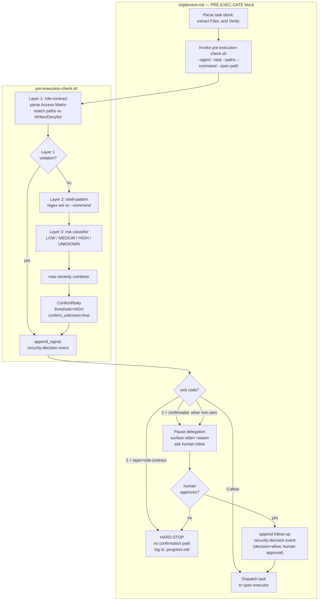
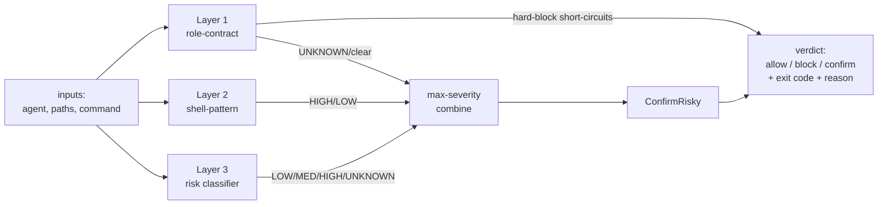

# Design: Pre-Execution Security Critic

> Spec 9 of engine-roadmap-epic. Adopts the OpenHands SDK SecurityAnalyzer + SecurityRisk + ConfirmRisky + exit-code-2 hook pattern. Scope: **Core mechanical enforcement** — deterministic, zero LLM/network calls.

## Overview

A new shell script `hooks/scripts/pre-execution-check.sh` classifies each task **before** the coordinator delegates it. The coordinator extracts two structured fields already present in every task block — `**Files:**` (intended write paths) and `**Verify:**` (intended shell command) — and passes them to the script. The script runs three deterministic layers (role-contract, dangerous-shell-pattern, risk classifier), combines their verdicts by **max-severity**, applies the fixed `ConfirmRisky(threshold=HIGH, confirm_unknown=true)` policy, and emits an exit-code verdict: `0` allow, `2` block/confirm, any other non-zero treated by the coordinator as `UNKNOWN`→confirm. Every invocation appends exactly one `security-decision` event to `signals.jsonl` via the existing `append_signal` helper.

The gate lives in `commands/implement.md` as a new delimited block (`# BEGIN PRE-EXEC-GATE`) inserted between the existing `# END MALFORMED-CHECK` and `# BEGIN HOLD-GATE`. Layer 1 role-contract violations **hard-block** (no confirmation path). Layers 2 and 3 only escalate risk; HIGH/UNKNOWN route through the coordinator's inline confirmation prompt. The check reuses Spec 4 infrastructure entirely — no new lock, no new log file, no new schema file.

---

## Architecture

### Decision Flow

Purpose tag — how a task travels from the coordinator's pre-delegation gate to an allow / hard-block / inline-confirm outcome.



### Layer Pipeline

Purpose tag — how the three layers compose inside the script into a single verdict.



---

## Components

### `pre-execution-check.sh` (CREATE)

**Purpose**: Mechanical pre-execution classifier. Deterministic, no LLM/network calls (NFR-1), completes < 100 ms (NFR-2).

**CLI contract**:

| Flag | Required | Meaning |
|------|----------|---------|
| `--agent <name>` | yes | Target agent role (e.g. `spec-executor`); resolved against the Access Matrix |
| `--task <id>` | yes | Task ID (e.g. `1.3`); recorded in the audit event |
| `--paths <csv>` | no | Comma-separated intended write paths from the task `**Files:**` field; may contain globs. Absent → Layer 1 contributes UNKNOWN |
| `--command <cmd>` | no | The task `**Verify:**` field value, passed verbatim. Note `**Verify:**` is often free-text prose ("Code compiles", "Tests pass") rather than an executable command — Layer 2's regex simply does not match prose, yielding a no-op `LOW` (the intended fail-safe). Absent → Layer 2 is a no-op (LOW) per AC-3.4 |
| `--spec-path <dir>` | yes | Spec directory; locates `signals.jsonl` for the audit append |

**Exit-code contract** (US-5):

| Exit | Meaning | Coordinator action |
|------|---------|--------------------|
| `0` | allow | Dispatch the task |
| `2` | block/confirm | Do NOT dispatch. Layer-1 hard-block → hard-stop. Confirmable (HIGH/UNKNOWN) → inline confirm |
| other non-zero | non-blocking script error | Treat as UNKNOWN → inline confirm; WARN to `.progress.md` (fail-safe, NFR-4) |

**I/O streams** (AC-5.4): human-readable reason → `stderr`; optional structured one-line verdict → `stdout`. The audit event goes to `signals.jsonl`, never to stdout/stderr.

**Internal layers**:

#### Layer 1 — role-contract matrix parser

**Purpose**: Hard-block writes outside the target agent's `Writes` set or matching its `Denylist`.

**Responsibilities**:
- Locate `references/role-contracts.md` (relative to `CLAUDE_PLUGIN_ROOT`).
- Extract the `## Access Matrix` markdown table; find the row whose `Agent` cell equals `--agent`.
- For each path in `--paths`, test it against the row's `Writes` and `Denylist` cells.
- A path matching `Denylist`, or a path NOT covered by `Writes`, is a Layer 1 violation → emit verdict `block`, `layer=role-contract`, exit `2`, **no confirmation path** (AC-1.2, AC-1.3).
- `role-contracts.md` missing, Access Matrix unparseable, or `--agent` not found in the matrix → return `UNKNOWN` (AC-1.4) — never `allow`.
- `--paths` absent → return `UNKNOWN` (the script cannot prove the writes are in-bounds).

#### Layer 2 — dangerous shell pattern regex set

**Purpose**: Classify known-dangerous shell commands `HIGH` regardless of agent (AC-3.2). Layer 2 never hard-blocks.

**Pattern set** (extended-regex, case-sensitive, deterministic — AC-3.1, AC-3.3):

| Pattern (ERE) | Catches |
|---------------|---------|
| `rm[[:space:]]+(-[a-zA-Z]*r[a-zA-Z]*[[:space:]]+\|-[a-zA-Z]*f[a-zA-Z]*[[:space:]]+).*-` then a combined `rm .*-rf\|rm .*-fr` check | `rm -rf`, `rm -fr`, `rm -r -f` |
| `(^\|[[:space:];&\|])sudo[[:space:]]` | `sudo` privilege escalation |
| `chmod[[:space:]]+(-[a-zA-Z]+[[:space:]]+)?777` | `chmod 777` |
| `(curl\|wget)[^\|]*\|[[:space:]]*(sudo[[:space:]]+)?(sh\|bash)` | fetch piped to a shell |
| `(^\|[[:space:];&\|`$(])eval[[:space:]]` | `eval` |

- Match on `--command` → `HIGH`. No match, or `--command` absent → `LOW` (AC-3.4).
- The reason text names which pattern matched (e.g. `Layer 2: dangerous pattern 'rm -rf' in verify command`).

#### Layer 3 — risk classifier

**Purpose**: Assign every task exactly one `SecurityRisk` baseline level (AC-2.1).

**Rules** (deterministic):
- `--paths` absent (no `**Files:**` field) → `UNKNOWN` (resolves Unresolved Question 1's missing-field case).
- `--paths` present and Layer 1 clean, `--command` absent or read-only → `LOW`.
- `--paths` present (the task modifies files) and Layer 2 clean → `MEDIUM`.
- (Layer 2's `HIGH` and Layer 1's outcomes are merged in via the combiner, not re-derived here.)

#### max-severity combiner

**Purpose**: One verdict from three layers; highest concrete risk wins (never average) — AC-2.1.

- Severity order: `LOW < MEDIUM < HIGH < UNKNOWN`. `UNKNOWN` ranks above `HIGH` so an indeterminate layer always forces confirmation rather than being masked by a HIGH (both route to confirm, but the recorded `risk` must reflect the indeterminacy).
- Layer 1 is special: a Layer 1 **violation** short-circuits the pipeline and produces an unconditional hard-block before the combiner runs (AC-1.3). Layer 1's non-violation outputs (`clear` or `UNKNOWN`) feed the combiner like any other layer.
- Combined risk = max over {Layer 1 risk-contribution, Layer 2 risk, Layer 3 risk}.

#### ConfirmRisky policy function

**Purpose**: Map combined risk to the allow/confirm verdict (AC-2.2). Fixed parameters — not configurable (Out of Scope).

| Combined risk | Verdict | Exit |
|---------------|---------|------|
| `LOW` | allow | `0` |
| `MEDIUM` | allow | `0` |
| `HIGH` | confirm | `2` |
| `UNKNOWN` | confirm | `2` |

Layer 1 violation bypasses this table entirely → `block`, exit `2`, no confirmation.

### `implement.md` PRE-EXEC-GATE block (MODIFY)

**Purpose**: Coordinator-side gate that runs the check before each delegation and acts on the exit code.

**Placement**: a new `# BEGIN PRE-EXEC-GATE` / `# END PRE-EXEC-GATE` block inserted **after** `# END MALFORMED-CHECK` and **before** `# BEGIN HOLD-GATE` (decision 4).

**Responsibilities**:
1. Parse the current task block from `tasks.md`: extract the `**Files:**` field → `--paths`, the `**Verify:**` field → `--command` (passed verbatim — `**Verify:**` may be free-text prose, which Layer 2 safely treats as a no-op `LOW`). Missing `**Files:**` → pass no `--paths` (script returns UNKNOWN→confirm).
2. Invoke `pre-execution-check.sh` with `--agent` (spec-executor, or qa-engineer for `[VERIFY]` tasks), `--task`, `--paths`, `--command`, `--spec-path`.
3. Branch on exit code:
   - `0` → fall through to HOLD-GATE, then dispatch.
   - `2` with `layer=role-contract` on the stdout verdict → **hard-stop**: log the Layer 1 reason to `.progress.md`, do NOT dispatch, do NOT advance `taskIndex`. Resolution requires fixing the task or the role contract.
   - `2` confirmable (any other layer) → pause: surface the script's stderr reason to the human inline, ask for explicit approval. On approval, append a follow-up `security-decision` event (`decision:"allow"`, recording the human approval) then dispatch. On refusal, hard-stop.
   - other non-zero → WARN to `.progress.md`, treat as UNKNOWN, follow the confirmable path.

### `security-decision` event emitter

**Purpose**: Append exactly one audit event per invocation (AC-4.1).

- The script builds the JSON payload and calls `append_signal "$spec_path" "$payload"` sourced from `lib-signals.sh` — reusing flock fd 202 and the pre-write `jq -e .` validation. No new lock, no direct file write.
- The coordinator emits the **follow-up** event on human approval of a confirmable verdict, also via `append_signal`.
- `append_signal` returning non-zero (flock timeout exit 75, or malformed payload exit 2) is treated by the script as a non-blocking error: WARN to `.progress.md`, exit non-zero → coordinator routes to confirm (fail-safe).

### `spec.schema.json` extension (MODIFY)

**Purpose**: Formalize the `security-decision` event shape. Added as a new `securityDecisionEvent` definition under `definitions` in the existing `schemas/spec.schema.json` (decision 3 — no new `signals.schema.json`).

---

## Technical Decisions

| Decision | Options considered | Choice | Rationale |
|----------|--------------------|--------|-----------|
| Layer 1 matrix parse | Hardcode the matrix; YAML sidecar; parse the markdown table | Parse the `## Access Matrix` markdown table with `awk`/`grep` | Single source of truth (Spec 3 owns the table). `awk` extracts the table region between `## Access Matrix` and the next `##`, splits rows on `|`, trims cells. Deterministic, no deps beyond coreutils. |
| Glob matching of `**Files:**` paths | Shell `case` glob; `grep` literal; `[[ == ]]` pattern | Bash `[[ "$path" == $pattern ]]` per Writes/Denylist entry, with `extglob` for `*` | Task `**Files:**` may contain globs (`src/pages/*.tsx`); the matrix cells are also patterns. Glob-vs-glob is matched literally first, then by `[[ ]]` pattern. No false-allow: if no Writes pattern matches, the path is out-of-bounds. |
| Layer 2 escalates to HIGH, not hard-block | Hard-block dangerous patterns; escalate to HIGH→confirm | Escalate to HIGH (AC-3.2) | Dangerous-but-legitimate commands exist (a task's verify may legitimately need `sudo` in some envs). Hard-block has no escape hatch; HIGH→ConfirmRisky gives the human a decision point. Only role-contract violations (Layer 1) are categorically wrong, so only they hard-block. |
| Combiner: max-severity | Average; sum; weighted | Max-severity (AC-2.1) | OpenHands SDK precedent. Simpler and more auditable — the worst layer dictates the verdict. Averaging could mask a HIGH under two LOWs. |
| `UNKNOWN` ranks above `HIGH` in the order | UNKNOWN below HIGH; UNKNOWN == HIGH | UNKNOWN highest | "I don't know" must never be silently downgraded. Both route to confirm, but the recorded `risk` field must show the indeterminacy for accurate replay. |
| Fail-safe defaults | Fail-open (allow on error); fail-closed (hard-block on error); fail-to-confirm | Fail-to-confirm — every indeterminate state → UNKNOWN→confirm (NFR-3, NFR-4) | Fail-open is unsafe; fail-closed (hard-block) would lock the engine on a missing/garbled contract. Confirm is the only safe-and-non-locking outcome. |
| Confirmation capture | `signals.jsonl` PENDING/ACK round-trip; inline coordinator prompt | Inline coordinator prompt (decision 2) | Matches the existing HOLD-gate UX (synchronous, in coordinator chat). No new signal types, no async round-trip. The follow-up `security-decision` event still records the approval for audit. |
| Schema location | New `signals.schema.json`; extend `spec.schema.json` | Extend `spec.schema.json` (decision 3) | Control events are not schema-formalized today; keeping one schema file avoids fragmentation. |

---

## Data Design

### `security-decision` event JSON shape

One line per invocation appended to `specs/<name>/signals.jsonl` (AC-4.1, AC-4.2):

```json
{
  "type": "security-decision",
  "decision": "block",
  "layer": "role-contract",
  "risk": "HIGH",
  "agent": "spec-executor",
  "task": "1.3",
  "path": "specs/demo/.ralph-state.json",
  "command": null,
  "reason": "Layer 1: write to '.ralph-state.json' matches spec-executor Denylist",
  "timestamp": "2026-05-16T22:04:11Z",
  "iteration": 7
}
```

Field semantics:

| Field | Type | Values / notes |
|-------|------|----------------|
| `type` | string | const `"security-decision"` |
| `decision` | string | `allow` \| `block` \| `confirm` |
| `layer` | string | `role-contract` \| `shell-pattern` \| `risk` \| `none` (which layer drove the verdict; `none` = clean LOW/MEDIUM allow) |
| `risk` | string | `LOW` \| `MEDIUM` \| `HIGH` \| `UNKNOWN` (the combined max-severity risk) |
| `agent` | string | target agent role |
| `task` | string | task ID (e.g. `1.3`) |
| `path` | string \| null | offending / relevant write path; `null` when not path-driven |
| `command` | string \| null | offending / relevant shell command; `null` when not command-driven |
| `reason` | string | human-readable reason (mirrors stderr) |
| `timestamp` | string | ISO-8601 UTC (`date -u +%FT%TZ`) |
| `iteration` | integer | `globalIteration` from `.ralph-state.json` at decision time |

The follow-up event on human approval reuses the same shape with `decision:"allow"`, `layer` unchanged, and `reason` prefixed `human approved: ...`.

### `spec.schema.json` definition (added under `definitions`)

```json
"securityDecisionEvent": {
  "type": "object",
  "description": "A pre-execution security decision recorded in signals.jsonl",
  "required": ["type", "decision", "layer", "risk", "agent", "task", "reason", "timestamp", "iteration"],
  "properties": {
    "type":      { "const": "security-decision" },
    "decision":  { "type": "string", "enum": ["allow", "block", "confirm"] },
    "layer":     { "type": "string", "enum": ["role-contract", "shell-pattern", "risk", "none"] },
    "risk":      { "type": "string", "enum": ["LOW", "MEDIUM", "HIGH", "UNKNOWN"] },
    "agent":     { "type": "string" },
    "task":      { "type": "string" },
    "path":      { "type": ["string", "null"] },
    "command":   { "type": ["string", "null"] },
    "reason":    { "type": "string" },
    "timestamp": { "type": "string", "format": "date-time" },
    "iteration": { "type": "integer", "minimum": 1 }
  }
}
```

---

## File Structure

| File | Action | Purpose |
|------|--------|---------|
| `plugins/ralphharness/hooks/scripts/pre-execution-check.sh` | **Create** | The 3-layer mechanical check; CLI + exit-code contract |
| `plugins/ralphharness/commands/implement.md` | Modify | Insert `# BEGIN PRE-EXEC-GATE` block after MALFORMED-CHECK, before HOLD-GATE |
| `plugins/ralphharness/schemas/spec.schema.json` | Modify | Add `securityDecisionEvent` definition |
| `plugins/ralphharness/templates/signals.jsonl` | Modify | Add header note + commented `security-decision` example line |
| `plugins/ralphharness/references/role-contracts.md` | Modify | Add `pre-execution-check.sh` to Access Matrix as a read-only consumer; note it as the mechanical enforcer |
| `plugins/ralphharness/.claude-plugin/plugin.json` | Modify | Version bump `5.3.0` → `5.4.0` (minor — new feature) |
| `.claude-plugin/marketplace.json` | Modify | Mirror the `ralphharness` version bump to `5.4.0` |

No new lock file, no new log file, no new schema file — Spec 4 infrastructure is reused as-is.

---

## Error Handling & Failure Modes

| Scenario | Handling | Outcome |
|----------|----------|---------|
| `role-contracts.md` missing | Layer 1 returns `UNKNOWN`; reason notes the missing file | combined risk UNKNOWN → confirm (NFR-4) |
| Access Matrix unparseable / malformed table | Layer 1 returns `UNKNOWN` | confirm; reason names the parse failure |
| `--agent` not in matrix | Layer 1 returns `UNKNOWN` | confirm (AC-1.4) |
| `**Files:**` field missing from task block | coordinator passes no `--paths`; Layer 1 + Layer 3 return `UNKNOWN` | confirm (resolves Unresolved Question 1) |
| `**Verify:**` field missing | coordinator passes no `--command`; Layer 2 is a no-op `LOW` (AC-3.4) | risk derived from Layers 1/3 only |
| `jq` absent | `append_signal` uses lib-signals path; if the audit append fails the script WARNs and exits non-zero | coordinator treats as UNKNOWN → confirm (NFR-7) |
| `pre-execution-check.sh` crashes / exits unexpected non-zero | coordinator's PRE-EXEC-GATE catches any exit ∉ {0,2} | WARN to `.progress.md`, treat as UNKNOWN → confirm (AC-5.3) |
| `flock` timeout on audit append (exit 75) | script WARNs, exits non-zero | coordinator → confirm; no torn write (validation precedes lock) |
| `signals.jsonl` absent on first run | PRE-EXEC-GATE runs *before* the HOLD-GATE `cp` seed, but `append_signal`'s `printf ... >>` creates `signals.jsonl` on first write — no pre-seed required | event appends cleanly, file created (NFR-5) |

**Hard invariants enforced**:
- Layer 1 violations always hard-block — never reachable by confirmation (AC-1.3).
- The check never fails open: every indeterminate state → UNKNOWN → confirm.
- `signals.jsonl` is append-only — `append_signal` only appends; existing lines never mutated (AC-4.3).
- No LLM calls, no network access (NFR-1).

---

## Test Strategy

> Core rule: deterministic shell logic, tested real with `bats` and on-disk fixtures. The only doubles are filesystem fixtures (role-contracts.md variants, task blocks) and a temp `signals.jsonl`.

### Test Double Policy

| Type | Use in this spec |
|------|------------------|
| **Fixture** | Predefined `role-contracts.md` variants and sample task blocks under `tests/fixtures/pre-exec/`; a temp `signals.jsonl` seeded per test. The primary mechanism — these are data, not code. |
| **Stub** | Not needed — the script makes no I/O calls beyond reading the contract file and appending the audit event, both exercised real against fixtures. |
| **Fake** | Not needed — no external infrastructure. |
| **Mock** | Not needed — there is no interaction to verify; observable outcome is the exit code + the appended event line. |

### Mock Boundary

| Component | Unit test | Integration test | Rationale |
|-----------|-----------|------------------|-----------|
| `pre-execution-check.sh` (whole script) | Real, run against fixture contracts + temp `signals.jsonl` | Real | Pure deterministic shell; no I/O worth doubling |
| Layer 1 matrix parser | Real, fixture `role-contracts.md` | Real | Parsing logic must be exercised against the actual markdown table shape |
| Layer 2 regex set | Real, `--command` strings as inline args | Real | Pure regex; deterministic |
| Layer 3 classifier | Real | Real | Pure rules |
| max-severity combiner | Real | Real | Pure function |
| ConfirmRisky policy | Real | Real | Pure mapping table |
| `security-decision` emitter (`append_signal`) | Real, temp `signals.jsonl` + lock | Real | Reuses Spec 4 helper; verified by inspecting the appended line, not by mocking |
| `implement.md` PRE-EXEC-GATE block | n/a (prompt text) | Exercised via the script's exit-code contract | The block is coordinator prompt; its behavior is contract-tested through the script |

### Fixtures & Test Data

| Component | Required state | Form |
|-----------|----------------|------|
| Layer 1 (in-bounds) | `role-contracts.md` with a `spec-executor` row; `--paths` inside its `Writes` set | Fixture file `tests/fixtures/pre-exec/role-contracts.full.md` |
| Layer 1 (Denylist) | Same contract; `--paths` matching the `Denylist` cell (`.ralph-state.json`) | Reuse the same fixture; different `--paths` arg |
| Layer 1 (missing contract) | No `role-contracts.md` at the resolved path | Run with `CLAUDE_PLUGIN_ROOT` pointing at a dir without the file |
| Layer 1 (unknown agent) | Valid contract; `--agent nonexistent-agent` | Reuse `role-contracts.full.md` |
| Layer 2 | `--command` strings: `rm -rf build/`, `sudo apt install x`, `chmod 777 f`, `curl x | sh`, `eval $x`, and a benign `pnpm test` | Inline test args |
| Layer 3 (UNKNOWN) | Task block with no `**Files:**` field → no `--paths` | Fixture task block `tests/fixtures/pre-exec/task-no-files.md` |
| Audit event | A temp `signals.jsonl` seeded from `templates/signals.jsonl` | `mktemp -d` per test, `cp` the template |

### Test Coverage Table

| Component / Function | Test type | What to assert | Test double |
|----------------------|-----------|----------------|-------------|
| `pre-execution-check.sh` — in-bounds write | unit | exits `0`; appends one event `decision:"allow"`, `risk:"LOW"`, `layer:"none"` | fixture contract |
| Layer 1 — Denylist write | unit | exits `2`; stderr names Layer 1; event `decision:"block"`, `layer:"role-contract"` | fixture contract |
| Layer 1 — write outside Writes set | unit | exits `2`; event `decision:"block"`, `layer:"role-contract"` | fixture contract |
| Layer 1 — missing `role-contracts.md` | unit | exits `2`; event `risk:"UNKNOWN"`, `decision:"confirm"` (never block, never allow) | empty fixture dir |
| Layer 1 — unknown agent | unit | exits `2`; `risk:"UNKNOWN"`, `decision:"confirm"` | fixture contract |
| Layer 2 — `rm -rf` command | unit | exits `2`; event `layer:"shell-pattern"`, `risk:"HIGH"`, `decision:"confirm"` | inline `--command` |
| Layer 2 — `sudo` / `chmod 777` / `curl|sh` / `eval` | unit | each exits `2` with `risk:"HIGH"` | inline `--command` |
| Layer 2 — benign command, no `--command` | unit | does not escalate; contributes `LOW` | inline `--command` |
| Layer 3 — task with no `**Files:**` | unit | `risk:"UNKNOWN"`, `decision:"confirm"` | fixture task block |
| max-severity combiner — Denylist + `rm -rf` together | unit | Layer 1 hard-block wins; `decision:"block"`, exit `2` | fixture + inline command |
| ConfirmRisky — LOW/MEDIUM | unit | exit `0`, `decision:"allow"` | inline inputs |
| ConfirmRisky — HIGH/UNKNOWN | unit | exit `2`, `decision:"confirm"` | inline inputs |
| Audit append | unit | exactly one new line in `signals.jsonl`; valid JSON; matches `securityDecisionEvent` schema; existing lines byte-identical (immutability, AC-4.3) | temp `signals.jsonl` |
| `replay-signals.sh` over `security-decision` events | integration | replay runs without error; the security decision is visible in output (AC-4.4) | temp log with mixed event types |
| Determinism | unit | identical inputs run twice → identical exit code + identical event payload (modulo `timestamp`) | fixture inputs |
| Speed | unit | single invocation completes < 100 ms (NFR-2) | fixture inputs, `time` measurement |

PASS/FAIL observables map directly to the requirements Verification Contract: a Denylist write must exit `2` with `layer:"role-contract"`; a `rm -rf` task must exit `2` with `decision:"confirm"`; an unclassifiable task must exit `2` with `risk:"UNKNOWN"`. FAIL = a Denylist write exiting `0`, an in-place edit of a `security-decision` line, or any LLM/network call.

### Test File Conventions

Discovered from the codebase:
- Test runner: `bats` (present at `tests/*.bats`; `bats` on PATH).
- Test file location: `tests/<feature>.bats` (e.g. `tests/signal-log.bats`, `tests/ci-autodetect.bats`). New file: `tests/pre-exec-check.bats`.
- Fixtures: `tests/fixtures/<spec-or-phase>/` (e.g. `tests/fixtures/phase6/`). New: `tests/fixtures/pre-exec/`.
- Setup/teardown: `setup()` creates a `mktemp -d` workspace; `teardown()` `rm -rf`s it; `REPO_ROOT="$(dirname "$BATS_TEST_DIRNAME")"`.
- Run command: `bats tests/pre-exec-check.bats` (TO CREATE — the test file is part of this spec).
- No mock framework — fixtures + temp dirs only.

Smoke run baseline: `bats tests/signal-log.bats` runs clean today; the runner is ready.

---

## Performance Considerations

- NFR-2 target < 100 ms: all three layers are `grep`/`awk`/bash-builtin operations on small inputs (one markdown table, a few path strings, one command string). The single I/O cost is the `append_signal` flock+append. No process spawned in a loop beyond `jq` once for payload validation.
- The check runs once per delegation; it adds one script invocation to each loop iteration — negligible against the cost of a delegated task.

## Security Considerations

- The script is the security control itself; its own integrity matters. It performs no `eval`, no dynamic command construction from task input — task `--command`/`--paths` values are only ever *matched against* patterns, never executed.
- Fail-safe: no indeterminate state can produce `allow`. The only `allow` paths are explicit LOW/MEDIUM verdicts with a parsed, matched contract.
- Layer 1 hard-block is unconditional and uncircumventable by the coordinator — the enforcement is in the exit code + the `layer` field, both mechanically checked.

## Existing Patterns to Follow

- `lib-signals.sh` `append_signal` for all `signals.jsonl` writes — flock fd 202, JSON-validate-before-lock. Never write the log directly.
- Delimited blocks in `implement.md` (`# BEGIN ... / # END ...`) — the PRE-EXEC-GATE follows the MALFORMED-CHECK / HOLD-GATE convention.
- `bats` + `tests/fixtures/<phase>/` test layout from Spec 4 (`signal-log.bats`).
- Single schema file `spec.schema.json` with `definitions` — add to it, do not fragment.
- CLAUDE.md mandate: any plugin change requires a synchronized version bump in `plugin.json` + `marketplace.json`.

---

## Unresolved Questions

None — both requirements-phase Unresolved Questions are resolved by settled design decisions: task→structured-input via the `**Files:**`/`**Verify:**` fields (decision 1), and inline coordinator confirmation capture (decision 2).

---

## Implementation Steps

1. Create `hooks/scripts/pre-execution-check.sh` skeleton: arg parsing for `--agent --task --paths --command --spec-path`; exit-code contract scaffolding.
2. Implement Layer 1: `awk`/`grep` parser for the `## Access Matrix` table; agent-row lookup; glob match of `--paths` against `Writes`/`Denylist`; hard-block on violation; UNKNOWN on missing/unparseable contract or unknown agent.
3. Implement Layer 2: the dangerous-shell-pattern ERE set against `--command`; match → HIGH.
4. Implement Layer 3: risk classifier (UNKNOWN if no `--paths`, LOW read-only, MEDIUM modifying).
5. Implement the max-severity combiner and the fixed `ConfirmRisky` policy function; produce verdict + exit code + reason on stderr + structured line on stdout.
6. Wire the `security-decision` event emitter: build the JSON payload, `source lib-signals.sh`, call `append_signal`; handle append failure as a non-blocking error.
7. Extend `schemas/spec.schema.json` with the `securityDecisionEvent` definition.
8. Add the header note + commented `security-decision` example line to `templates/signals.jsonl`.
9. Update `references/role-contracts.md`: add a `pre-execution-check.sh` Access Matrix row (read-only consumer) and a note that it mechanically enforces the matrix.
10. Insert the `# BEGIN PRE-EXEC-GATE` / `# END PRE-EXEC-GATE` block into `commands/implement.md` after `# END MALFORMED-CHECK`, before `# BEGIN HOLD-GATE`: parse `**Files:**`/`**Verify:**`, invoke the script, branch on exit code (allow / hard-stop / inline-confirm), append the follow-up event on approval.
11. Bump version `5.3.0` → `5.4.0` in `plugins/ralphharness/.claude-plugin/plugin.json` and `.claude-plugin/marketplace.json`.
12. Create `tests/fixtures/pre-exec/` fixtures and `tests/pre-exec-check.bats`; implement every Test Coverage Table row.
