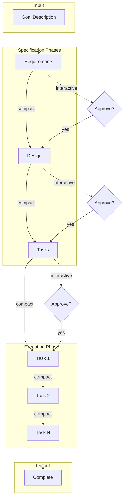
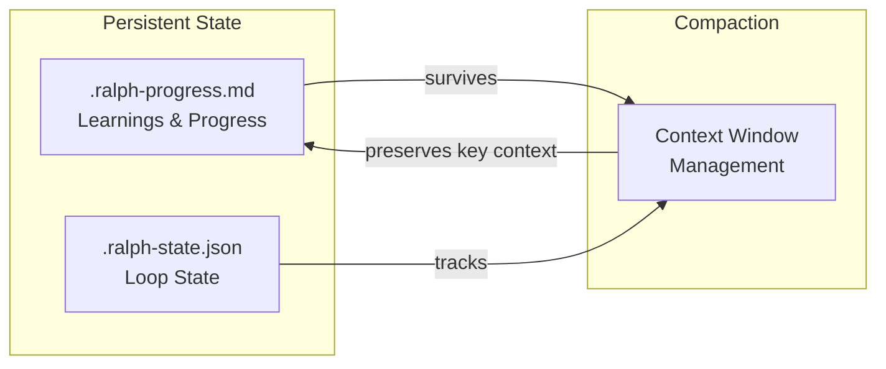

# RalphHarness

Spec-driven development with smart compaction. A Claude Code plugin that combines the Ralph Wiggum agentic loop with structured specification workflow.

> **Fork Notice**: RalphHarness is a fork of [tzachbon/smart-ralph](https://github.com/tzachbon/smart-ralph) that has been renamed and reorganized as an independent project. The original "Ralph" pattern and core architecture are preserved from the upstream project by Geoffrey Huntley and tzachbon.

## Features

- **Spec-Driven Workflow**: Automatically generates requirements, design, and tasks from a goal description
- **Smart Compaction**: Strategic context management between phases and tasks
- **Persistent Progress**: Learnings and state survive compaction via progress file
- **Two Modes**: Interactive (pause per phase) or fully autonomous
- **BMAD Bridge**: Import BMAD planning artifacts (PRD, epics, architecture) into ralphharness specs via `/ralph-bmad:import`
- **Loop Safety**: Pre-loop git checkpoint, circuit breaker, per-task metrics, and read-only detection
- **Role Boundaries**: Mechanical enforcement of file access rules per agent role

## Installation

### From Marketplace (Recommended)

```bash
# Add the marketplace
/plugin marketplace add informatico-madrid/ralphharness

# Install the plugin
/plugin install ralphharness@informatico-madrid

# Restart Claude Code to load
```

### From GitHub Repository

```bash
# Clone the repo
git clone https://github.com/informatico-madrid/ralphharness.git

# Install from local path
/plugin install /path/to/ralphharness

# Or install directly from GitHub
/plugin install https://github.com/informatico-madrid/ralphharness
```

### Local Development

```bash
# Clone and link for development
git clone https://github.com/informatico-madrid/ralphharness.git
cd ralphharness
/plugin install .
```

## Packaged Distribution

When installed via the Codex-packaged distribution (`ralphharness-codex`), commands are exposed with the `ralph-harness-` prefix:

```
$ralph-harness-triage "Build a multi-tenant SaaS platform"
$ralph-harness-research
$ralph-harness-requirements
$ralph-harness-design
$ralph-harness-tasks
$ralph-harness-implement
$ralph-harness-start my-feature "Build user authentication"
$ralph-harness-cancel
$ralph-harness-status
$ralph-harness-feedback
$ralph-harness-help
$ralph-harness-index
$ralph-harness-refactor
$ralph-harness-rollback
$ralph-harness-switch
```

See the [Codex plugin README](plugins/ralphharness-codex/README.md) for full Codex-specific documentation.

## Quick Start

### Interactive Mode (Recommended)

```
/ralph-harness "Add user authentication with JWT tokens" --mode interactive --dir ./auth-spec
```

This will:
1. Generate `requirements.md` and pause for approval
2. After `/ralph-harness:approve`, generate `design.md` and pause
3. After approval, generate `tasks.md` and pause
4. After approval, execute all tasks (compacting after each)

### Autonomous Mode

```bash
# The smart way (auto-detects resume or new)
/ralph-harness:start user-auth Add JWT authentication

# Quick mode (skip spec phases, auto-generate everything)
/ralph-harness:start "Add user auth" --quick

# The step-by-step way
/ralph-harness:new user-auth Add JWT authentication
/ralph-harness:requirements
/ralph-harness:design
/ralph-harness:tasks
/ralph-harness:implement
```

---

## Commands

| Command | Description |
|---------|-------------|
| `/ralph-harness "goal" [options]` | Start the spec-driven loop |
| `/ralph-harness:approve` | Approve current phase (interactive mode) |
| `/ralph-harness:cancel` | Cancel active loop and cleanup |
| `/ralph-harness:feedback` | Collect and process user feedback |
| `/ralph-harness:help` | Show help |
| `/ralph-harness:index` | Index/rebuild spec directory |
| `/ralph-harness:refactor` | Refactor existing spec |
| `/ralph-harness:rollback` | Rollback to git checkpoint |
| `/ralph-harness:switch` | Switch to another spec |

---

## How It Works



### State Management



### Smart Compaction

Each phase transition uses targeted compaction:

| Phase | Preserves |
|-------|-----------|
| Requirements | User stories, acceptance criteria, FR/NFR, glossary |
| Design | Architecture, patterns, file paths |
| Tasks | Task list, dependencies, quality gates |
| Per-task | Current task context only |

### Progress File

The `.ralph-progress.md` file carries state across compactions:

```markdown
# Ralph Progress

## Current Goal
**Phase**: execution
**Task**: 3/7 - Implement auth flow
**Objective**: Create login/logout endpoints

## Completed
- [x] Task 1: Setup scaffolding
- [x] Task 2: Database schema
- [ ] Task 3: Auth flow (IN PROGRESS)

## Learnings
- Project uses Zod for validation
- Rate limiting exists in middleware/

## Next Steps
1. Complete JWT generation
2. Add refresh tokens
```

## Files Generated

In your spec directory:

| File | Purpose |
|------|---------|
| `requirements.md` | User stories, acceptance criteria |
| `design.md` | Architecture, patterns, file matrix |
| `tasks.md` | Phased task breakdown |
| `.ralph-state.json` | Loop state (deleted on completion) |
| `.ralph-progress.md` | Progress and learnings (deleted on completion) |

## Configuration

### Max Iterations

Default: 50 iterations. The loop stops if this limit is reached to prevent infinite loops.

### Templates

Templates in `templates/` can be customized for your project's needs.

## Troubleshooting

### Loop not continuing?

1. Check if in interactive mode waiting for `/ralph-harness:approve`
2. Verify `.ralph-state.json` exists in spec directory
3. Check iteration count hasn't exceeded max

### Lost context after compaction?

1. Check `.ralph-progress.md` for preserved state
2. Learnings should persist across compactions
3. The skill always reads progress file first

### Cancel and restart?

```
/ralph-harness:cancel --dir ./your-spec
/ralph-harness "your goal" --dir ./your-spec
```

## Development

### Plugin Structure

```
ralphharness/
├── .claude-plugin/
│   └── marketplace.json
├── commands/
│   ├── ralph-loop.md
│   ├── cancel-ralph.md
│   ├── approve.md
│   └── help.md
├── skills/
│   └── spec-workflow/
│       └── SKILL.md
├── hooks/
│   ├── hooks.json
│   └── scripts/
│       └── stop-handler.sh
├── templates/
│   ├── requirements.md
│   ├── design.md
│   ├── tasks.md
│   └── progress.md
└── README.md
```

## Credits and Acknowledgments

### Upstream Project

RalphHarness is a fork of [tzachbon/smart-ralph](https://github.com/tzachbon/smart-ralph) by [@tzachbon](https://github.com/tzachbon). The original project established the Ralph agentic loop pattern for Claude Code and proved that spec-driven development at scale was possible.

### Original Inspiration

- **[Ralph agentic loop pattern](https://ghuntley.com/ralph/)** by [Geoffrey Huntley](https://github.com/ghuntley) — the foundational pattern this project builds upon
- Built for [Claude Code](https://claude.ai/code)
- Inspired by every developer who wished their AI could just figure out the whole feature

### RalphHarness Fork Rationale

This fork was created to:
1. Establish an independent project identity under `informatico-madrid`
2. Continue development under the "RalphHarness" brand (preserving "Ralph" as the fundamental pattern)
3. Enable community contributions without depending on the upstream fork owner

### Current Maintainers

- [@informatico-madrid](https://github.com/informatico-madrid) — RalphHarness project maintainer

---

<div align="center">

**Made with confusion and determination**

*"The doctor said I wouldn't have so many nosebleeds if I kept my finger outta there."*

MIT License

</div>
